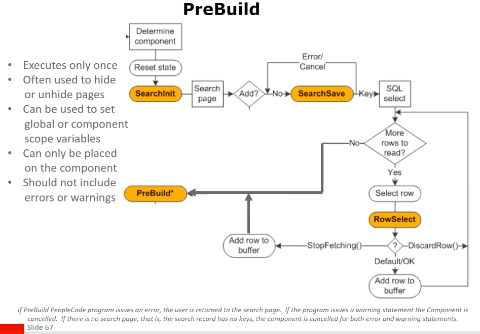
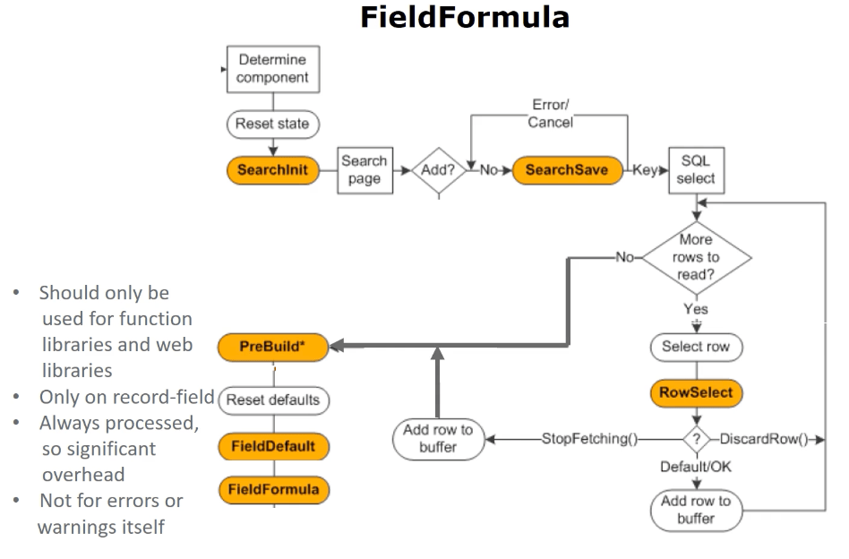
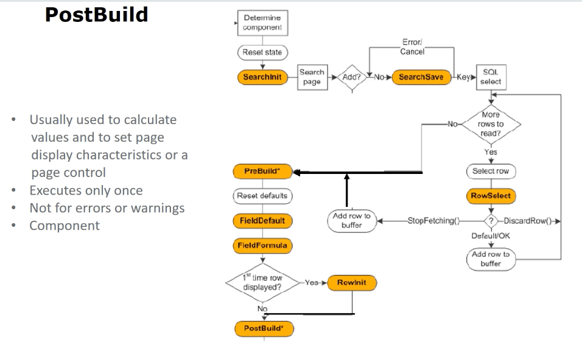
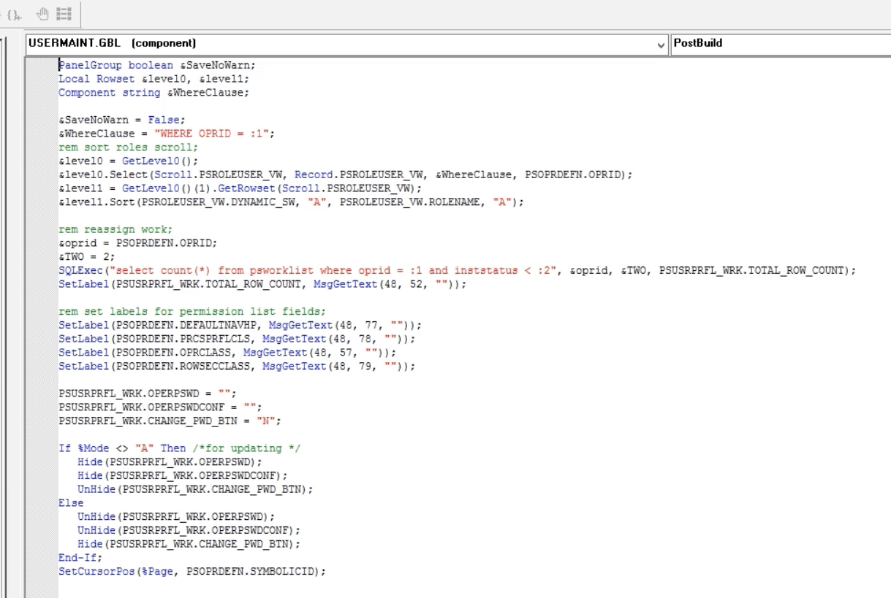
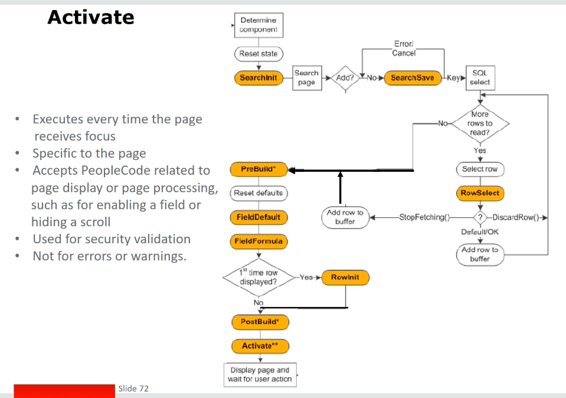

以下是文章內容的條列式摘要，每段包含 3 到 5 個重點，幫助您快速理解 **Component Build** 和 **Page Display Events** 在 PeopleSoft 中的運作：

### **Component Build 和 Page Display 流程**
- **載入搜尋結果**：使用者選擇一筆數據後，系統根據搜尋鍵 (Search Key) 將其載入至元件 (Component) 的高階鍵值。
- **讀取 Component Buffer**：系統從資料庫讀取對應的行數據，並開始執行 `RowSelect` 等事件。
- **事件處理順序**：包含 `PreBuild`, `RowSelect`, `FieldDefault`, `FieldFormula`, `RowInit`, `PostBuild`, `Activate`。

### **PeopleCode 事件詳解**
- **`PreBuild` & `PostBuild`**：只在 **Component 建構時執行一次**。
- **`Activate`**：當 **頁面獲得焦點** 時執行，適用於 **Fluid 應用**。
- **`RowSelect`**：決定 **哪些行數據將載入至 Component Buffer**，但 **不建議在新代碼中使用**。

### **RowSelect 的替代方案**
- **推薦使用 Record View** (`_SEARCH` 或 `有效日期記錄`)，取代 `RowSelect` 來決定載入的行數據。
- **應避免 `RowSelect` 事件**，改使用 `ScrollSelect` 或 `Select` 方法來過濾數據。

### **行數據控制：DiscardRow & StopFetching**
- **`DiscardRow`**：排除不符合條件的行，防止其載入至 **Component Buffer**。
- **`StopFetching`**：在達到所需行數後，停止 **SQL SELECT** 以減少載入的數據量。
- **避免用 `RowSelect` 來篩選數據**，應改為 **SQL View 或 Select 方法**。

### **RowSelect 事件的實際應用**
- **`If %Component = PSRF_RLIST_COMP Then CurrentNumber += 1`**：依據 Component 變數累加計算目前行數。
- **限制最大載入數據**：`If CurrentNumber = UserMaxReports + 1 Then StopFetching`，使 **行數達到限制時終止載入**。

這些步驟有助於您清楚理解 **Component Build** 和 **Page Display Events**，以及如何管理 **Component Buffer** 的行數據載入。如果有需要更深入解析的部分，請讓我知道！ 😊
以下是文章內容的條列式摘要，每段包含 3 到 5 個重點，幫助您快速理解 **Component Build** 和 **Page Display Events** 在 PeopleSoft 中的運作：

### **RowSelect 與最佳替代方案**
- **PeopleSoft 應用通常不使用 RowSelect**，而是透過 **Views (檢視)** 來過濾行數據，提高效能。
- **使用 Views 可提升效能**，避免不必要的 SQL `SELECT` 和 `DiscardRow` 操作。
- **有效日期表 (Effective-Dated Tables)** 會透過 `Update Display` 自動限制歷史數據下載。

### **RowSelect 的錯誤處理**
- **過去的做法**：
  - `Warning()` 曾用於 **DiscardRow** 的功能，但未顯示訊息。
  - `Error()` 曾用於 **StopFetching** 的功能，但未顯示訊息。
- **現代建議**：
  - **使用 `DiscardRow` 或 `StopFetching` 來管理行數據載入**，避免錯誤的做法。

### **PreBuild 事件**
- **PreBuild 執行時機**：在所有行數據載入 **完成後** 只執行一次。
- **用途**：
  - 隱藏/顯示頁面 (`Hide/Unhide Pages`)。
  - 設定 **Global 或 Component Scope 變數**。
- **應用限制**：
  - 只能放置於 **Component** 上。
  - **不建議** 使用 `Error()` 或 `Warning()`，以免影響 UI 流程。

### **PreBuild 的行為**
- **技術上允許錯誤與警告**，但若 `Error()` 觸發，使用者會返回搜尋頁面。
- **若無搜尋頁面 (無鍵值搜尋紀錄)**，則錯誤與警告都會導致 **Component 被取消**。
- **可用於欄位預設值**：
  - 例如 `OPERDESCRIPTION` 欄位，若無值則透過 `GetUserDescription()` 設為 `UserID`。

### **FieldDefault 事件**
- **僅適用於空白欄位**：
  - 若 **Record 定義** 已設預設值，則 `FieldDefault` **不會執行**。
- **執行順序**：
  1. **PreBuild**
  2. **系統預設值處理 (Record Default)**
  3. **FieldDefault 事件**
- **若欄位已有 Record 預設值，則 `FieldDefault` 不會影響該欄位**。

這些摘要有助於理解 **PeopleSoft 中的 Component Build 和 Page Display Events**，並掌握最佳數據管理方式。如果有特定部分需要更深入解析，請讓我知道！ 😊

以下是文章內容的條列式摘要，每段包含 3 到 5 個重點，幫助您快速理解 **FieldDefault、FieldFormula 和 RowInit** 在 PeopleSoft 中的運作：

### **FieldDefault 事件**
- **適用於空白欄位**：僅在欄位 **沒有值** 時才執行，如數字欄位為 `0`、字元欄位為空格或 `NULL`。
- **設定 Component Record Field 預設值**：
  - 例如 `COUNTRY` 欄位可透過 `FieldDefault` 設定為 `USA`。
- **記錄級預設 vs. FieldDefault**：
  - 若記錄級預設已設值 (`Record Definition` 設定 `CAN`)，則 `FieldDefault` **不會執行**。
  - 不應在 **相同欄位** 同時使用 **Record-Level Default** 與 `FieldDefault`。

### **FieldFormula 事件**
- **執行時機**：在 `FieldDefault` **之後** 執行，適用於 **函式庫與網頁函式**。
- **適用於函式庫 (Function Library) 或 Web Library**：
  - **不適用於錯誤處理** (`Error` 或 `Warning`)。
- **有較高的執行負擔**：
  - 每次變更欄位值，系統會執行 `FieldFormula`、`FieldEdit` 及 `FieldChange`。
  - 通常僅用於函式庫 (Function Libraries) 或 Web Libraries (例如 iScript)。

### **FieldFormula 事件的替代方案**
- **應用類別 (Application Classes) 取代函式庫**：
  - **現代開發** 更傾向使用 **Application Class Methods** 取代傳統函式庫。
  - 在 **FieldFormula** 設定函式，如 `assign_student_id()`，以 **自動生成學生 ID**。

### **RowInit 事件**
- **執行時機**：於 **首次顯示該行數據時執行**。
- **準備行數據顯示**：
  - 透過 **PreBuild**、`Reset Defaults`、`FieldDefault`、`FieldFormula` 設定完預設值後，執行 `RowInit`。
- **初始化行數據，使其可在 UI 呈現**。

這些步驟能幫助您理解 **FieldDefault、FieldFormula 和 RowInit** 在 **PeopleSoft** 中的作用，讓開發邏輯更清晰。您有特定部分需要更深入解析嗎？ 😊

以下是文章內容的條列式摘要，每段包含 3 到 5 個重點，幫助您快速理解 **RowInit、PostBuild 和 Activate** 事件在 PeopleSoft 中的運作：

### **RowInit 事件**
- **執行時機**：
  - 在 **元件處理器** 首次遇到行數據時執行。
  - 當使用者點擊 **新增列 (Row Insert, +)**，`RowInit` 會 **對每個新行執行一次**。
- **計算與控制欄位顯示**：
  - 可計算數值，如 `Total Price = Quantity * Unit Price`。
  - 可用於 **隱藏/顯示/啟用/禁用欄位**。
- **等效於迴圈處理**：
  - 若使用者插入多行 (`+10`)，則 **`RowInit` 會對每行執行一次**，類似 `For Loop`。

### **PostBuild 事件**
- **執行時機**：
  - 在 `PreBuild` **執行後**，且 **僅執行一次**。
  - 用於 **計算值** 或 **設置頁面顯示屬性**。
- **用途**：
  - 可用於 **欄位顯示邏輯**，如 **基於計算結果隱藏或禁用欄位**。
  - 適用於 **安全性維護** (如 `User Maintenance Component`)。
- **重要特點**：
  - **不是用來處理錯誤或警告** (`Error`、`Warning`)。
  - **僅在元件 (Component) 層級執行**。

### **Activate 事件**
- **執行時機**：
  - 在 **每次頁面獲得焦點時** 執行 (而非只執行一次)。
  - 適用於 **Fluid 應用**，可用於 **樣式設定 (CSS) 或圖表生成**。
- **用途**：
  - 用於 **標籤設定** (`Labeling`) 或 **建立圖表** (`Pie Chart, Bar Chart`)。
  - 可用於 **安全性驗證** (但不適用於錯誤或警告處理)。
- **適用範圍**：
  - 可用於 **標準頁面** 和 **次要頁面 (Secondary Pages)**。
  - **不適用於子頁面 (Subpages)**。

這些摘要有助於理解 **RowInit、PostBuild 和 Activate** 事件在 **PeopleSoft** 中的作用，以及如何正確應用這些事件來處理欄位顯示與行數據控制。如果有特定部分需要更深入解析，請讓我知道！ 😊

以下是此段內容的條列式摘要，幫助您快速掌握 **Grid 操作、欄位顯示控制與 Component Build 事件** 在 PeopleSoft 中的運作：

### **Grid 操作與欄位管理**
- **設定 Grid 物件**：
  - `LOCAL GRID ampersand GRID` 用於處理 Grid 內的欄位與顯示設定。
  - `GetGrid("USER_ROLES", "PSROLEUSER_VW")` 取得 `USER_ROLES` 頁面內的 Grid (`PSROLEUSER_VW`)。
- **隱藏標題列**：
  - `GRID.LABEL.Text_Label.Label = ""` 設定標題為空白，使標題列消失。

### **動態顯示或隱藏欄位**
- **控制欄位可視性**：
  - 若 `Component = User Maintenance Distribution Component`，則 `GRIDCOLUMN.VISIBLE = FALSE` 隱藏 `VIEW_DEFINITION` 欄位。
- **條件式隱藏欄位**：
  - 例如在 `User Roles` 頁面時，隱藏 `Route Control` 欄位。

### **Component Build 事件與使用者動作**
- **檢視 Component Build 事件的執行時機**：
  - `WinMessage` 事件可以在 `PreBuild`、`RowInit` 中執行，以確認 PeopleCode 何時觸發。
  - `PreBuild` 事件通常用於初始化變數或控制全域設定。

   
   
   
   
   
   
   
   
   
   
   
   
   
   
   
   
   
   

-----------------  

