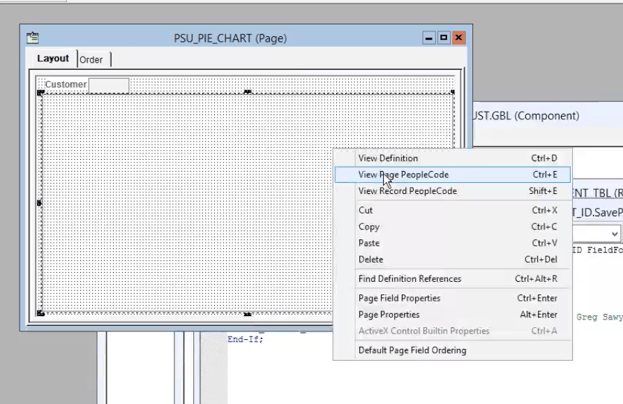
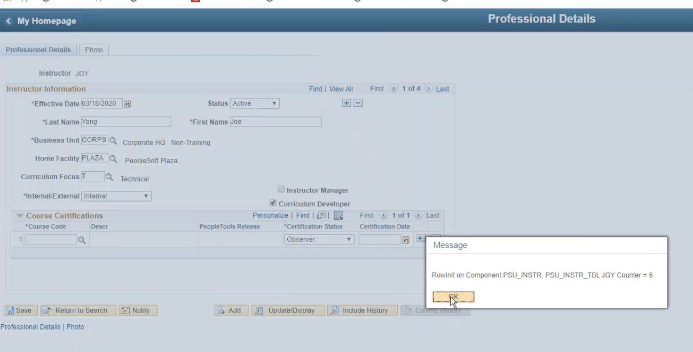

## 1. PeopleCode Course Overview

介紹課程大綱

--------

## 2. PeopleCode Technology Overview

### **Component Processor Flow**
- **PeopleCode 可用於 Component, Page, Record Field 及 Menu**
- **Component Processor Flow** 控制 **資料載入、Buffer處理** 及 **頁面顯示**
- 用 **PeopleCode** 確保 User 輸入符合業務邏輯

  
   

    

--------

## 3. Using PeopleCode Development Tools
- Using PeopleCode Development Tools
- Locating PeopleCode Programs
- Using the PeopleCode Debugger
- Describing Additional Development Tools
- Activity 1: Reviewing the PeopleSoft Application Development Process
- Activity 2: Using the PeopleCode Editor
- Activity 3: Debugging PeopleCode Programs

3.1 也是在介紹 PeopleCode 能做到什麼，沒什麼好講解的  

3.2 Locating PeopleCode Programs 就值得講了  
開始講 localtion 了

### **PeopleCode 的三大考量**
1. **WHERE (程式位置)**
   - **Component 人工影響範圍較小**，僅影響單一元件，適合局部應用。
   - **Record Field 影響範圍較廣**，影響 **多個元件**，適合全系統規則。

2. **WHEN (事件觸發時機)**
   - **事件是 PeopleSoft 預設的中斷點**
   - 常見事件: 
     - **RowInit**(資料初始化)
     - **FieldChange**(欄位變更)
     - **SavePreChange / SavePostChange**(存檔前後處理)
3. **WHAT (程式語法)** 
    - 業務邏輯

-----

  
  
  
  
  
  
  
  
  
  
  
  
  
  
  
   
  
   
  

3.3 Using the PeopleCode Debugger

Debug 的方法:
1. **MessageBox & WinMessage**  
- `MessageBox(style, title, message_set, message_num, default_txt [, paramlist])`: 可顯示訊息，適合快速檢查變數值與執行流程。
- `WinMessage(message [, style] [, title])`: 類似 `MessageBox`，但更簡單，適合臨時測試。

2. **PeopleCode Debugger**  
- 可設定 **斷點(Breakpoints)**，逐步執行程式碼，檢視變數值與緩衝區內容。
- 啟用   
- 開啟後，有更多的東西可以開啟  
   
    
- 離開    

3. Trace log
- 
- 

3.5 Activity 1: Reviewing the PeopleSoft Application Development Process

**Deferred Mode的影響**
- 設定是一層一層影響的
  - So first it checks the component, then the page, and then the fields.
- 若 Component 設為 Interactive Mode(互動模式)，則 Page 和 Fields 的 Deferred 設定無效
- 若 Component 設為 Deferred Mode(延遲模式)，則 Page 的 Deferred 設定生效，再依序影響各 Fields

    
    

Interactive Mode(互動模式)
- 即時 submit 變更: User 在 Page 上輸入或修改資料後，每次點 save 、切換欄位或觸發事件時，系統會立即執行資料驗證與 submit
- 適合即時回應: 用於需要立即回饋或資料必須馬上被處理的情境，例如即時計算薪資或費用
- 可能影響效能: 由於每次操作都會觸發處理，可能導致伺服器頻繁運算，影響系統效能。

Deferred Mode(延遲模式)
- 延遲處理: User 的輸入不會立即觸發 submit ，而是等到點選 submit 或執行某個特定動作時才一併處理。
- 提升效能: 適用於批次作業或大量資料處理，減少即時計算對系統的影響。
- 更適合長表單輸入: 例如需要填寫多個欄位後才進行驗證的表單，避免每次輸入都觸發系統運算

3.6 Activity 2: Using the PeopleCode Editor

跟上面 3.2 差不多的東西走過一遍  

可以從左邊把東西往 Editor 拉  
  

PeopleCode 自動儲存機制
- PeopleCode 編輯器在每次輸入時自動備份，存放於 TMP 目錄。
- TMP 目錄通常位於 Windows 系統的 TMP 路徑，而非 C:\Temp。
- 可透過 Windows 指令 `set` 來檢視 TMP 目錄的實際位置。
- 自動儲存檔案名稱格式為 PPCMMDDYY_HHMMSS，其中 MMDDYY 為日期，HHMMSS 為建立時間
- 儲存 PeopleCode 後，備份檔案將被刪除，可嘗試輸入新內容並再次檢視。

3.7 Activity 3: Debugging PeopleCode Programs

--------
## 4.1 Understanding the Component Processor and PeopleCode Events

- 理解 Component Processor flow  
- identify PeopleCode events, describe
  - search events
  - component build and page display events
  - field action events
  - row action events
  - save action events
  - add mode processing

### **追蹤 Component Processor 流程**
- 在撰寫 PeopleCode 程式前，需決定程式執行的時機點(例如 FieldEdit、FieldChange、SavePreChange 等)。
- 決定 PeopleCode 的放置位置(Component 層級、Record 層級、Page 層級等)。

### **搜尋與 Component Buffer**
- 使用 Search Record 建立搜尋頁面，依據欄位屬性設定搜尋關鍵字、替代搜尋鍵及結果列表框。
- 當使用者執行搜尋，系統根據 Search Key 產生 SQL `SELECT` 語句並載入對應的資料。
- Component Processor 迴圈處理資料庫中的每一行資料並載入 Component Buffer。

當我們用 Search Record 搜尋後，

### **Component Buffer 建構過程**
- 檢查是否處於 Add Mode，若非 Add Mode，則執行 SQL `SELECT` 並載入對應資料。
- 逐步載入 Component Buffer，檢查是否有更多資料列需要讀取並存入緩衝區。
- Apply default value to display Page

### **Component 層級資料載入**
- 載入 Level 0 ~ 3 資料
  - **確保所有資料都載入至 Buffer**，並在每個層級反覆執行資料處理。
- **Row 是 Component Buffer 的單位**: PeopleSoft 使用 **Row Set** 來管理多筆 Row 資料的載入與存儲。
  - **由 Record 組成**: 每個 Row 對應於一個 **Record**，而 Record 內含多個欄位 (Fields)。

### **套用 Record 預設值**
- **應用記錄的預設值**: 根據 Record Field 設定，將預設值套用至無資料的欄位。
- **處理系統預設值**: 若 Record Field 無預設值，則套用系統預設，例如文字欄位設為空白，數字欄位設為 0。
- **顯示頁面並等待使用者操作**: 所有資料完成載入後，系統顯示頁面並準備接受使用者互動。

 
### Field Change Action
- **使用者修改欄位值**，系統執行標準系統驗證(如 Prompt Table Edit, Translate Table, Yes/No Edit)。
- **如果驗證失敗**，則顯示錯誤訊息並停留在頁面上，等待使用者修正輸入。
- **如果驗證通過**，則接受變更並重新套用預設值，頁面準備下一步使用者操作。

### **Row Action**
- **Row Insert**: 
  - 點「+」按鈕新增一行資料。
  - 系統套用記錄預設值並顯示新行，等待使用者輸入資料。

- **Row Delete**: 
  - 點「-」按鈕移除特定行
  - **如果系統允許刪除**，則移除該行並重新載入頁面
  - **如果刪除受限**，則顯示錯誤訊息，拒絕刪除

開啟 Page 時，Component Processor 會把資料 load 進來，然後等待 User 動作  

  
  
  
  
  
  
  

 
--------------   

## 4.2 Identifying PeopleCode Events

### ** Event 的位置**
- **Component**
  - **Component**
  - **Component Record**
  - **Component Record Field**
- **Menus**
- **Pages**
- **Record Fields** (記錄欄位)

### **PeopleCode Event 類型**
- **SearchAction Events**: `SearchInit`、`SearchSave`，用於處理搜尋頁面
- **Component 建構與 Page dispaly (Component Build & Page Display Events)**: 
  - `RowSelect`, `PreBuild`, `FieldDefault`, `FieldFormula`, `RowInit`, `PostBuild`, `Activate`
- **FieldAction Events**: 
  - `FieldEdit`, `FieldChange`
- **RowAction Events**: 
  - `RowInsert`, `RowDelete`
- **SaveAction Events**: 
  - `SaveEdit`, `SavePreChange`, `Workflow`, `SavePostChange`

### **非 Component Processor 事件**

### **SearchInit event**
- 當使用者透過 **Navigator** 或 **Content Reference** 選擇某個 **Component**，該元件會被載入。
- **SearchInit 事件** 會清除 Component Buffer，建立搜尋頁面並準備載入資料。
- **SearchSave 事件** 用於檢查搜尋結果並驗證輸入。

### **SearchInit 事件用途**
- **執行時機**: 在搜尋頁面顯示之前執行
- **設預設值**: 可在進入搜尋頁面前，設定某些欄位的預設值，例如設為目前登入使用者的 ID
  - 可利用 **系統變數** (`%UserID`, `%EMPLID`, `%Date` 等) 來設定值
- **控制欄位狀態**: 
  - **Disable 欄位**: 使使用者無法修改。
  - **Hide 欄位**: 可隱藏特定欄位，使其不出現在搜尋頁面。

### **SearchInit 用於安全性與行為控制**
- **控制安全性存取**: 
  - 預設情況下，若 `EMPL_ID` 為鍵值且與登入使用者相符，系統不允許更改。
  - 可透過 `Allow EMPL ID Change = True` 覆寫預設行為，允許修改該欄位。
- **略過搜尋頁面**: 
  - 設定 `SearchDialogBehavior = 0`，可直接跳過搜尋頁面，進入 Component。
  - 適用於當前已知 search key 的情境

### **SearchInit 限制**
- **某些 PeopleCode 函數無法在 SearchInit 中使用**: 
  - `DoModal`, `Transfer`, `TransferExact`, `TransferNode`, `TransferPortal` **等函數不可用**。
- **SearchInit 的變數不會傳遞至後續頁面。Search Page 有獨立的 Buffer**

### **SearchSave 事件的應用**
- **執行時機**: 在使用者點擊 `Search` 或 `Add` 按鈕後執行。
- **驗證搜尋輸入值**: 
  - 可使用 `SearchSave` 限制使用者的搜尋條件，例如管理者只能搜尋自己部門的員工。
  - 可透過 `Error` 或 `Warning` 函數 **阻止使用者繼續操作**，並返回搜尋頁面。

 
 
 |   | **SearchInit** | **SearchSave** |  |
|---|---|---|---|
| 觸發時機 | 1. User開啟「搜尋/新增」對話框時執行 | User在搜尋頁「按下 **Search / Add**」後、元件真正被開啟之前觸發。 | 一前一後：SearchInit 用來**布置搜尋頁**，SearchSave 用來**判斷是否允許進入**。 |
| 可存取物件 | 只能存取 **Search Record** 中的欄位 無法存取 Component Buffer，因為尚未建構。 | 同左；仍僅有搜尋頁欄位可用。 | 兩者都發生於「Component 之外」，所以不能用 `GetLevel0()` 等。 |
| 主要用途 | • 預帶預設值 (`FIELD.Value = ..`)。 • 控制唯讀/隱藏。 • 用 `SetSearchDialogBehavior()` 自動跳過搜尋頁。 | • 驗證搜尋 Key是否存在 / 是否為合法組合。 • 若無權限，可 `Error()` 阻擋。 | SearchSave 是防線：只有它可以真正終止進入 Component |
| 常見問題 | • 在此做 heavy task 影響搜尋頁載入速度 | • 忘了對重複鍵或權限驗證 → User可進入但後續 SaveEdit 才報錯 |  |

  
  
  
  
  
  
  
  
  
  
  
  
  

-------

## 4.3 Describing Component Build and Page Display Events

**`RowSelect`**: 決定 **哪些行資料將載入至 Component Buffer**，但 **不建議在新代碼中使用**  
- 替代方案: **推薦用 Record View** ，取代 `RowSelect` 來決定載入的資料。

### **PreBuild**
- **執行時機**: 在所有 row 載入 **完成後** 只執行一次。
- **用途**: 
  - 隱藏/顯示頁面 (`Hide/Unhide Pages`)。
  - 設定 **Global 或 Component Scope 變數**。
  - **可設欄位預設值**
- **不建議** 使用 `Error()` 或 `Warning()`，以免影響 UI 流程。
 

   
   

|  | 觸發先後 | 主要用途 |
| --- | --- |  --- |
| **PreBuild** | 1 第一個被呼叫 | ‑ 動態決定哪個 PageSet 預設顯示 - 依登入者權限轉向 | 
| **RowSelect** | 2 針對每一筆即將載入的 Row 呼叫 |   ‑ 篩選資料列 (`RowSelect = False`) - 只讓有效、合權限資料進入頁面 | 
| **FieldDefault** | 3 於每列插入 Buffer 時、對 **每個欄位** 觸發 |   ‑ 填入系統／業務預設值 - 帶流水號、預設日期 |
| **FieldFormula** | 4 跟在 FieldDefault 後、同樣對「每欄」跑 |   ‑ 派生計算值 - FUNCLIB 共用副程式集中放這裡 |
| **RowInit** | 5 每筆 Row 完成後呼叫一次 |  ‑ Enable/Hide 欄位 - 初始化 Grid 樣式、按鈕 | 
| **PostBuild** | 6 Component 全部 Row 建完後 |  ‑ 控制 Tab order、動態隱藏 Page、修改標題 - 設定頁面級安全性 | 
| **Activate** | 7 **每次切入該 Page** 都會跑 |  ‑ 頁面進入時最後 UI 調整：Grid 方法、Dynamic Prompt - 最終安全檢查（隱頁、Disable） | 
 

   
   
   
   
   
   
   
   
   
   
   
   
   
   
   

--------

## 4.4 Describing Field Action Events  

總共介紹這兩組 Event
1. **FieldAction Events**: `FieldEdit`, `FieldChange`
2. **RowAction Events**: `RowInsert`, `RowDelete`

| | **FieldEdit** | **FieldChange** |
| --- | --- | --- |
| 順序 | FieldEdit → FieldChange → (SaveEdit, SavePreChange, …) | 位於 FieldEdit 之後；若前者失敗則不會執行。 |
| 觸發時機 |  User 「離開欄位」時立即執行。若頁面設為 *Deferred Processing*，則在 **save** 時才批次執行。 | 只有當 **FieldEdit 完成且未拋出 Error** 後才觸發。同樣受 *Deferred Processing* 影響，可能延後到 save 階段。 |
| 主要用途 | 驗證輸入值，不符合時以 `Error()` / `Warning()` 阻止後續處理。不能修改其他欄位 | 依欄位變動「衍生」或「影響」其他欄位／邏輯，例如重新計算金額、帶出預設值、啟用/停用控制項。 |
| | ‑ 欄位長度、格式、範圍檢查   - 業務規則（例：不得超過預算） | ‑ 依輸入自動計算 (Qty × Rate = Amount)   - 修改頁面狀態：`SetCursorPos()`, `Enable()`/`Disable()`   - 讀取其他記錄以帶值 |
| 對儲存流程的影響 | `Error()` 會中斷 User 動作。若發生 Error，**FieldChange 不會執行**。 | 就算 `Warning()` 顯示警示， User 仍可繼續操作並儲存；`Error()` 應盡量避免放在此事件，以免難以追蹤。 |
| 常見問題 | 在 FieldEdit 進行大量 IO，導致效能問題 | • 在 FieldChange 做驗證卻沒擋住錯誤資料，導致不符合的資料被寫入。 • 忘記考量 Deferred Processing，導致欄位未即時更新。 |

  
  
  
  
  
  
  

### **RowInit 與 Field Change 的關聯**
- RowInit 在資料行首次載入時執行，用於初始化或設定預設值。
- Field Change 在欄位變更時執行，確保計算邏輯正確運行。
- RowInit 負責初始狀態，Field Change 負責動態更新

### **Row Action**
- 當 User 點「+」或「-」時，觸發 Row Insert 或 Row Delete
- RowInit 會在 Row Insert 之後執行，以設定新 row 的初始狀態。

| | **RowInsert** | **RowDelete** |
| --- | --- | --- |
| 觸發時機 | • User 點「+」 • PeopleCode 叫用 `InsertRow()` / `Scroll.InsertRow()` | • User 點「-」 • PeopleCode 叫用 `DeleteRow()` / `Scroll.DeleteRow()` |
| 執行順序 (單筆資料流程) | 1. **RowInsert** 2. **RowInit**（對新列） 3. 使用者繼續輸入 → FieldEdit → FieldChange… | 1. **RowDelete** 2. **RowInit**（對刪除後下一列，因畫面更新 |
| 主要用途 | • 預設欄位值 (`RECORD.FIELD.Value = ...`) • 複製上一列資料作快速新增 • 動態控制新增行數上限（超過則 `Error()`） | • 驗證是否允許刪除  • 累計已刪除列的資料量，稍後更新彙總 • 觸發業務邏輯 |
| | 設定預設值、自動編號、調整有效日期 | 重新計算資料(訂單總額)、調整行號、防止刪除 |
| 阻止動作的方法 | `Error()`：**立即取消新增** | `Error()`：**取消刪除**，列保留 |
| 與 DB 互動 | 只在 **Component Buffer** 加新 Row，尚未寫入 DB。實際 INSERT 發生在 `SavePostChange` | 只將 Row 標記為 *Delete Pending*，尚未刪表。真正 DELETE 亦在 `SavePostChange` |
| 注意事項 | • **RowInit 會緊接著執行**，避免重複預設邏輯。 • 若在 RowInsert 做大量 SQL，效能易受影響。 | • 刪除前需檢查外鍵：可用 `Select()` 或 `SqlExec()` 判斷子表。 • 刪除後若要即時更新頁面彙總，須在 RowDelete 同步計算。 |
| 需注意常見問題 | • 在 RowInsert 用 `SaveEdit` 等語法阻止新增 → 邏輯錯位。 • 忽略 Deferred Processing，導致預設值未即時顯示。 | • 在 RowDelete 直接呼叫 `CommitWork()` → 破壞 Component Processor 流程。 • 刪關鍵資料但沒同步移除暫存變數，導致 SaveEdit 失敗。 |

  
  
  
  

當使用者刪除行時，系統重新調整剩餘行的行號，確保行號順序一致:  
  

--------

## 4.5 Describing Save Action Events

### **1. Save Action Events（儲存動作事件）**
- 當使用者儲存元件時，僅寫入 **變更的資料**，但所有 Save Stream PeopleCode 仍會執行。
- **Component Processor** 負責處理 **緩衝區內的資料** 並將其更新至資料庫。
- 儲存過程中會執行 **SaveEdit、SavePreChange、Workflow** 三個 PeopleCode 事件。

| 面向 | **SaveEdit** | **SavePreChange** | **Workflow** | **SavePostChange** |
|---|---|---|---|---|
| 觸發順序 | 1（FieldEdit/RowEdit 之後） | 2（所有驗證通過後，真正寫 DB 前一刻） | 3（SavePreChange 結束緊接著） | 4（資料已寫入 DB 之後） |
| 執行時機點 | 按 Save 按鈕時、準備寫 DB 前，**最後整體驗證** | 在 Buffer → DB 前，仍可改 Component Buffer | 在同一交易內，資料尚未 commit | 資料已插/改/刪成功 |
| 是否可 **阻擋 save** | 可用 `Error()/Warning()` | 可用 `Error()`，但不建議 | 不應該 | 不應該 |
| 主要用途 | ‑ 跨欄位/跨 Row 的資料驗證 - 最後的業務邏輯審核 | ‑ 產生系統欄位：流水號、時間戳、補資料、資料格式  - 同步欄位一致性 | ‑ 設定 `WORKLIST_REQ`, `WF_EVENT` 等欄位 - 送 Worklist / Email | ‑ 更新 table - 呼叫 CI、REST、Pub/Sub - 寫 audit/log |
| 與 **交易/Commit** 關係 | 尚未開始 DB 更新 | 尚未開始 DB 更新 | 尚未 Commit | 尚未 Commit，但 DB 內已有資料 |
| 需注意常見問題 | ‑ 大量 SQL 影響效能 - 忘記重新驗證批次匯入資料 | ‑ 在此拋 Error → 使用者見到怪訊息 - 變更不在 Buffer 的表，結果被滾回 | ‑ 在此查表卻看不到「自己剛寫」的資料（尚未落地） | ‑ 用 `Error()` 只會回 Rollback 給整批，使用者難理解 |

   
   
   
   
   
   

--------

## 4.6 Describing Add Mode Processing

### **Add Mode Processing（新增模式處理）**
- 在新增模式（Add Mode）下，系統不會載入現有資料，而是 **建立新的資料列**。
- `SearchSave` 事件可用於驗證關鍵欄位（例如防止使用預留的 `UserID`）。
- **適用於**: 新增使用者、訂單、課程等需要獨立編號的資料。

|  | **Add Mode** (`%Mode = "A"`) | **Update**（`%Mode = "U"` / `"L"` / `"C"`） |  |
|---|---|---|---|
| 入口 | Search Page 點 **Add** | Search Page 點 **Search** | 新增一筆 vs. 維護既有資料 |
| Component Buffer 載入 | 僅載入關鍵欄位 (`Search Keys`) | 按有效日期規則載入現有資料 | Buffer 乾淨，Update 則已含資料 |
| Search Keys | **可輸入/編輯** ➜ 儲存後成為 PK | **唯讀**；決定讀哪筆資料 | 只有 Add 允許新增 PK |
| 有效日期 | 系統插入 `EFFDT`，通常 = `%Date` | 依 Component |  |
| 主要 Event 差異 | • SearchInit → SearchSave • **FieldDefault → FieldFormula → RowInit** （Add 專屬建構流程） | • PreBuild → RowSelect → RowInit （Update 先挑列，再跑初始化） |  |
| 常見驗證位置 | `SearchSave`：重複Key、權限 `SaveEdit`：跨欄位驗證 | `FieldEdit` / `SaveEdit`：欄位驗證、業務邏輯 | |
| 預設值處理 | `FieldDefault` 會大量觸發；常用於帶流水號、系統預設 | 預設值通常已存在；`FieldDefault` 很少被執行 | |
| 主要用途 | 新增資料 | 修改資料 |  |

---

### **其他 Component process flow**
- **Cancel Processing**: 
  - 允許使用者 **取消目前操作**，避免誤儲存未完成的資料。
- **Pop-Up Menu Processing**: 
  - 不再廣泛使用，現在用 **hyperlink** 來實現相同功能
 

### **Deferred Processing 與 Interactive Mode**
- **Server Trips（伺服器請求）與處理模式**
  - **每次伺服器請求都會耗費時間**，影響系統效能與使用者體驗
- Interactive: 
  - 每次 **FieldEdit 或 FieldChange** 都會立即與伺服器互動，影響效能
- **Deferred (預設)**: 
  - 減少伺服器請求，提高系統與網路效能。

 |  | **Deferred Processing** | **Interactive Mode** |  |
|---|---|---|---|
| 事件觸發時點 | FieldEdit／FieldChange 等「欄位修改事件」被延後，直到執行某些動作： • 點儲存、按按鈕等 | User 離開欄位 (Click elsewhere) 時即刻送往伺服器執行 | 延後 vs 即時  |
| Server trip 次數 | 極少；一次動作可能批次送出多欄驗證 | 多；每次離開欄位就往返一次 |  |
| 使用者體感 | 連續輸入、不被驗證訊息打斷 | 輸入即時獲得錯誤／Derived Values | 考量立即性 |
| 主要用途 | 輸入大量資料、表單長 | 關鍵欄位需即刻驗證、計算或動態顯示其他欄位 | 可混用：整體 Deferred，少數 Interactive |
| 預設 | Component 預設為 Deferred | 需在 Component／Page／Field 取消「Allow Deferred Processing」 | |
| 覆寫規則 | Component 設 Deferred 時，可在 Page 或 Field 個別改成 Interactive | Component 設 Interactive 時，下層無法再改回 Deferred |  |
| 需注意常見問題 | 忘了 Deferred，User 離開欄位卻沒看到 Derived Values；以為失效 | 在 Interactive 中寫大量 SQL，User 每離開欄位就 Lag | |
 
 
 
 
---
 
  
  
  
  
  
  
  
  
  
  
  
  
  
  
  
  

--------

## 4.7 Activity 4: Using SearchInit to Control the Search Page

從這裡開始是一個一連串的練習題目  
這節完全就是在講 `SetSearchDialogBehavior(0)`
- 用 SearchInit，設定 `%UserId` 搭配 `SetSearchDialogBehavior(0)`

  

--------

## 4.8 Activity 5: Placing WinMessage in Search Events

這節練習在展示 `SearchInit` 和 `SearchSave` 的執行時機點  
並且涉及到變數的 scope 議題

  
  
  
  
  

|  | **Local 變數 (`Local &`)** | **Component 變數 (`Component &`)** | **Global 變數 (`Global &`)** |
| --- | --- | --- | --- |
| 存取範圍 | 僅限當前事件或function內 | 可在相同component內的所有事件間存取 | 可在所有component、所有事件間存取 |
| 生命週期 | 只在事件執行期間有效 | component開啟後到關閉前都有效 | 保留至使用者登出或 Session 終止 |
| 主要用途 | 暫時性計算資料 | component內共享的資訊 | Session 內的共享的資訊 |
| 跨 event 存取 | 不能跨，event 結束變數就消失 | 可以跨event，但僅限於 component 內 | 可跨所有 event |
| 跨 component 存取 | 不能 | 不能 | 可以 |

--------

## 4.9 Activity 6: Placing WinMessage in Component Build Events

這節練習在展示 `PreBuild` 和 `RowInit` 的執行時機點  
並且涉及到變數的 scope 議題

接續 4.8 最後的狀態  
  

 
Search buffer 跟 Component Buffer 有所區別  
所以 &C 是不同的?

接著看  

  
  
  
  
  
  

--------

## 4.10 Activity 7: Placing WinMessage in Row Action Events

延續 4.9 的範例繼續下去   
展示 RowInsert  
- RowInsert 執行完後，又會有一次  RowInit  

  
  
  
  

--------

## 4.11 Activity 8: Placing WinMessage in Save Action Events

延續 4.10 的範例繼續下去   
展示 SaveEdit  
- 如果有 3 行，則 SaveEdit 會執行 3 次
- 只有被修改的資料才會被存入，不影響未變更的行 row
 
  
  
  
  

--------

## 4.12 Activity 9: Examining Deferred Processing

這章節沒有系統操作  
就是複習工具上我們要怎麼設定 interative or deferred mode 而已  
可以拿之前的圖片一起做參考  

--------

## 4.13 Activity 10: Reviewing the Programs That Synchronize Student Addresses with Customer Addresses

前半段完全就是之前的 RowInit + FieldChange 範例  
- 前面的 checkbox 確認 same address 案例
  - RowInit 設定初始值
  - FieldChange 處理 checkbox 勾選
  

後半段就是用 SavePostChange 展示  確保客戶地址變更後，所有相關學生記錄均被更新  

  
  
  

--------

--------

--------

--------

## 5. Writing PeopleCode Programs
- Writing PeopleCode Programs
- Writing Conditional Statements (continued)
- Activity 11: Selecting the Correct PeopleCode Events for Error Messages

--------

## 6. Using PeopleCode Variables
- Using PeopleCode Variables
- Incorporating Derived/Work Fields into Your Applications
- Describing Contextual Prompt Table Edits
- Activity 12: Calculating and Displaying Derived Values
- Activity 13: Reviewing the Setup for Contextual Prompt Table Edits

--------

## 7. Using PeopleCode Built-In Functions
- Using PeopleCode Built-In Functions
- Explaining String Functions
- Activity 14: Using PeopleCode Built-In Functions

--------

## 8. Writing User-Defined Functions
- Writing User-Defined Functions
- Calling User-Defined Functions
- Activity 15: Writing User-Defined Functions

--------

## 9. Explaining the Component Buffer
- Explaining the Component Buffer
- Activity 16: Determining the Contents of the Component Buffer

--------

## 10. Using Legacy Techniques to Access Data in the Component Buffer
- Using Legacy Techniques to Access Data in the Component Buffer

--------

## 11. Programming With Object-Oriented PeopleCode
- Programming With Object-Oriented PeopleCode
- Instantiating Objects of the components Buffer Classes
- RowNumber Property
- Activity 17: Using Methods and Properties of the Field Class

--------

## 12. Referencing Data in the Component Buffer
- Referencing Data in the Component Buffer
- Instructor Demonstration
- Using Shorthand Dot Notation
- Traversing Multiple Occurs Levels in the Component Buffer
- Activity 18: Traversing Objects and Data in the Component Buffer
- Activity 19: Looping Through Data in a Rowset
- Activity 20: Modifying Objects at Multiple Occurs Levels

--------

## 13. Using Additional Component Buffer Methods
- Using Additional Component Buffer Methods
- Using the Rowset Flush Method
- Working with Standalone Rowsets
- Using Other Component Buffer Methods
- Activity 21: Using the Select Method to Display Enrollments
- Activity 22: Flushing Data from a Rowset
- Activity 23: Using a Standalone Rowset to Calculate Effort Spent

--------

## 14. Creating and Using Application Classes
- Creating and Using Application Classes
- Using the PeopleCode Editor to Create and Modify Application Classes
- Using Application Classes
- Passing Parameters to Methods
- Activity 24: Creating and Using an Application Class
- Activity 25: Passing Method Parameters by Value
- Activity 26: Passing Method Parameters by Reference

--------

## 15. Extending and Implementing Base Classes
- Extending and Implementing Base Classes
- Activity 27: Extending a Built-in Class

--------

## 16. Executing SQL in PeopleCode
- Executing SQL in PeopleCode
- Creating SQL Definitions
- Using the SQL Class and SQL Objects
- Incorporating Meta-SQL in PeopleCode and SQL Definitions Executing SQL Using Record Objects
- Activity 28: Updating Effort Spent with a SQLExec Statement
- Activity 29: Updating Effort Spent with a SQL Definition
- Activity 30: Updating Effort Spent Using a SQL Object
- Activity 31: Choosing the Best SQL Option
- Activity 32: Using Object-Oriented Techniques to Execute SQL in PeopleCode

--------

## 17. Using PeopleCode to Create Charts
- Using PeopleCode to Create Charts
- Activity 33: Creating a Bar Chart

--------

## 18. PeopleCode Course Workshop
- PeopleCode Course Workshop

--------

## 19. PeopleSoft Peoplecode Course Review
- PeopleCode Cou