## PeopleSoft
- hcchaoa@tsmc.com  // #####Fufu0109

## PeopleCode Debugger
- https://mylearn.oracle.com/ou/course/peoplesoft-peoplecode/76935/104356
- 有斷點
- 有 steps
- 看 function 當下變數  

Debug env 聽不懂  
- 有的時候要 connect 2 tier, 有時候要 3 tier  


啟用  
  

開啟後，有更多的東西可以開啟  
   


設定 break point  

他怎麼做到的，怎麼會網頁一直行，就可以連動 break point  
這可能就是前面說的 connect tier2 or tier3 的功能  

可以設定 `Log options`  
- 好像可以記錄每個步驟  


---------

## 介紹 additional tool
用來
- Find definition Reference
  - 
  - 
- Find In
  - 
- WinMessage and MessageBox: 快速設 breakpoint 的方法  
  - `WinMessage("Hello, Jacky! 這是一則 PeopleCode 訊息框。", 0);`
  - `WinMessage(messageText, messageType [, titleText]);`
  - 已棄用  不該在 PROD 
- Trace PeopleCode Page
  -  
  - 
  - 
  - 
  - 
  - 
- SetTracePC
- Event Mapping
  -    
  -   


 


```
功能	WinMessage	MessageBox
適用環境	Windows	PeopleSoft
互動性	可接受使用者回應	只能顯示訊息
訊息類型	可選 Yes/No、OK/Cancel	單純顯示系統訊息
回傳值	依按鈕決定 (Yes/No 等)	無回傳值
``` 

-------

## Activity 1: Reviewing the PeopleSoft Application Development Process

這個 activity 跟之前的差不多  
這張圖片上的英文文字如下：
1. Plan the application.
2. Define fields.
3. Define records.
4. Build tables.
5. Define pages.
6. Define components.
7. Register components.
8. Test the application.

這章節大綱  
  

打開專案後，他調整了兩個設定
   
  


**建立 SQL 表**  
開發 new application 時，記得要 create table:  
- Build => Current Definition 來建立，但要避免覆蓋現有資料

 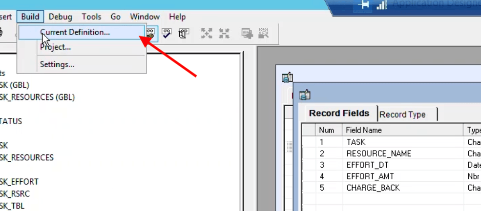  
 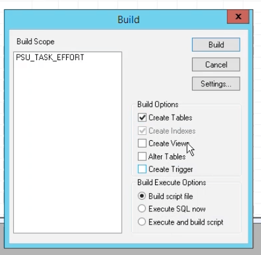  

  


- **定義 PSU_TASK_RESOURCES 頁面**
  - 記錄欄位包括
    - `Level 0` (PSU_TASKS)
    - `Level 1` (PSU_TASK_RSRC)
    - `Level 2` (PSU_TASK_EFFORT)。
  - 在屬性中選擇 allow deferred processing，但須在 Component 層級啟用 deferred processing 模式

- **延遲處理模式的影響**
  - 若 Component 設為「互動模式」，則頁面和欄位的延遲處理設定無效。
  - 若 Component 設為「延遲模式」，則頁面的延遲處理設置生效，再依序影響各欄位。

    
  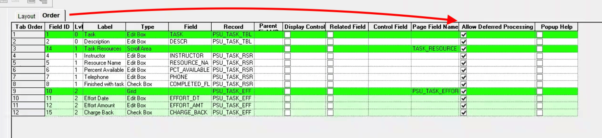  


Interactive Mode（互動模式）
- 即時提交變更：使用者在頁面上輸入或修改資料後，每次點選「儲存」、切換欄位或觸發事件時，系統會立即執行資料驗證與提交。
- 適合即時回應：通常用於需要立即回饋或資料必須馬上被處理的情境，例如即時計算薪資或費用。
- 可能影響效能：由於每次操作都會觸發處理，可能導致伺服器頻繁運算，影響系統效能。

Deferred Mode（延遲模式）
- 延遲處理：使用者的輸入不會立即觸發提交，而是等到點選「儲存」或執行某個特定動作時才一併處理。
- 提升效能：適用於批次作業或大量資料處理，減少即時計算對系統的影響。
- 更適合長表單輸入：例如需要填寫多個欄位後才進行驗證的表單，避免每次輸入都觸發系統運算。

一層一層設定影響的
- So first it checks the component, then the page, and then the fields.

這章節的練習，總時數應該是 12 小時，end date 也不該早於 start date
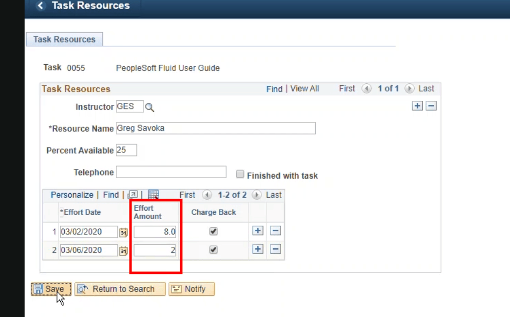  
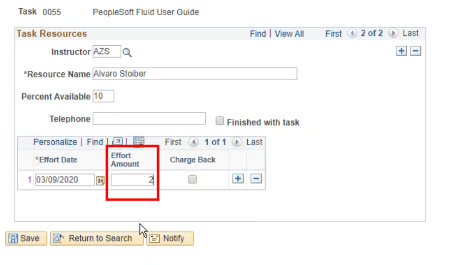  
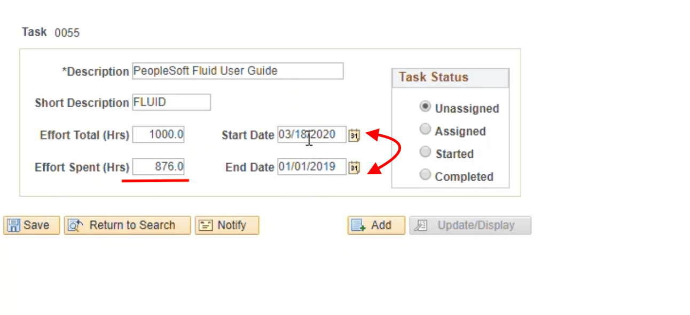  

這就要靠 People code 來幫忙  

---------

## Activity 2: Using the PeopleCode Editor


**使用 PeopleCode Editor**
- 回顧 PeopleCode Editor 的概述並試用多項功能。
- 學習如何用 Editor 寫與修改 PeopleCode 程式
- 觀察自動格式化、語法驗證及自動備份等功能。
 
**開啟 PeopleCode 編輯器**
點 `PeopleCode Display` 來看 Field 上有哪些 event 有 code   
  

FieldChange checkbox 上點兩下就能打開   

    


 
**編輯器的文字顏色與格式**
- 用 `Display Fonts and Colors` 調整預設文字顏色與字的格式

  


**瀏覽記錄欄位與事件**
- 左側清單顯示所有 Records 欄位，粗體代已有 PeopleCode
  -   
- 右側 Event 清單，粗體表示該事件已含 PeopleCode
  -   
- 可選擇 STUDENT_NAME 欄位與 FieldEdit 事件進行編輯。
 


**輸入 PeopleCode 程式碼** 
- 輸入 `If ^ = student_id Then Warning "Student name equals student ID";`，按「Save」儲存。
- 確保程式碼符合語法規範，例如 `If` 語句需縮排。
- 若語法有誤，編輯器會顯示錯誤訊息，如缺少 `And/If`。

Editor 會做語法檢查  
   

**驗證與格式化 PeopleCode**
- 語法驗證時，編輯器會檢查 `^` 是否為目前欄位並自動補全記錄名稱。
- 若欄位屬於記錄，會自動添加記錄名稱；若不屬於，則顯示錯誤訊息。
- 編輯器統一函式、類別與變數的大小寫，並根據第一個出現的寫法調整。

**程式碼可讀性改進**
- 編輯器會自動縮排，提高程式碼可讀性。
- 引號內的文字不受格式化影響，可自由輸入內容。
- 若變數未宣告，編輯器會顯示自動宣告訊息，預設類型為 `Any`。


語法正確時，存擋後會做自動縮排、程式碼補全
-    
-   


**變數宣告與語法驗證**  
- 雖然非必需，但建議宣告所有變數，以確保類型檢查與語法驗證。  
- 特別是物件型變數，宣告可避免屬性與方法使用上的錯誤。  
- PeopleCode 會驗證大部分宣告的物件類型，確保資料類型匹配。  

**編輯功能**  
- PeopleCode 編輯器提供剪下、複製、貼上、復原等標準文本編輯功能。  
- 相關選項可在「Edit」選單中找到，如 Undo、Redo、Cut、Copy、Paste 等。  
- 可使用快捷鍵提升操作效率，例如 Ctrl + Z 進行復原。  

**PeopleCode 定義的存儲**  
- PeopleCode 定義不會與 record 定義一起存，而是保存在 PeopleTools tables 中。  
- 可在 PeopleCode 編輯器中查看並管理 PeopleCode 程式碼。  
- 這種設計有助於統一管理程式碼與版本控制。  

**F1 取得 PeopleCode 說明**  
- 在編輯器中選擇「Warning」，按 F1 鍵可開啟 PeopleCode 語言參考文件。  
- F1 說明是區分大小寫的，錯誤輸入可能導致「404 Not Found」錯誤。  
- 可用來查詢內建函式、系統變數、PeopleCode 語法與 PeopleTools API。  

**PeopleCode 開發者指南**  
- F1 說明可用於相關功能與對話框，如 PeopleCode 編輯器的使用說明。  
- 可選擇瀏覽器開啟文件，例如 Google Chrome。  
- 若有新版指南，可選擇最新版本，但可能失去上下文關聯性。  

**版本更新與 Web 伺服器調整**  
- 若需查看新版的 PeopleCode 說明，需更新 Web 設定。  
- 可在 PeopleTools → Web Profile Configuration 修改 Help URL。  
- 若要變更生效，須重新啟動 PIA 網域。  

**開發工具的幫助位置設置**  
- 在 PeopleTools → Administration → PeopleTools options 內設定幫助文件位置。  
- 修改 Help URL 可更新 App Designer、Data Mover 及 PIA 的參考文件。  
- 若修改成功，開啟 F1 將會指向新版文件。  

**F1 Help 測試與結果**  
- 重新設定 Help URL 後，若未重啟 PIA，仍會指向舊版本文件。  
- 測試變更版本號可能無法運作，但值得一試。  
- 若要完整套用更新，仍需重啟 Web 伺服器。  


**Web 伺服器設定變更**  
- 變更 Help URL 後，需重啟 Web 伺服器並重新登入，才會生效。  
- 若未重新啟動 PIA，依舊會指向舊版說明文件。  
- 這是更改 PeopleTools 設定時需注意的步驟。  

**檢視記錄與 PeopleCode 定義**  
- 右鍵點擊 PSU_STUDENT_TBL，選擇「 iew Definition」可檢視記錄定義。  
- 可檢視記錄欄位屬性與其他相關設定。  
- 程式內的定義皆可透過右鍵選單檢視對應的 PeopleCode。  

  


**檢視函式與類別定義**  
- 右鍵點擊函式名稱，選擇「View Function」可開啟該函式所在的程式。  
- 右鍵點擊類別名稱，選擇「View Application Package」或「View Application Class」可檢視類別定義。  
- 這些功能可用來快速導航至相關的應用程式類別與函式。  

**拖曳功能**  
- PeopleCode 編輯器支援拖曳功能，可拖曳專案檢視中的元素至編輯區。  
- 可拖曳記錄定義、欄位定義、元件定義等至編輯區，但不需儲存。  
- 可跨 PeopleCode 程式進行拖曳，便於程式編寫。  

可以從左邊把東西往 Editor 拉  
  

**PeopleCode 自動儲存機制**  
- PeopleCode 編輯器在每次輸入時自動備份，存放於 TMP 目錄。  
- TMP 目錄通常位於 Windows 系統的 TMP 路徑，而非 C:\Temp。  
- 可透過 Windows 指令 `set` 來檢視 TMP 目錄的實際位置。  

**存取暫存備份檔案**  
- 若 TMP 目錄內有編號的資料夾，應開啟該資料夾來查找備份檔案。  
- 自動儲存檔案名稱格式為 `PPCMMDDYY_HHMMSS`，其中 MMDDYY 為日期，HHMMSS 為生成時間。  
- 儲存 PeopleCode 後，備份檔案將被刪除，可嘗試輸入新內容並再次檢視。  


**查看 PeopleCode 暫存資料**  
- 進入 TMP 目錄，查看 PeopleCode 的自動備份檔案。  
- 備份檔案名稱包含日期與時間，可用記事本開啟。  
- 每次輸入時，編輯器會將資料備份至 TMP 目錄。  
 

這個也要去測試看看   


------------  

## Activity 3: Debugging PeopleCode Programs


### 1. **PeopleCode 程式除錯概述**
- 介紹如何使用 PeopleCode 除錯工具來分析程式。
- 主要關注在 PSU_PO_DTL 記錄的 ORDER_LINE_NBR 欄位的 RowInsert 事件。
- 設定斷點並執行應用程式，觀察除錯工具提供的資訊與選項。

### 2. **活動概覽**
- 在 **PeopleSoft Application Designer** 三層模式下開啟 PeopleCode 程式。
- 變更連線類型為 **Application Server**，使用 T1B85701 資料庫。
- 使用 PTCODE 帳號登入後，開始進行程式除錯。

不知道之前在公司都是選哪個，是不是要用 3 tier debug 這邊就必須要選 `Application Server`  
  


### 3. **活動詳細步驟**
- 開啟 **PSU_PO_DTL** 記錄，檢視 ORDER_LINE_NBR 欄位的 PeopleCode。
- 切換至 **RowInsert 事件**，確保未選錯為 RowDelete。
- 關閉輸出視窗 (Alt+1) 以擴展除錯視窗範圍。

### 4. **啟動除錯工具**
- 進入 **Debug Mode**，開啟 **Call Stack** 與 **Local Variables** 窗格。
- 若有先前設定的斷點，系統會自動恢復。
- 開啟 **Component Buffer** 以檢視元件資料，可調整視窗大小以利觀察。


找到你要 debug 的 Field 和 event，開啟 debug mode  
  

把 Component Buffer 視窗也開起來  
  


Component Buffer
- 專門用來存當前作用中的 Component 相關的資料
- 當 User 開啟某個 page，系統會將該 Component 內的所有 Recode data 載入到 Component Buffer，並按照 Scroll Level 和 Page Level 進行組織


Component Buffer 的結構
- 包含多層資料：按照 Level 0、Level 1、Level 2 等層級儲存，每層可能包含 RowSet, Record, Field
- 儲存 page 控制相關資料：包括 Primary Scroll Records, Related Display Records）、衍生/工作記錄（Derived/Work Records）、Translate Table 記錄。

PeopleCode 可以透過
- GetLevel0()、GetRowSet()、GetRecord()、GetField() 等方法來存取 Component Buffer 內的資料


面板上就會有這些區塊  
  

### 5. **設置斷點**
- 在程式碼第 3 行 **"If LINE > MAXLINE Then"** 設定斷點。
- 使用 **F9** 或 **Debug → Toggle Break at Cursor** 設定紅色斷點標記。
- 斷點觸發時，應用程式會停在相應的執行位置。

設斷點  
  

### 6. **在瀏覽器測試**
- 進入 **Purchasing → Maintain Purchase Orders**，選擇 **Order 00000029**。
- 在第二行插入新資料列，按 **+** 按鈕新增一行，確認數值為 1 並按 OK。
- 程式遇到斷點時，PeopleSoft Application Designer 會閃爍或自動取得焦點。

上面是用課程中的範例來執行出發執行到斷點  
我不好拿來當範例  
重點是我要怎麼在公司重現這個功能  


### 7. **程式除錯的視覺指標**
- **App Designer 閃爍**表示程式執行到斷點並暫停。
- 在除錯器中，黃色箭頭標示當前執行位置，紅色斷點標記被綠色箭頭覆蓋，顯示當前執行的 PeopleCode 陳述式。

### 8. **檢視變數的值**
- 在 **PeopleCode 編輯器**內，可**滑鼠懸停**於變數查看其當前值，如 `&I` 變數顯示數值 `1`。
- 也可懸停於欄位名稱來檢視當前欄位值，例如 `ORDER_LINE_NBR` 目前為 `0`。

hover 在變數名稱上，就能看到當下的 value
  

### 9. **除錯面板與資料檢視**
- **Local Variables 面板**預設開啟，顯示**區域變數與物件屬性**，可展開物件以查看更多資訊。
- 也可開啟 **全域變數、元件變數與函式參數面板**。
- 使用 **F8** 可逐行執行程式碼，箭頭指示目前執行行，變數數值隨迴圈變化。

下面 `Local Variables 面板` 也能看到變數的資訊   
  

### 11. **動態變數變化**
- 使用 **F8** 逐步執行程式時，可查看 `MAXLINE` 和 `LINE` 變數如何變化。
- `&I` 變數會隨迴圈增加，數值從 `1` 變成 `2`，而 `MAXLINE` 也會隨條件判斷更新。

按 F8 繼續下一行執行  


### 10. **Component Buffers 面板與資料結構**
- **Component Buffer** 顯示所有元件資料，可展開來檢視記錄 (`GetRecord`)、欄位 (`GetField`) 等資料。
- **不要展開 ParentRowsets 或 ParentRow**，可能導致無限迴圈。
  - Do not drill down on any ParentRowset or ParentRow item You can end up in an endless loop
 

### 12. **記錄層級結構**
- **RowSet 由行組成**，可展開檢視其方法與屬性，如 `RowCount, ActiveRowCount` 等。
- **行可能包含記錄或子 RowSet**，每個記錄內包含欄位，展開 `GetFields` 可看到欄位名稱與其當前值。


Component Buffers 的展開截圖，可以展開非常多細節與關聯  
  

### 13. **建立 Debug 記錄**
- 在 **Debug → Options → Log Options** 選擇 **Execution Trace** 記錄每行程式碼執行情況。
- 按 **ALT+1** 開啟 Debug 記錄，觀察 PeopleCode 日誌。

開啟 log 的方式  
  
   

開啟後，用 `alt+1` 開啟下方的 log panel 來看 log  

   

 

### 14. **除錯第二個程式**
- **清除現有斷點**：在 **Debug → Edit Breakpoints** 點擊 **Remove All** 來移除所有斷點，然後點擊 **OK**。

編輯斷點的功能，可以方便移除任意斷點  
  
  


### 15. **終止程式執行**
- 在 **Debug → Abort Running Program** 終止程式執行，以釋放資源。
- 關閉 **PeopleCode 編輯器** 和 **PSU_PO_DTL 記錄定義**，減少工作區混亂。
- 應用程式中確認程式終止訊息，點選 **OK** 並返回主畫面。

Abort 怎麼操作  
  

### 16. **開啟 PSU_STUDENT_TBL 記錄**
- 開啟 **PSU_STUDENT_TBL**，檢視 **STUDENT_ID 欄位的 PeopleCode**。
- 在 **事件選擇區** 選擇 **SavePreChange**，確保使用正確事件。

### 17. **檢視與設置斷點**
- 右鍵 **assign_student_id 函式**，選擇 **檢視函式程式碼**。
- 在 **STUDENT_ID = LAST_STUDENT + 1** 處按 **F9** 設置斷點。

### 18. **測試新增學生資料**
- 在 **Students → Personal Information** 中新增學生資料。
- **輸入姓氏、名字、客戶 ID**，按 **Save**。
- 執行 Save 時，應用程式進入除錯模式，**App Designer 閃爍**。

### 19. **檢視變數與修改值**
- **懸停於 LAST_STUDENT 變數** 以檢視當前值，例如 `3001`。
- **修改變數值** 為 `4001`，確保輸入數字且不含雙引號。

Debug 中，直接調整 local var 的值來測試  
  
   

### 20. **檢視 Call Stack 面板**
- 在 **Call Stack 面板** 中檢視函式呼叫順序。
- 使用 **F8** 執行 PeopleCode，每次點擊皆可檢視堆疊變化。
- 當函式執行完畢時，會**從堆疊中移除**。


### 21. **檢視新建學生 ID**
- 在瀏覽器中檢查 **新建立的學生 ID**，應比原值多 1，例如 `4002`。
- 使用 **F8** 最後一步執行程式，檢視學生 ID 變化。

### 22. **退出 PeopleCode 除錯模式**
- 在 **Application Designer** 中，選擇 **Debug → Edit Breakpoints**，點擊 **Remove All** 清除所有斷點。
- 進入 **Debug → Options → Log Options**，取消 **Each statement** 勾選，然後按 **OK**。

離開前，一定要自己手動清除斷點嗎？  

### 23. **結束除錯模式**
- 在 **Debug → Exit Debug Mode** 退出 PeopleCode 除錯模式。
- 在 **File → Exit** 完全關閉 **PeopleSoft Application Designer**，準備開啟新的設計器會話。  

離開 debug mode  
   

-----------------  

# 4. Understanding the Component Processor and PeopleCode Events  

第四章  

-----------------

## 4.1 Understanding the Component Processor and PeopleCode Events


### **理解 Component Processor 與 PeopleCode 事件**
- 目標包括追蹤 Component Processor 的流程、識別 PeopleCode 事件，以及理解不同類型的事件（搜尋事件、頁面顯示事件、欄位動作事件等）。
- 涵蓋 Add Mode 處理、Deferred Processing，以及其他流程的運作方式。
- 透過 PeopleCode 事件設計高效的系統行為與使用者體驗。

這章節要學會 追蹤 Component Processor flow  
identify PeopleCode events, describe
- search events, 
- component build and page display events, 
- field action events, 
- row action events, 
- save action events, 
- add mode processing

explain other processing flows, and describe deferred processing.   
 

### **追蹤 Component Processor 流程**
- 在撰寫 PeopleCode 程式前，需決定程式執行的時機點（例如 FieldEdit、FieldChange、SavePreChange 等）。
- 確認事件執行順序及執行時的 Component Buffer 狀態。
- 決定 PeopleCode 的放置位置（Component 層級、Record 層級、Page 層級等）。

決定 When, Where, What  


### **PeopleCode 的放置位置**
- 可放在 Component 本身、Component Record、Component Record Field、Page 或 Record Field。
- 最佳化程式碼放置位置，以減少影響範圍並提升維護性。
- 一般情況下，將程式碼放置於 Component 層級以確保影響範圍明確。
  - 這樣就只會影響我們的 Component，不會影響其他的東西  

這就是 Where  
我們要確認放哪邊  
 


### **程式撰寫邏輯**
- 設計程式邏輯，如使用 `MessageBox` 顯示訊息或 `If-Then-Else` 控制流程。
- 依據特定需求撰寫合適的 PeopleCode，提高系統處理的精準度。
- 確保程式符合 Component Processor 流程，避免邏輯錯誤。

### **搜尋與 Component Buffer**
- 使用 Search Record 建立搜尋頁面，依據欄位屬性設定搜尋關鍵字、替代搜尋鍵及結果列表框。
- 當使用者執行搜尋，系統根據 Search Key 產生 SQL `SELECT` 語句並載入對應的資料。
- Component Processor 迴圈處理資料庫中的每一行資料並載入 Component Buffer。

當我們用 Search Record 搜尋後，

### **Component Buffer 建構過程**
- 檢查是否處於 Add Mode，若非 Add Mode，則基於高階鍵值執行 SQL `SELECT` 並載入對應資料。
- 逐步載入 Component Buffer，檢查是否有更多資料列需要讀取並存入緩衝區。
- 應用預設值並顯示頁面，確保頁面正確呈現並符合 PeopleCode 邏輯。

### **Component 層級資料載入**
- 在 Level 0（最上層），系統僅載入 PSU_TASK_TBL，確保該層無 Grid 或 Scroll Area。
- Rows 由 Record 組成，Record 內含多個 Fields，每個欄位存儲特定資訊。
- 依照 Component 結構載入適當的欄位值，提高應用系統的可讀性與可靠性。
 


### **Level 0 (基礎層)**
- **主要欄位**：Task ID 與 Description（如 Task 1, PeopleTools 1）。
- **結構**：Level 0 由記錄 (Record) 與欄位 (Field) 組成，無 Grid 或 Scroll Area。
- **資料載入**：記錄包含所有欄位，並依據高階鍵值進行讀取。

### **Level 1 (第一層 Row Set)**
- **Row Set 來源**：PSU_TASK_RSRC，表示任務資源的集合。
- **資料載入順序**：從左到右、從上到下，優先載入第一頁，再載入下一頁。
- **記錄結構**：Rows 由記錄組成，如 PSU_TASK_RSRC，其中包含 Instructor, Resource Name, Percent Available, Completed Flag 等欄位。

### **記錄與記憶體分配**
- **完整欄位載入**：即使某些欄位未顯示在頁面上，仍會載入至記憶體 (Full Row Allocation)。
- **記錄關聯**：PSU_TASK_RSRC 內的各欄位皆會載入至 Component Buffer 以供後續操作。

### **Level 2 (第二層 Row Set)**
- **Row Set 來源**：PSU_TASK_EFFORT，表示任務工作量的集合。
- **資料載入順序**：從 Level 1 讀取對應的行，再載入 Level 2 的行。
- **記錄結構**：PSU_TASK_EFFORT 內含 Effort Date, Amount, Charge Back 等欄位。
- **載入方式**：所有 PSU_TASK_EFFORT 記錄的欄位皆載入 Component Buffer，以利後續處理。


### **Level 2 的載入流程**
- **檢查是否還有更多資料行**：系統確認 Level 2 是否還有未載入的行，並逐步讀取每一筆資料。
- **載入額外資料行**：例如 2001 年 11 月 15 日的 effort amount 為 8，並逐步載入第 3、4 行資料。
- **確認頁面層級**：由於此 Component 沒有 Level 3，因此所有 Level 2 的資料都會載入至緩衝區。

### **回到 Level 1 並載入更多記錄**
- **檢查是否還有額外的 Level 1 記錄**：確認是否還有與 Level 0 鍵值相關的額外行。
- **載入新的 Level 1 記錄**：例如第二筆記錄為 PSU_TASK_RSRC，包括 Instructor, Resource Name, Percent Available, Completed Flag, Telephone 等欄位。
- **載入 Level 2 資料**：再依循相同邏輯，載入 PSU_TASK_EFFORT 記錄及其相關欄位。

### **反覆處理所有層級資料**
- **載入所有 Level 1 記錄**：包含不同的 Instructor 資源（例如 Jim Guss、Joe Yang、Scott Sanchez）。
- **載入 Level 2 的子資料**：對應 Level 1 的 Instructor，載入 PSU_TASK_EFFORT 記錄中的 Effort Date, Amount, Charge Back 等欄位。
- **確保所有資料都載入至緩衝區**，並在每個層級反覆執行資料處理。

### **套用 Record 預設值**
- **應用記錄的預設值**：根據 Record Field 設定，將預設值套用至無資料的欄位。
- **處理系統預設值**：若 Record Field 無預設值，則套用系統預設，例如文字欄位設為空白，數字欄位設為 0。
- **顯示頁面並等待使用者操作**：所有資料完成載入後，系統顯示頁面並準備接受使用者互動。

 

### **頁面顯示與使用者操作**
- **資料已載入至緩衝區**，並顯示在頁面上，等待使用者輸入。
- **應用記錄預設值**：如果 Record Field 設有預設值，則載入該值；若無，則套用系統預設（文字欄位為空白，數字欄位為 0，其他為 Null）。
- **頁面顯示後**，系統等待使用者執行下一步操作。

### **欄位變更 (Field Change)**
- **使用者修改欄位值**，系統執行標準系統驗證（如 Prompt Table Edit, Translate Table, Yes/No Edit）。
- **如果驗證失敗**，則顯示錯誤訊息並停留在頁面上，等待使用者修正輸入。
- **如果驗證通過**，則接受變更並重新套用預設值，頁面準備下一步使用者操作。

### **列 (Row) 動作**
- **插入新列 (Row Insert)**：
  - 使用者點擊「+」按鈕新增一行資料。
  - 系統套用記錄預設值並顯示新行，等待使用者輸入資料。
  - 每個欄位輸入後，系統執行系統驗證，確保資料有效。

- **刪除列 (Row Delete)**：
  - 使用者點擊「刪除」按鈕移除特定行。
  - **如果系統允許刪除**，則移除該行並重新載入頁面。
  - **如果刪除受限**，則顯示錯誤訊息，拒絕刪除，並套用預設值。

### **行刪除 (Provisionally Delete)**
- **暫時刪除行 (Provisionally Delete)**：當使用者執行刪除時，該行不會立即從資料庫刪除，而是被標記為待刪除狀態。
- **移動至 Row Set 末端**：標記刪除的行仍然存在於 Component Buffer 中，但會被移至 Row Set 最末端。
- **影響其他處理**：該行在刪除前將被忽略於其他 Row Set 操作，如排序與取得行數計算。
- **正式刪除**：最終刪除需等到使用者執行 Save 操作，觸發 SQL `DELETE` 及 `COMMIT`。

### **保存動作 (Save Process)**
- **當使用者點擊 Save**，系統會進入保存處理流程。
- **執行 SQL 操作**：
  - **`INSERT`**：新增的行將正式寫入資料庫。
  - **`UPDATE`**：已變更的行會更新至資料庫。
  - **`DELETE`**：標記為刪除的行將從資料庫中移除。
  - **`COMMIT`**：提交所有變更，使資料儲存永久生效。
- **頁面重新顯示**：執行 `COMMIT` 後，頁面會重新載入並等待使用者進一步操作。
 


開啟 Page 時，Component Processor 會把資料 load 進來，然後等待 User 動作  

  
  
  
  
  
  
  


Row 到底是什麼？  

在 PeopleSoft 中，**Row** (行) 是資料層級結構的一部分，主要涉及 **Component Buffer** 的資料存儲與處理。以下是 **Row** 在 PeopleSoft 中的重要概念：

### **1. Row 的基本概念**
- **Row 代表一筆記錄**：它是由多個 **Field (欄位)** 組成的單筆資料，例如一個員工記錄可能包含員工 ID、姓名、部門等欄位。
- **由 Record 組成**：每個 Row 對應於一個 **Record**，而 Record 內含多個欄位 (Fields)。
- **Row 是 Component Buffer 的單位**：PeopleSoft 使用 **Row Set** 來管理多筆 Row 資料的載入與存儲。

### **2. Row 在不同 Level 中的角色**
- **Level 0 (根層級)**：通常代表主要的主鍵資料，例如某個任務的 ID、描述等，Level 0 只能包含單筆 Row，沒有捲動區 (Scroll Area)。
- **Level 1 (子層級)**：關聯 Level 0 的子記錄，例如任務的資源分配，每個 Level 1 可能包含多筆 Row。
- **Level 2 (更深層級)**：關聯 Level 1 的進一步細節，例如某個任務資源的工作量，Level 2 也是由多筆 Row 組成。

### **3. Row 的載入與處理**
- **搜尋與載入**：PeopleSoft 會透過 SQL `SELECT` 指令載入特定 Row 至 **Component Buffer**。
- **排序與計數**：可對 Row 進行排序與統計計算，例如取得 Row Set 的總數。
- **新增、刪除與修改**：
  - **Row Insert**：使用者點擊 `+` 符號新增一筆 Row，系統套用 Record 預設值並等待輸入。
  - **Row Delete**：標記 Row 為刪除狀態，刪除僅在 `SAVE` 操作時正式執行。
  - **Row Update**：修改 Row 內的資料，經過系統驗證後存入 Component Buffer。

### **4. Row 在 Save 動作中的處理**
- **Provisionally Delete**：刪除的 Row 先標記為「待刪除」，不會立即移除。
- **正式刪除**：當使用者點擊 `SAVE`，系統執行 SQL `DELETE` 並 `COMMIT` 變更至資料庫。
- **套用系統預設**：所有無值的欄位會依系統規則設定，如文字欄位為 `空白`，數字欄位為 `0`。


--------------   

## 4.2 Identifying PeopleCode Events


### **PeopleCode 事件的基本原則**
- 每個 **PeopleCode** 程式都與 **PeopleSoft 應用設計** 或 **定義** 內的事件相關聯。
- 事件為 **預定義的執行點**，當遇到事件時，**Component Processor** 會執行該事件內的 PeopleCode。
- **事件集合 (Event Set)**：特定定義可包含一組適用的事件，每個事件最多可對應一個 PeopleCode 程式。

### **事件的位置**
- PeopleCode 事件可存在於不同的 **Application Designer 定義**：
  - **Component** (元件)
  - **Component Record** (元件記錄)
  - **Component Record Field** (元件記錄欄位)
  - **Menus** (選單項目)
  - **Pages** (頁面)
  - **Record Fields** (記錄欄位)
- **事件的位置影響 PeopleCode 的執行範圍與行為**。

### **PeopleCode 事件類型**
- **搜尋事件 (SearchAction Events)**：`SearchInit`、`SearchSave`，用於處理搜尋頁面。
- **Component 建構與頁面顯示事件 (ComponentBuild & Page Display Events)**：
  - `RowSelect`, `PreBuild`, `FieldDefault`, `FieldFormula`, `RowInit`, `PostBuild`, `Activate`
- **欄位動作事件 (FieldAction Events)**：
  - `FieldEdit`, `FieldChange`
- **行動作事件 (RowAction Events)**：
  - `RowInsert`, `RowDelete`
- **儲存動作事件 (SaveAction Events)**：
  - `SaveEdit`, `SavePreChange`, `Workflow`, `SavePostChange`
- **部分事件會迴圈處理所有觸碰過的行資料**。

### **非 Component Processor 事件**
- PeopleCode 亦可綁定至以下定義，但不受 **Component Processor** 流程影響：
  - **Application Engine 程式**
  - **Application Package 定義**
  - **Component Interface**
  - **Message 定義**
- **這些事件具有獨立的觸發機制**，不同於標準的 Component Processor 事件。

### **搜尋與 SearchInit 事件**
- 當使用者透過 **Navigator** 或 **Content Reference** 選擇某個 **Component**，該元件會被載入。
- **SearchInit 事件** 會清除 Component Buffer，建立搜尋頁面並準備載入資料。
- **SearchSave 事件** 用於檢查搜尋結果並驗證輸入。

### **搜尋資料的處理**
- **搜尋鍵 (Search Key) 用於 SQL `SELECT` 指令**，將選擇的資料載入至 **Component Buffer**。
- **SearchSave 可執行額外的驗證**，需避免不適當的錯誤或警告訊息影響流程。


 
### **事件錯誤處理**
- **PeopleSoft 允許設定錯誤與警告，但需謹慎使用**，不正確的錯誤可能導致 **Component Invalid**，使使用者無法儲存資料。
- **錯誤應僅放置於允許錯誤處理的事件內**，否則可能影響 UI 運作。
- **錯誤位置不當可能導致存取問題**，使用者在存檔時可能會遇到無法提交的情況。

### **SearchInit 事件用途**
- **執行時機**：在搜尋頁面或新增對話框顯示之前執行。
- **設置預設值**：可在進入搜尋頁面前，設定某些欄位的預設值，例如將 `EMPL_ID` 設為目前登入使用者的 ID。
- **控制欄位狀態**：
  - **灰化 (Disable) 欄位**：例如將 `EMPL_ID` 灰化，使使用者無法修改。
  - **隱藏 (Hide) 欄位**：可隱藏特定欄位，使其不出現在搜尋頁面。
- **強制驗證**：可套用 `SearchEdit` 來確保某些搜尋欄位的值符合預期。

### **SearchInit 用於安全性與行為控制**
- **控制安全性存取**：
  - 預設情況下，若 `EMPL_ID` 為鍵值且與登入使用者相符，系統不允許更改。
  - 可透過 `Allow EMPL ID Change = True` 覆寫預設行為，允許修改該欄位。
- **略過搜尋頁面**：
  - 設定 `SearchDialogBehavior = 0`，可直接跳過搜尋頁面，進入 Component。

### **SearchInit 限制**
- **某些 PeopleCode 函數無法在 SearchInit 中使用**：
  - `DoModal`, `Transfer`, `TransferExact`, `TransferNode`, `TransferPortal` **等函數不可用**。
- **SearchInit 事件的變數不會傳遞至後續頁面**，搜尋頁面有獨立的 Buffer。

### **SearchInit 設定驗證**
- **預設情況**：若輸入無效的值 (如 `XXX`)，搜尋不會返回錯誤，而是顯示無結果。
- **使用 `SearchEdit` 強制驗證**：
  - 透過 `SearchEdit PSU_STUDENT_TBL.CUSTOMER_ID` 可強制檢查值是否符合預期。
  - 若輸入 `XXX`，則顯示錯誤訊息，而非僅無結果。
 以下是此段內容的條列式摘要，幫助您快速掌握 **SearchInit 與 SearchSave 事件** 在 PeopleSoft 中的作用：

### **SearchInit 事件的應用**
- **設定預設值**：在 `SearchInit` 中可設定欄位的預設值，例如 `PS_USER_SRCH.OPR_ID = %UserID`，使其預設為當前登入使用者的 ID。
- **控制搜尋頁面行為**：
  - 透過 `SearchDialogBehavior = 0` **跳過搜尋頁面**，直接進入 Component。
  - 可利用 **系統變數** (`%UserID`, `%EMPLID`, `%Date` 等) 來設定欄位值。
- **禁止使用某些函數**：
  - `DoModal`, `Transfer`, `TransferExact`, `TransferNode`, `TransferPortal` **等函數不可用於 SearchInit**。

### **SearchSave 事件的應用**
- **執行時機**：在使用者點擊 `Search` 或 `Add` 按鈕後執行。
- **驗證搜尋輸入值**：
  - 可使用 `SearchSave` 限制使用者的搜尋條件，例如管理者只能搜尋自己部門的員工。
  - 可透過 `Error` 或 `Warning` 函數 **阻止使用者繼續操作**，並返回搜尋頁面。
- **適用範圍**：
  - 只能用於 **搜尋鍵 (Search Key)** 或 **替代搜尋鍵 (Alternate Search Key)**，不可用於其他欄位。

### **SearchInit 與 SearchSave 的區別**
| 事件 | 觸發時機 | 主要用途 | 是否可用錯誤處理 |
|-------------|----------------------------------|--------------------------------------|----------------|
| `SearchInit` | 搜尋頁面顯示前 | 設定預設值、隱藏/禁用欄位、跳過搜尋頁面 | ❌ 不可使用 `Error` 或 `Warning` |
| `SearchSave` | 使用者點擊 `Search` 或 `Add` 按鈕後 | 驗證搜尋值、限制使用者搜尋條件 | ✅ 可使用 `Error` 或 `Warning` |
 


### **SearchSave 事件的行為**
- **僅適用於搜尋鍵 (Search Key) 或替代搜尋鍵 (Alternate Search Key)**，不會在使用者選擇搜尋結果時觸發。
- **搜尋條件驗證**：可設定 `SearchSave` 確保使用者輸入符合條件，例如必填欄位 (`Error` 若未輸入 Customer ID)。
- **提供錯誤與警告**：`SearchSave` 允許使用 `Error()` 或 `Warning()` 來回饋使用者，而 `SearchInit` 則 **不允許**。

### **SearchSave 的應用**
- **強制輸入特定欄位**：
  - 例如 `If None(PSU_STUDENT_TBL.CUSTOMER_ID) Then Error "Customer field is required when searching for students."`
  - 若使用者未填寫 Customer ID，則顯示錯誤，要求輸入。
- **限制搜尋值**：
  - 可設定條件，如 `If Find(" ") > 0 Then Error()`，避免 `OPR_ID` 包含空格。
  - 可檢查不允許的特殊字元，如 `;`, `:`, `&`, `<`, `>`, `/`, `"`, `[ ]`, `( )` 等。

### **SearchSave 限制**
- **不適用於 SearchInit**：錯誤訊息 (`Error`) **不可用於 SearchInit**，只能在 `SearchSave` 內使用。
- **獨立於使用者選擇結果**：無論使用者選擇哪一列搜尋結果，`SearchSave` 均不會觸發。

以下是此段內容的條列式摘要，幫助您快速掌握 **字元驗證與 SearchInit 的應用**：

### **ASCII 字元驗證**
- **`Local String mastering character 34`** 指的是 **ASCII 代碼 34**，即 **雙引號 (`"`)**。
- **程式邏輯**：`If Find > 0, Give Error`，表示當字串包含 **雙引號** 時，系統會拋出錯誤。
- **使用場景**：可用於驗證 **姓名或其他欄位是否含有不允許的字元**。

### **使用者資料輸入限制**
- **系統不允許特定字元**：
  - 例如輸入 `Swenson, Greg`，PeopleCode 會檢測 `,` (逗號) 並顯示錯誤訊息。
  - 這類驗證可防止錯誤格式影響系統運作。
- **透過 PeopleCode 進行輸入控制**：
  - 可在 `SearchInit` 或 `SearchSave` 中設定，防止使用者輸入無效值。

### **SearchInit 與 SetSearchDialogBehavior**
- **SearchInit 可用於控制搜尋頁面行為**：
  - 例如透過 `SetSearchDialogBehavior(0)` **略過搜尋頁面，直接載入 Component**。
  - 適用於當前登入使用者已知搜尋鍵值的情境。
- **可應用於安全性設定**：
  - 在 `SearchInit` 內設定 `%UserID` 來預先填充 `OPR_ID` 欄位。
  

介紹一些 event  
但後半段主要在講 search event  這兩個 search evet 我們應該很常使用  
  
  
  
  
  
  
  
  
  
  
  
  
  
  


-----------------

## 4.3 Describing Component Build and Page Display Events


幫助您快速理解 **Component Build** 和 **Page Display Events** 在 PeopleSoft 中的運作：

### **Component Build 和 Page Display 流程**
- **載入搜尋結果**：使用者選擇一筆資料後，系統根據搜尋鍵 (Search Key) 將其載入至元件 (Component) 的高階鍵值。
- **讀取 Component Buffer**：系統從資料庫讀取對應的行資料，並開始執行 `RowSelect` 等事件。
- **事件處理順序**：包含 `PreBuild`, `RowSelect`, `FieldDefault`, `FieldFormula`, `RowInit`, `PostBuild`, `Activate`。

### **PeopleCode 事件詳解**
- **`PreBuild` & `PostBuild`**：只在 **Component 建構時執行一次**。
- **`Activate`**：當 **頁面獲得焦點** 時執行，適用於 **Fluid 應用**。
- **`RowSelect`**：決定 **哪些行資料將載入至 Component Buffer**，但 **不建議在新代碼中使用**。

### **RowSelect 的替代方案**
- **推薦使用 Record View** (`_SEARCH` 或 `有效日期記錄`)，取代 `RowSelect` 來決定載入的行資料。
- **應避免 `RowSelect` 事件**，改使用 `ScrollSelect` 或 `Select` 方法來過濾資料。

### **行資料控制：DiscardRow & StopFetching**
- **`DiscardRow`**：排除不符合條件的行，防止其載入至 **Component Buffer**。
- **`StopFetching`**：在達到所需行數後，停止 **SQL SELECT** 以減少載入的資料量。
- **避免用 `RowSelect` 來篩選資料**，應改為 **SQL View 或 Select 方法**。

### **RowSelect 事件的實際應用**
- **`If %Component = PSRF_RLIST_COMP Then CurrentNumber += 1`**：依據 Component 變數累加計算目前行數。
- **限制最大載入資料**：`If CurrentNumber = UserMaxReports + 1 Then StopFetching`，使 **行數達到限制時終止載入**。


### **RowSelect 與最佳替代方案**
- **PeopleSoft 應用通常不使用 RowSelect**，而是透過 **Views (檢視)** 來過濾行資料，提高效能。
- **使用 Views 可提升效能**，避免不必要的 SQL `SELECT` 和 `DiscardRow` 操作。
- **有效日期表 (Effective-Dated Tables)** 會透過 `Update Display` 自動限制歷史資料下載。

### **RowSelect 的錯誤處理**
- **過去的做法**：
  - `Warning()` 曾用於 **DiscardRow** 的功能，但未顯示訊息。
  - `Error()` 曾用於 **StopFetching** 的功能，但未顯示訊息。
- **現代建議**：
  - **使用 `DiscardRow` 或 `StopFetching` 來管理行資料載入**，避免錯誤的做法。

### **PreBuild 事件**
- **PreBuild 執行時機**：在所有行資料載入 **完成後** 只執行一次。
- **用途**：
  - 隱藏/顯示頁面 (`Hide/Unhide Pages`)。
  - 設定 **Global 或 Component Scope 變數**。
- **應用限制**：
  - 只能放置於 **Component** 上。
  - **不建議** 使用 `Error()` 或 `Warning()`，以免影響 UI 流程。

### **PreBuild 的行為**
- **技術上允許錯誤與警告**，但若 `Error()` 觸發，使用者會返回搜尋頁面。
- **若無搜尋頁面 (無鍵值搜尋紀錄)**，則錯誤與警告都會導致 **Component 被取消**。
- **可用於欄位預設值**：
  - 例如 `OPERDESCRIPTION` 欄位，若無值則透過 `GetUserDescription()` 設為 `UserID`。


```
程式碼解析
PeopleCode
Declare Function GetUserDescr PeopleCode FUNCLIB_PTSEC.OPRID FieldFormula;

rem 若使用者描述為空，則嘗試使用 GetUserDescr 函數取得描述；
If None(PSUSRSELF_SRCH.OPRDEFNDESC) Then
    PSUSRSELF_SRCH.OPRDEFNDESC = GetUserDescr(%UserId);
End-If;

rem 若仍無描述，則直接使用 UserID 作為預設值；
If None(PSUSRSELF_SRCH.OPRDEFNDESC) Then
    PSUSRSELF_SRCH.OPRDEFNDESC = %UserId;
End-If;
說明
宣告函數 (GetUserDescr)：

這段程式碼引入 FUNCLIB_PTSEC.OPRID 內的 GetUserDescr 函數，該函數負責查詢 使用者描述。

檢查 OPRDEFNDESC 欄位是否有值：

如果 PSUSRSELF_SRCH.OPRDEFNDESC 欄位是 空值 (None)，則調用 GetUserDescr(%UserId) 函數，嘗試取得 目前登入使用者的描述。

最後的防呆機制：

若 PSUSRSELF_SRCH.OPRDEFNDESC 仍然為空 (None)，則 直接使用 %UserId 來填入 欄位值，確保欄位不為空。

應用場景
確保使用者描述欄位始終有值：

避免出現空白欄位，提升系統穩定性。

自動填充使用者資訊：

若資料庫沒有對應的使用者描述，則預設使用 登入者的 UserID。

這段程式碼是 PeopleSoft 開發中常見的 欄位預設值處理邏輯，確保系統顯示正確的使用者資訊。若有進一步問題，歡迎詢問！ 😊
```


### **FieldDefault 事件**
- **僅適用於空白欄位**：
  - 若 **Record 定義** 已設預設值，則 `FieldDefault` **不會執行**。
- **執行順序**：
  1. **PreBuild**
  2. **系統預設值處理 (Record Default)**
  3. **FieldDefault 事件**
- **若欄位已有 Record 預設值，則 `FieldDefault` 不會影響該欄位**。


### **FieldDefault 事件**
- **適用於空白欄位**：僅在欄位 **沒有值** 時才執行，如數字欄位為 `0`、字元欄位為空格或 `NULL`。
- **設定 Component Record Field 預設值**：
  - 例如 `COUNTRY` 欄位可透過 `FieldDefault` 設定為 `USA`。
- **記錄級預設 vs. FieldDefault**：
  - 若記錄級預設已設值 (`Record Definition` 設定 `CAN`)，則 `FieldDefault` **不會執行**。
  - 不應在 **相同欄位** 同時使用 **Record-Level Default** 與 `FieldDefault`。

上面這句話很重要  
Record level 的會影響全部  


### **FieldFormula 事件**
- **執行時機**：在 `FieldDefault` **之後** 執行，適用於 **函式庫與網頁函式**。
- **適用於函式庫 (Function Library) 或 Web Library**：
  - **不適用於錯誤處理** (`Error` 或 `Warning`)。
- **有較高的執行負擔**：
  - 每次變更欄位值，系統會執行 `FieldFormula`、`FieldEdit` 及 `FieldChange`。
  - 通常僅用於函式庫 (Function Libraries) 或 Web Libraries (例如 iScript)。

### **FieldFormula 事件的替代方案**
- **應用類別 (Application Classes) 取代函式庫**：
  - **現代開發** 更傾向使用 **Application Class Methods** 取代傳統函式庫。
  - 在 **FieldFormula** 設定函式，如 `assign_student_id()`，以 **自動生成學生 ID**。

### **RowInit 事件**
- **執行時機**：於 **首次顯示該行資料時執行**。
- **準備行資料顯示**：
  - 透過 **PreBuild**、`Reset Defaults`、`FieldDefault`、`FieldFormula` 設定完預設值後，執行 `RowInit`。
- **初始化行資料，使其可在 UI 呈現**。


### **RowInit 事件**
- **執行時機**：
  - 在 **元件處理器** 首次遇到行資料時執行。
  - 當使用者點擊 **新增列 (Row Insert, +)**，`RowInit` 會 **對每個新行執行一次**。
- **計算與控制欄位顯示**：
  - 可計算數值，如 `Total Price = Quantity * Unit Price`。
  - 可用於 **隱藏/顯示/啟用/禁用欄位**。
- **等效於迴圈處理**：
  - 若使用者插入多行 (`+10`)，則 **`RowInit` 會對每行執行一次**，類似 `For Loop`。

### **PostBuild 事件**
- **執行時機**：
  - 在 `PreBuild` **執行後**，且 **僅執行一次**。
  - 用於 **計算值** 或 **設置頁面顯示屬性**。
- **用途**：
  - 可用於 **欄位顯示邏輯**，如 **基於計算結果隱藏或禁用欄位**。
  - 適用於 **安全性維護** (如 `User Maintenance Component`)。
- **重要特點**：
  - **不是用來處理錯誤或警告** (`Error`、`Warning`)。
  - **僅在元件 (Component) 層級執行**。

### **Activate 事件**
- **執行時機**：
  - 在 **每次頁面獲得焦點時** 執行 (而非只執行一次)。
  - 適用於 **Fluid 應用**，可用於 **樣式設定 (CSS) 或圖表生成**。
- **用途**：
  - 用於 **標籤設定** (`Labeling`) 或 **建立圖表** (`Pie Chart, Bar Chart`)。
  - 可用於 **安全性驗證** (但不適用於錯誤或警告處理)。
- **適用範圍**：
  - 可用於 **標準頁面** 和 **次要頁面 (Secondary Pages)**。
  - **不適用於子頁面 (Subpages)**。


### **Grid 操作與欄位管理**
- **設定 Grid 物件**：
  - `LOCAL GRID ampersand GRID` 用於處理 Grid 內的欄位與顯示設定。
  - `GetGrid("USER_ROLES", "PSROLEUSER_VW")` 取得 `USER_ROLES` 頁面內的 Grid (`PSROLEUSER_VW`)。
- **隱藏標題列**：
  - `GRID.LABEL.Text_Label.Label = ""` 設定標題為空白，使標題列消失。

### **動態顯示或隱藏欄位**
- **控制欄位可視性**：
  - 若 `Component = User Maintenance Distribution Component`，則 `GRIDCOLUMN.VISIBLE = FALSE` 隱藏 `VIEW_DEFINITION` 欄位。
- **條件式隱藏欄位**：
  - 例如在 `User Roles` 頁面時，隱藏 `Route Control` 欄位。

### **Component Build 事件與使用者動作**
- **檢視 Component Build 事件的執行時機**：
  - `WinMessage` 事件可以在 `PreBuild`、`RowInit` 中執行，以確認 PeopleCode 何時觸發。
  - `PreBuild` 事件通常用於初始化變數或控制全域設定。


   
   
   
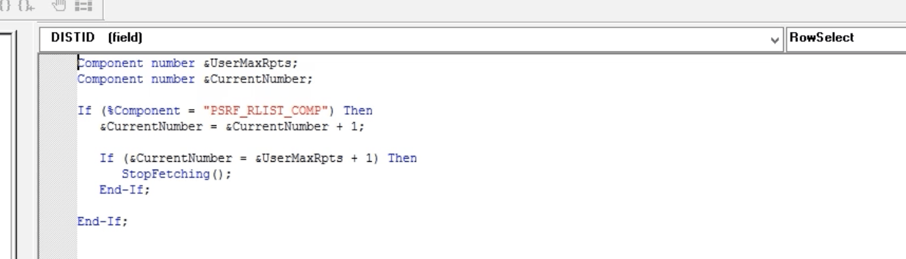   
   
   
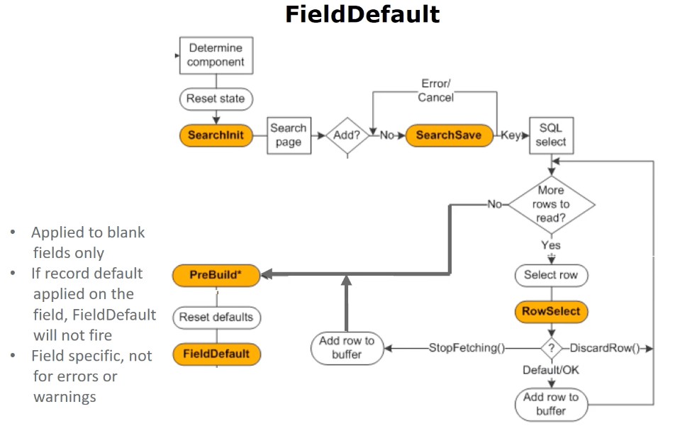   
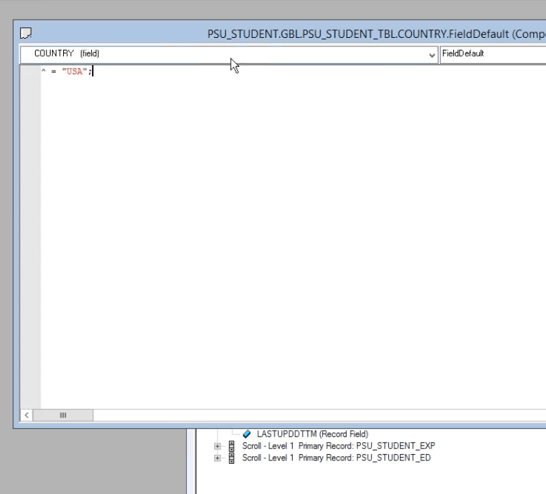   
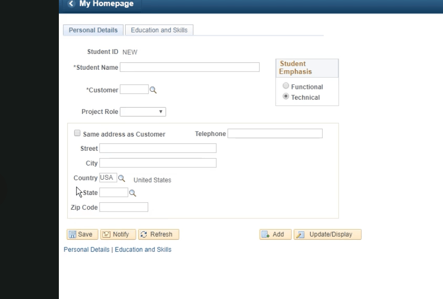   
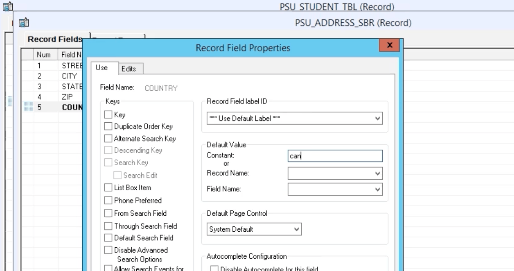   
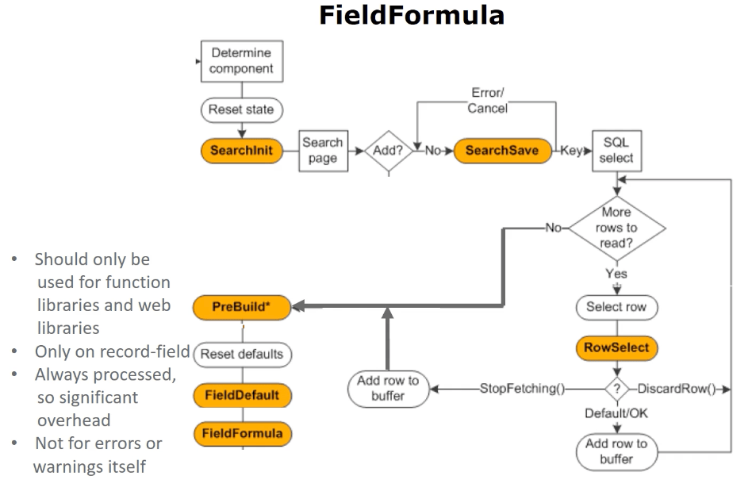   
   
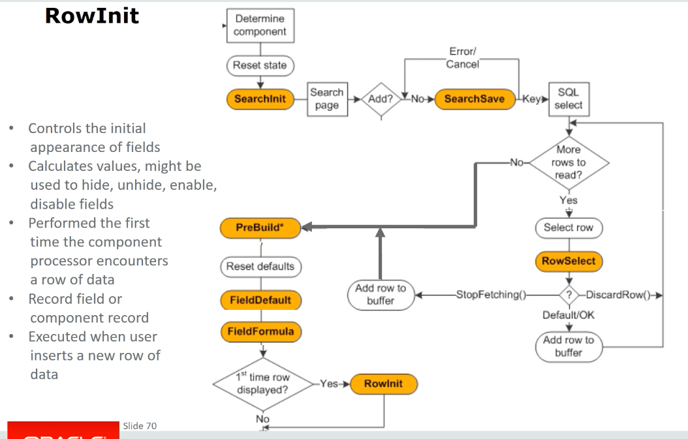   
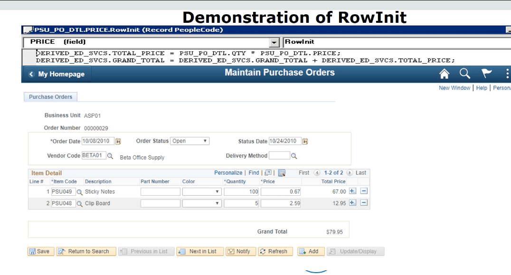   
   
   
   
   

-----------------  

## 4.4 Describing Field Action Events


### 1. **PeopleCode 欄位動作流程**
- 欄位變更後，系統先執行標準系統驗證。
- 若驗證通過，則進入 Field Edit，可設置自訂驗證邏輯。
- 若 Field Edit 通過，則進入 Field Change，進行計算或重新計算。

### 2. **Field Edit 事件**
- Field Edit 在欄位變更且通過系統驗證後執行。
- 檢查 Prompt Table、Translate Table 及 Yes/No Edit。
- 僅針對單一欄位進行驗證，不應包含賦值語句。
- 可放置於 Record Field 或 Component Record Field。
- 影響錯誤訊息與警告提示，且與延遲處理（Deferred Processing）相關。

### 3. **PeopleCode 編輯範例**
- 在 PSU_STUDENT_EDUCATION 記錄的 GPA 欄位，使用 Field Edit 事件驗證數值。
- 若 GPA 大於 4.0，則顯示警告：「GPA 高於 4.0 不被允許」。

### 4. **PIA 中的數據驗證**
- 在 PeopleSoft Internet Architecture（PIA）介面中，使用搜尋功能選擇資料行。
- 嘗試輸入 GPA 為 5.8 並儲存，系統應阻止此操作並提示錯誤。


 

### 1. **Field Change 事件與 Deferred Processing**
- 當欄位變更後，系統先執行標準系統驗證，然後執行 Field Edit PeopleCode 來檢驗新值。
- Field Edit 驗證通過後，Field Change PeopleCode 負責計算或重新計算數據。
- 延遲處理（Deferred Processing）會影響 Field Edit 和 Field Change 的執行方式。

### 2. **Field Change 事件的用途**
- 通常用來執行計算或重新計算數據，例如 GPA 計算或訂單價格更新。
- 在 PeopleSoft 中，Field Change 是 RowInit 的「夥伴事件」，兩者通常執行類似的邏輯。
- 可以用於記錄欄位或組件記錄欄位，並影響錯誤訊息與警告提示。

### 3. **Field Change 事件的應用範例**
- 當學生 GPA 大於 4.0 時，系統顯示警告：「GPA 高於 4.0 不被允許」。
- 在訂單應用程式中，當數量或價格改變時，Field Change 計算總價並更新總額。
- 在學生個人資訊表中，若地址與客戶相同，則系統自動灰顯並填入相關欄位。


### **PeopleCode 的 FieldEdit 與 FieldChange 事件解釋與比較**

#### **1. FieldEdit 事件**
FieldEdit 是 PeopleCode 事件之一，主要負責 **驗證欄位的內容**，確保資料符合系統規範，並在發生錯誤時顯示警告訊息。它的特性如下：
- **執行時機**：當使用者變更欄位後，系統執行標準驗證（如 Prompt Table、Translate Table），若通過驗證，FieldEdit 事件才會執行。
- **作用**：用於**檢查單一欄位的輸入值**，確保符合業務邏輯（如 GPA 不能超過 4.0）。
- **限制**：
  - 不應包含 **賦值語句**（例如 `&fieldValue = "New Value"`）。
  - 不能對其他欄位進行修改，僅能檢查和驗證該欄位的值。
- **錯誤與警告**：
  - 可使用 `Error` 來阻止處理（避免資料儲存）。
  - 可使用 `Warning` 讓使用者決定是否繼續。

---

#### **2. FieldChange 事件**
FieldChange 事件用於處理 **欄位變更後的邏輯運算**，它允許修改其他欄位值並執行計算操作。其特性如下：
- **執行時機**：
  - 欄位變更並通過標準系統驗證後。
  - **FieldEdit 執行完畢後，才會執行 FieldChange**。
- **作用**：
  - 用於執行 **計算或重新計算**（如 GPA 計算、總價更新）。
  - 可以修改其他欄位的值，例如自動填入相關欄位資訊。
- **允許修改其他欄位**：
  - **可以** 包含賦值語句，例如：
    ```peoplecode
    &TotalAmount = &Quantity * &Price;
    ```
  - **適合進行動態調整**，如地址欄位啟用/禁用。

---

### **3. FieldEdit 與 FieldChange 的比較**
| 特性        | **FieldEdit** | **FieldChange** |
|------------|-------------|---------------|
| **執行時機** | 欄位變更後，通過系統驗證 | FieldEdit 成功執行後 |
| **主要用途** | 驗證單一欄位值 | 執行計算、修改其他欄位 |
| **可修改其他欄位** | ✗ 不可 | ✓ 可修改 |
| **錯誤處理** | 可用 `Error` 或 `Warning` | 可用 `Warning`，但通常用來計算或調整欄位值 |
| **適用場景** | 限制欄位輸入（如 GPA 必須 ≤ 4.0） | 重新計算（如 總價更新、自動填入地址） |

---

### **4. 實作範例**
#### **FieldEdit（欄位驗證）**
```peoplecode
If &GPA > 4.0 Then
   Error "GPA 不可超過 4.0";
End-If;
```
➡ **這段程式碼在 GPA 欄位變更後執行，若超過 4.0，則阻止儲存並顯示錯誤訊息**。

#### **FieldChange（動態調整）**
```peoplecode
&TotalPrice = &Quantity * &UnitPrice;
```
➡ **當使用者修改 `Quantity` 欄位時，FieldChange 事件自動重新計算 `TotalPrice`**。

---

### **5. 總結**
- **FieldEdit** 主要用於**驗證欄位值**，但不能修改其他欄位。
- **FieldChange** 則是**負責計算**或**動態調整其他欄位**。
- **執行順序**：FieldEdit → FieldChange。
- **錯誤控制**：FieldEdit 用 `Error` 阻止儲存；FieldChange 則通常用於計算，而非錯誤驗證。


### 4. **RowInit 與 Field Change 的關聯**
- RowInit 在資料行首次載入時執行，用於初始化派生欄位或設定預設值。
- Field Change 在欄位變更時執行，確保計算邏輯正確運行。
- 在欄位灰顯與啟用過程中，RowInit 負責初始狀態，Field Change 負責動態更新。

### 5. **Row Action 事件（Row Insert & Row Delete）**
- 當使用者點選「+」或「-」時，觸發 Row Insert 或 Row Delete 事件。
- Row Insert 可用於覆蓋預設的有效日期處理，或自動編號新增的行。
- Row Delete 讓使用者刪除指定行，影響緩衝區中的資料結構。
- RowInit 會在 Row Insert 之後執行，以設定新行的初始狀態。

 
以下是 **Row Delete** 事件及其相關概念的摘要：

### 1. **Row Delete 事件的功能**
- 執行時機：使用者刪除資料列時觸發。
- 影響範圍：用於 **重新計算累計總額**、**自動編號**、**防止特定行刪除**。
- 可在 **記錄欄位**（Record Field）或 **組件記錄欄位**（Component Record Field）上使用。
- 可包含 **錯誤訊息** 以阻止刪除，或 **警告訊息** 讓使用者確認刪除動作。

### 2. **欄位狀態驗證**
- 若資料列狀態欄位設為 **1（啟用）**，則 Row Delete 事件可阻止刪除。
- 可透過錯誤訊息顯示「不可刪除此行」，防止使用者移除該列。
- 錯誤訊息會使頁面重新顯示，避免刪除的影響。

### 3. **Row Delete 事件的程式邏輯**
- **迴圈處理**：遍歷所有 **活動行數** 並調整行號。
- **邏輯判斷**：
  - 若刪除行號小於目前行號，則將剩餘行的數值 **向前調整**，確保順序維持一致。

### 4. **實作範例**
- **行刪除後的重新排序**：
  - 若刪除第 2 行，則：
    - **第 3 行 → 變成第 2 行**
    - **第 4 行 → 變成第 3 行**
    - 使所有行號維持連續性。

### 5. **WinMessage 在 Row Action 事件中的應用**
- **Row Insert 事件** 可插入 **WinMessage** 以標示事件執行時機。
- **透過 WinMessage 觀察** Row Insert 事件的運行流程，確認它在元件處理器（Component Processor）中的觸發時間。


### **PeopleCode 的 RowInsert 與 RowDelete 事件解釋與比較**

#### **1. RowInsert 事件**
RowInsert 事件在 **使用者新增資料列** 時執行，通常用於處理 **自動編號**、**預設值設定** 或 **其他邏輯運算**。它的特性如下：
- **執行時機**：
  - 當使用者點選 **「+」** 來新增行時觸發。
  - 先執行 RowInsert，然後再執行 RowInit。
- **主要用途**：
  - **設定新行的預設值**（如自動產生訂單編號）。
  - **調整有效日期**（可覆蓋 PeopleSoft 預設的有效日期複製行為）。
  - **進行自動編號處理**（確保新增的行號不重複）。
- **可修改其他欄位的值**：
  - 可使用賦值語句來設定新行的初始狀態：
    ```peoplecode
    &NewRow.ORDER_LINE = &MaxOrderLine + 1;
    ```

---

#### **2. RowDelete 事件**
RowDelete 事件用於 **處理刪除資料列**，確保刪除過程符合業務規則，並在必要時防止特定行被刪除。其特性如下：
- **執行時機**：
  - 當使用者點選 **「-」** 刪除行時觸發。
- **主要用途**：
  - **重新計算累計值**（例如訂單總金額、庫存數量）。
  - **自動調整行號**（確保刪除後仍維持正確排序）。
  - **防止特定行被刪除**（透過 `Error` 來阻止刪除）。
- **錯誤與警告**：
  - `Error`：可阻止行被刪除，如：
    ```peoplecode
    If &Status = "Active" Then
       Error "不可刪除啟用中的資料列";
    End-If;
    ```
  - `Warning`：允許使用者決定是否刪除，如：
    ```peoplecode
    Warning "確定要刪除此行？";
    ```

---

### **3. RowInsert 與 RowDelete 的比較**
| 特性        | **RowInsert** | **RowDelete** |
|------------|-------------|---------------|
| **執行時機** | 使用者新增行（點選「+」） | 使用者刪除行（點選「-」） |
| **主要用途** | 設定預設值、自動編號、調整有效日期 | 重新計算數據、調整行號、防止刪除 |
| **可修改其他欄位** | ✓ 可設定新行的值 | ✓ 可調整剩餘行的行號或計算累計值 |
| **錯誤處理** | ✗ 通常不會用 `Error` 阻止 | ✓ 可用 `Error` 防止刪除 |
| **適用場景** | 訂單編號遞增、有效日期調整 | 訂單總額計算、行號重新排序 |

---

### **4. 實作範例**
#### **RowInsert（新增行時的編號處理）**
```peoplecode
&MaxLine = 0;
For &I = 1 To ActiveRowCount(RECORD.ORDER_DETAIL)
   &Line = Fetch(RECORD.ORDER_DETAIL.ORDER_LINE, &I);
   If &Line > &MaxLine Then
      &MaxLine = &Line;
   End-If;
End-For;

RECORD.ORDER_DETAIL.ORDER_LINE = &MaxLine + 1;
```
➡ **當使用者新增一行時，系統自動計算最大行號，並將新行號設為最大行號 +1**。

#### **RowDelete（刪除行時的重新排序處理）**
```peoplecode
For &I = 1 To ActiveRowCount(RECORD.ORDER_DETAIL)
   &Line = Fetch(RECORD.ORDER_DETAIL.ORDER_LINE, &I);
   If &Line > DeletedLine Then
      RECORD.ORDER_DETAIL.ORDER_LINE = &Line - 1;
   End-If;
End-For;
```
➡ **當使用者刪除行時，系統重新調整剩餘行的行號，確保行號順序一致**。

---

### **5. 總結**
- **RowInsert** 用於 **新增行的初始設定**，如自動編號與有效日期調整。
- **RowDelete** 用於 **刪除行的調整**，如重新計算數據並確保行號順序。
- **RowInsert 影響 RowInit 執行**，而 **RowDelete 可影響其他行的數據計算**。

希望這份比較能清楚說明兩者的差異！有需要進一步探討某個部分嗎？ 😃


  
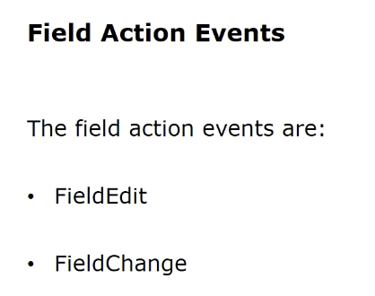  
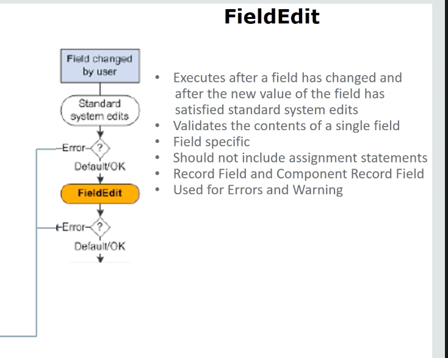  
  
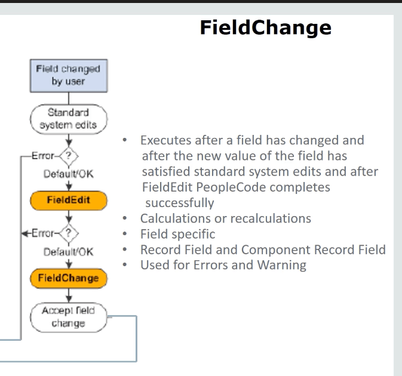  
  
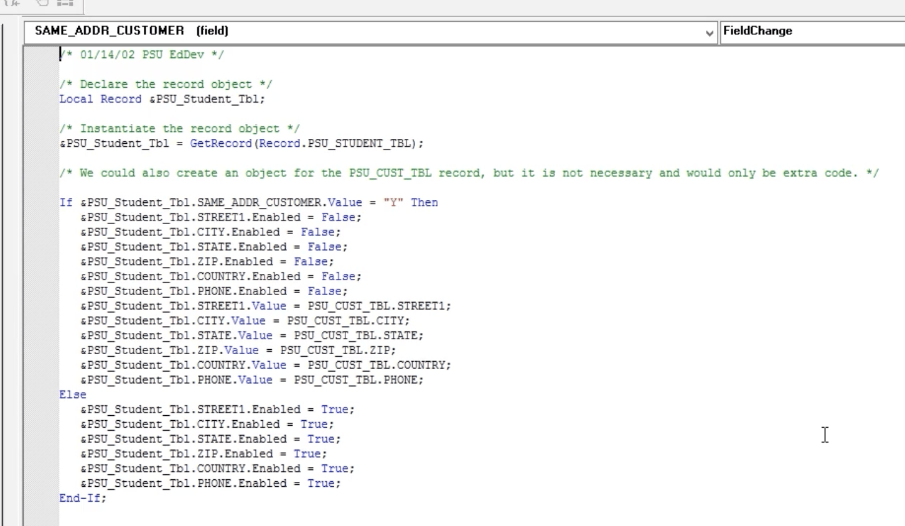  
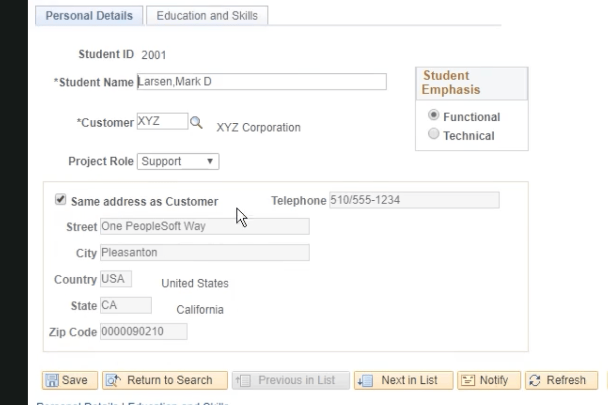  
  
  
  
  
  

所以 4.4 就教 4 個 event  兩兩一組  


----------  

## 4.5 Describing Save Action Events


### **1. Save Action Events（儲存動作事件）**
- 當使用者儲存元件時，僅寫入 **變更的資料**，但所有 Save Stream PeopleCode 仍會執行。
- **Component Processor** 負責處理 **緩衝區內的資料** 並將其更新至資料庫。
- 儲存過程中會執行 **SaveEdit、SavePreChange、Workflow** 三個 PeopleCode 事件。

---

### **2. SaveEdit 事件**
- **執行時機**：按下儲存按鈕時，為最先執行的事件。
- **作用**：確保欄位間數據一致性，進行關聯性驗證。
- **可用於**：檢查多行資料是否符合商業規則，防止異常輸入。

---

### **3. SavePreChange 事件**
- **執行時機**：在資料進入資料庫前執行最後的處理。
- **作用**：適用於數據轉換、格式化、或最後階段的欄位調整。
- **確保儲存的資料符合系統規範**。

---

### **4. Workflow 事件**
- **用途**：可觸發業務事件，如通知、工作流驅動的程序。
- **運作方式**：
  - 檢查緩衝區內的數據。
  - 確認是否符合商業規則。
  - 決定是否觸發特定業務事件。

---

### **5. SavePostChange 事件**
- **執行時機**：當 SQL DML 語法執行後，即資料已寫入資料庫後執行。
- **作用**：主要用於更新 **其他不在元件緩衝區內的資料表**。
- **處理流程**：
  1. 執行 SavePostChange PeopleCode。
  2. 發送 SQL 更新資料庫。

這些摘要應該能幫助你快速掌握 **PeopleSoft 儲存動作事件** 的主要概念！需要進一步解析某個部分嗎？ 😃
以下是文章內容的分段摘要：

### **1. SaveEdit 事件**
- 用於 **驗證多個欄位的數據一致性**，適用於所有行（但不包含已標記刪除的行）。
- 可放置於 **Record Field 或 Component Record**。
- 若有錯誤，則 **阻止元件儲存**，並顯示錯誤訊息。
- 若為警告，則允許使用者 **選擇是否繼續儲存**（點選「OK」接受或「Cancel」取消）。

---

### **2. SaveEdit 的錯誤與警告機制**
- **錯誤（Error）**：強制阻止元件儲存，要求使用者修正資料。
- **警告（Warning）**：顯示提示訊息，允許使用者決定是否覆寫警告並繼續儲存。
- **訊息清晰度**：錯誤與警告需明確說明問題，幫助使用者快速找到錯誤欄位。

---

### **3. SaveEdit 事件的應用範例**
- 在 **PSU Course Session** 元件中，設定 **開始日期不可晚於結束日期**。
- 使用 `Message Catalog` 來存儲錯誤訊息，確保訊息一致性。
- 若開始日期大於結束日期，則 **顯示錯誤並阻止儲存**：
  ```peoplecode
  If &StartDate > &EndDate Then
     Error MsgGet(1040, 3, "課程開始日期不可晚於結束日期");
  End-If;
  ```
- 在 **PIA** 介面測試時，輸入開始日期為 2018、結束日期為 2013，按下儲存按鈕後觸發 `SaveEdit` 事件。

---

### **4. SavePreChange 事件**
- 在 **SaveEdit 驗證完成後執行**，是修改資料的最後機會。
- **主要用途**：
  - **執行額外的計算**（例如自動產生序號）。
  - **更新其他欄位**（如動態設定有效日期）。
  - **執行連鎖更新**（例如更新庫存數據）。
- **不能** 用於錯誤或警告訊息。

---

### **5. SavePreChange 事件的應用範例**
- **自動生成訂單號碼（Order Number）**
  ```peoplecode
  If RECORD.ORDER_NBR = "NEW" And Mode = "ADD" Then
     RECORD.ORDER_NBR = AssignOrderNumber();
  End-If;
  ```
- 在 **PIA 購物訂單** 介面，輸入新訂單資料並點擊儲存時，`SavePreChange` 事件自動產生訂單編號。

 

### **1. SavePreChange 事件的執行時機與目的**
- **延遲產生訂單號碼**，避免未儲存的訂單浪費可用編號。
- **確保數據完整性**，僅在確定儲存時才執行最終計算。
- 可用於 **修改數據**，但不適合顯示錯誤或警告訊息。

---

### **2. Workflow 事件**
- **適用於業務流程自動化**，可放置於 Record Field 或 Component。
- 不能用於 **錯誤或警告處理**，僅用於觸發業務事件。
- 詳細內容可在 **PeopleSoft Workflow 課程**（為期四天）中深入學習。

---

### **3. SavePostChange 事件**
- **執行時機**：SQL 更新資料庫後，但 **尚未提交（Commit）** 前執行。
- **主要用途**：
  - 更新 **不在元件緩衝區內** 的資料表。
  - 進行 **系統整合**（如傳送訊息至 Integration Broker）。
  - **級聯更新**：透過 SQL 語法影響外部表格的資料。

---

### **4. SavePostChange 事件的應用範例**
- **當客戶地址變更時**，系統透過 `SQLExec` 更新學生表中的對應地址：
  ```peoplecode
  If FieldChanged(RECORD.CUSTOMER.STREET1, RECORD.CUSTOMER.CITY, RECORD.CUSTOMER.STATE, RECORD.CUSTOMER.ZIP, RECORD.CUSTOMER.COUNTRY, RECORD.CUSTOMER.PHONE) Then
     SQLExec("UPDATE STUDENT_TABLE SET ADDRESS = :1 WHERE CUSTOMER_ID = :2", RECORD.CUSTOMER.STREET1, RECORD.CUSTOMER.CUSTOMER_ID);
  End-If;
  ```
- **變更生效後，資料自動同步至學生資訊表**。

---

### **5. WinMessage 在 SaveEdit 事件中的應用**
- **活動 8：測試 SaveEdit 事件的執行順序**。
- **插入 WinMessage** 來追蹤事件何時在 Component Processor 流程中執行。
 

   
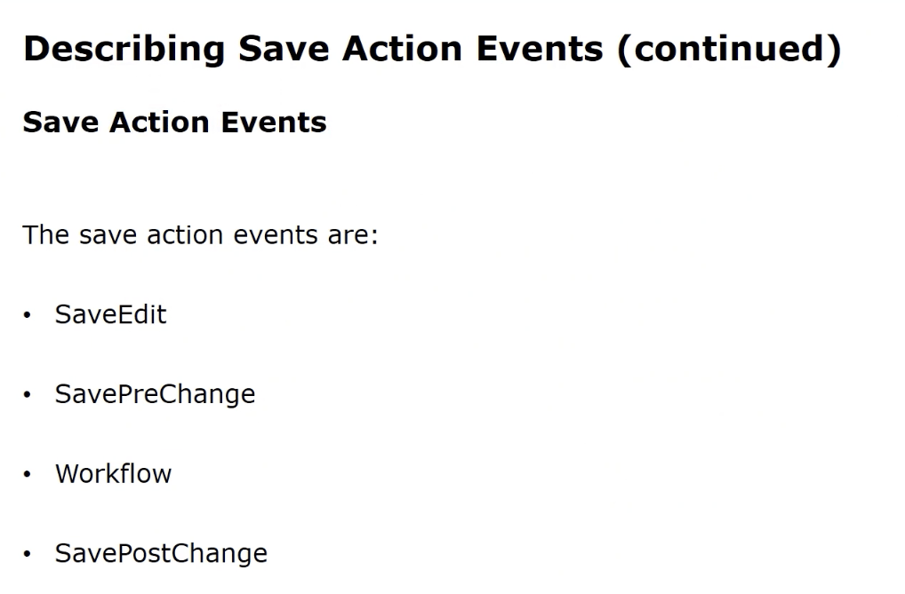   
   
   
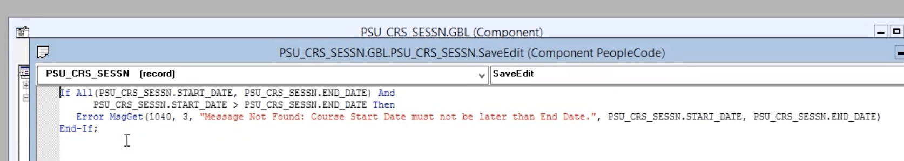   
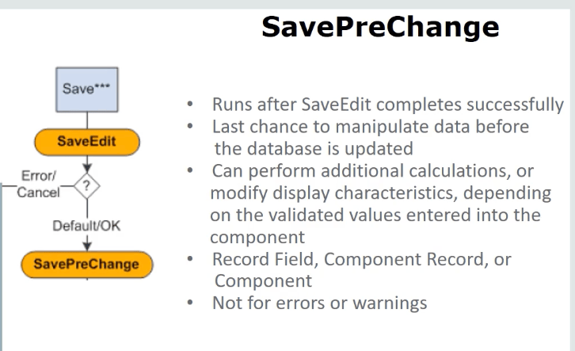   
   
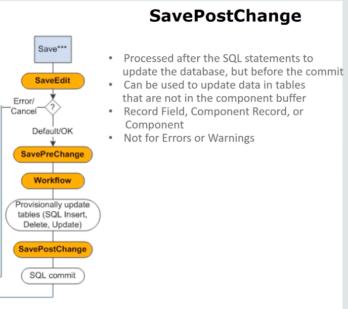   
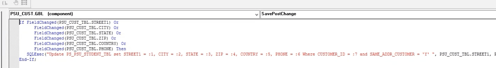   


---------------  

## 4.6 Describing Add Mode Processing

 

### **1. Add Mode Processing（新增模式處理）**
- **執行順序**：`SearchInit → SearchSave → RowSelect → PreBuild → FieldDefault → FieldFormula → RowInit → PostBuild → Activate`。
- 在新增模式（Add Mode）下，系統不會載入現有資料，而是 **建立新的資料列**。
- `SearchSave` 事件可用於驗證關鍵欄位（例如防止使用預留的 `UserID`）。
- **適用於**：新增使用者、訂單、課程等需要獨立編號的資料。

---

### **2. SearchSave 事件**
- **用途**：在新增模式下驗證輸入的關鍵欄位是否有效。
- **範例**：
  - 若 `UpperID = "pplsoft"`，則顯示錯誤：「使用者 ID 為預留 ID，不可使用」。
  - 透過 `Error` 來阻止不符合業務規則的資料被儲存。

---

### **3. 其他元件處理流程**
- **Cancel Processing（取消處理）**：
  - 允許使用者 **取消目前操作**，避免誤儲存未完成的資料。
- **Pop-Up Menu Processing（彈出式選單處理）**：
  - 在 **PeopleSoft 8 版本之前**，允許透過彈出式選單觸發 `PeopleCode` 事件。

---
 

### **1. Pop-Up Menu 及超連結**
- **Pop-Up Menu 仍可在 PeopleSoft Application Designer 建立**，但現在 **主要使用超連結** 來實現相同功能。
- **Pre Pop-Up 與 Item Selected 事件** 已不再廣泛使用。

---

### **2. Server Trips（伺服器請求）與處理模式**
- **每次伺服器請求都會耗費時間**，影響系統效能與使用者體驗。
- **互動模式（Interactive Mode）**：
  - 每次 **FieldEdit 或 FieldChange** 都會立即與伺服器互動，影響效能。
- **延遲處理模式（Deferred Processing Mode，預設值）**：
  - 減少伺服器請求，提高系統與網路效能。

---

### **3. Component、Page 與 Field 的處理模式**
- 若 **Component 設為互動模式**，則 **所有頁面與欄位皆為互動模式**。
- 若 **Component 設為延遲處理模式**，則會依 **頁面設定** 決定處理方式：
  - **頁面為互動模式**：所有欄位皆為互動模式。
  - **頁面為延遲處理模式**：則由 **欄位層級決定** 是互動或延遲處理。

---

### **4. Refresh Button（刷新按鈕）與 Expert Entry（專家輸入）**
- **Refresh Button**：
  - 允許使用者 **手動觸發伺服器請求**，強制刷新元件。
- **Expert Entry（專家輸入選項）**：
  - 當使用者啟用「專家輸入」，元件將 **強制使用延遲處理模式**。
  - 若未啟用，則元件依預設模式運行。

---


### **1. Deferred Processing 與 Interactive Mode（延遲處理 vs. 互動模式）**
- **可延遲處理的欄位**：
  - 提示表（Prompt Table）驗證欄位。
  - 具 **相關顯示**（Related Display）的欄位。
- **無法延遲處理的操作**：
  - 插入或刪除 Grid/Scroll 中的行。
  - 使用 Grid/Scroll 控制來移動或切換頁籤。
  - 展開或收合區塊。
  - 點擊按鈕、連結、圖示或刷新（Refresh）按鈕。

---

### **2. Processing Mode 設定**
- **元件層級（Component）設定優先**：
  - 若 **Component 設為互動模式**，所有頁面與欄位皆為 **互動模式**。
  - 若 **Component 設為延遲模式**，則由 **頁面層級決定**。
- **頁面層級（Page）處理方式**：
  - 若 **Page 設為互動模式**，所有欄位皆立即與伺服器互動。
  - 若 **Page 設為延遲模式**，則由 **個別欄位決定**處理方式。
  
---

### **3. Processing Mode 在 PIA 介面中的運作**
- **互動模式**：
  - 欄位變更後立即執行驗證（如輸入 `yyy` 後立刻顯示錯誤）。
  - 離開欄位時，會立即載入相關顯示資訊。
- **延遲模式**：
  - 欄位變更後不立即執行，而是等到使用者點擊「儲存」或「提交」時執行。

---

 

### **1. Deferred Mode 與 Interactive Mode 在 Component 的影響**
- 若 **Component 設為延遲處理模式（Deferred Mode）**，則由 **Page 決定** 處理方式。
- 若 **Page 設為延遲模式**，則再由 **欄位（Field）決定** 是否互動。
- **頁面層級設定**：
  - **Student Personal Information** 設為 **互動模式**，欄位變更後即時執行驗證。
  - **Education and Skills** 設為 **延遲處理模式**，欄位變更不立即執行。

---

### **2. Deferred Mode 的運作示範**
- 在 **Student Personal Information 頁面**：
  - 修改 `Customer` 欄位為 `CONS`，立即更新相關欄位值（因為該頁面為互動模式）。
- 在 **Education and Skills 頁面**：
  - 修改 `Skill` 欄位為 `xxx`，沒有即時更新（因為該頁面為延遲處理模式）。
  - 需按 **Refresh 按鈕**、**查詢（Lookup）** 或 **插入新行** 才會觸發伺服器請求。

---

### **3. 在延遲模式下修改欄位為互動模式**
- **欄位層級控制**：
  - 可將 **Skill 欄位設為互動模式**，即使頁面為延遲處理模式，該欄位仍可即時驗證輸入值。
- **效果展示**：
  - Component = Deferred，Page = Deferred，但 Skill 欄位 = Interactive。
  - `Skill = xxx` 時，立即執行驗證，而其他欄位仍維持延遲處理模式。

---

 

### **1. Expert Entry（專家輸入）**
- **Expert Entry** 允許使用者覆蓋頁面處理模式，讓所有 **互動模式（Interactive Mode）** 的頁面改為 **延遲處理模式（Deferred Mode）**。
- 可以在 **User Profiles** 內啟用「Allow Expert Entry」，提升使用者對處理模式的掌控權限。
- 若選擇「Expert Entry」，則即使頁面是 **互動模式**，仍會以 **延遲處理模式** 執行。

---

### **2. 設定 Expert Entry 的影響**
- 若 **Expert Entry 啟用**：
  - 頁面設定的 **互動模式** **將被覆蓋**，改為 **延遲處理**。
  - 使用者 **離開欄位時不立即執行驗證**，而是等到儲存或手動刷新時才更新。
- 若 **Expert Entry 取消**：
  - 頁面處理模式 **回復為原始設定**（互動或延遲）。

---

### **3. Component Processor Flow（元件處理流程）**
- **PeopleSoft 元件處理可分為七個主要階段**：
  1. **搜尋（Search）**：`SearchInit`、`SearchSave`。
  2. **元件建立與頁面顯示（Component Build & Page Display）**：`RowSelect`、`PreBuild`、`FieldDefault`、`FieldFormula`、`RowInit`、`PostBuild`、`Activate`。
  3. **欄位動作（Field Actions）**：`FieldEdit`、`FieldChange`。
  4. **資料列動作（Row Actions）**：`RowInsert`、`RowDelete`。
  5. **儲存動作（Save Actions）**：`SaveEdit`、`SavePreChange`、`Workflow`、`SavePostChange`。
  6. **取消處理（Cancel Processing）**。
  7. **彈出選單處理（Pop-Up Menu Processing）**。

---

### **4. Deferred Processing 與使用者體驗**
- **延遲處理提升系統效能**，但可能會影響即時回饋。
- 在互動模式下：
  - 欄位值變更後 **立即驗證**，使用者可以即時看到回應。
- 在延遲處理模式下：
  - 欄位值變更後 **不會立即執行驗證**，需 **手動儲存或刷新** 才更新。
 

  
  
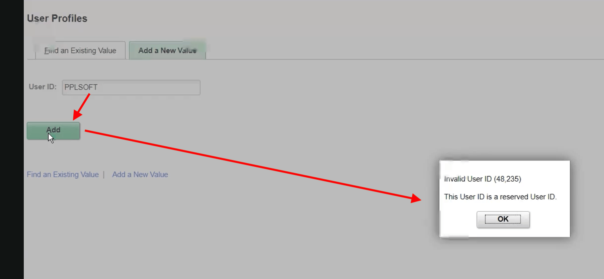  
  
  
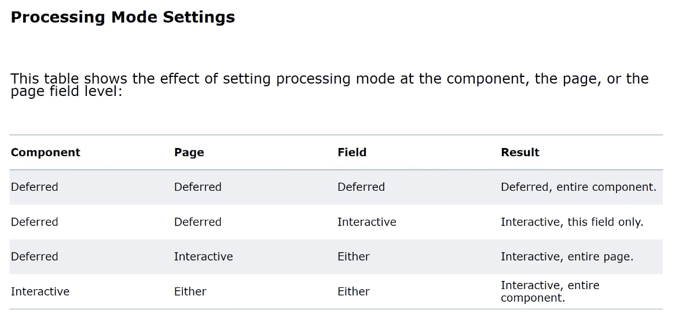  
  
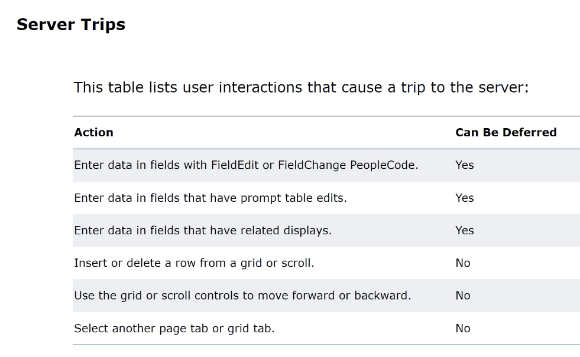  
  
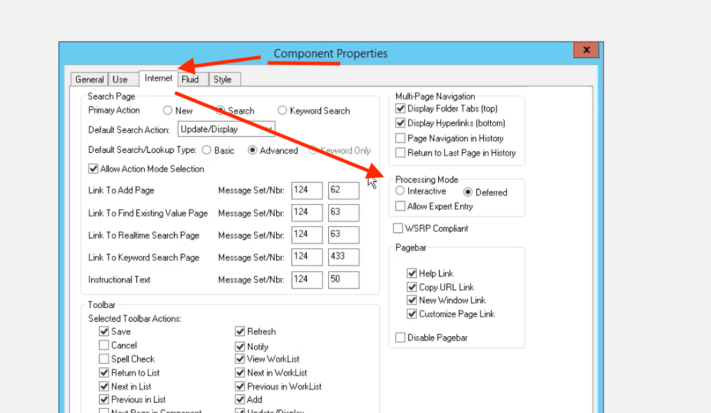  
  
  
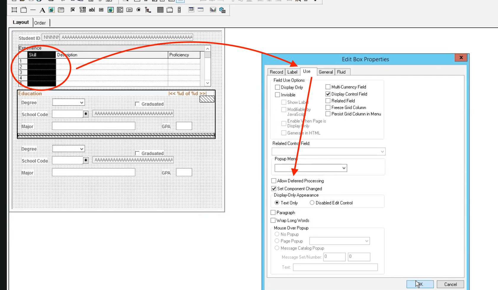  
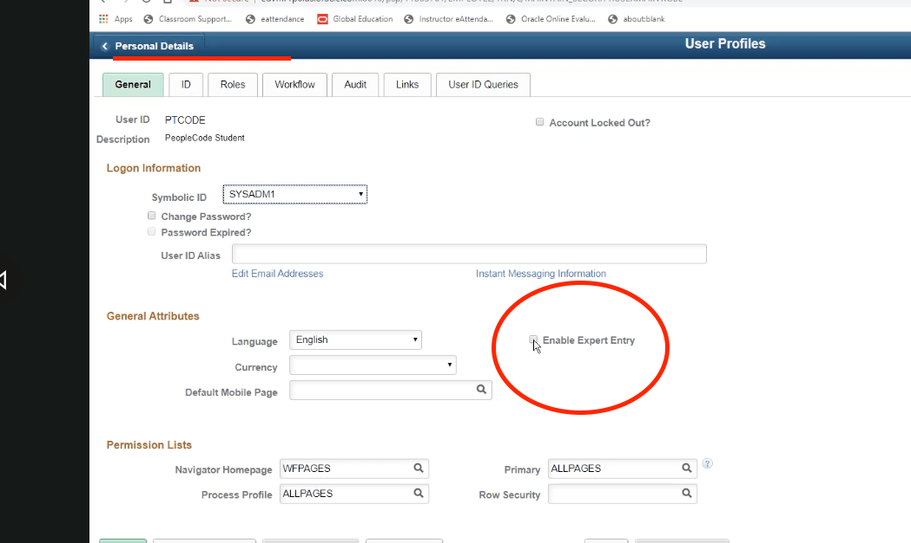  
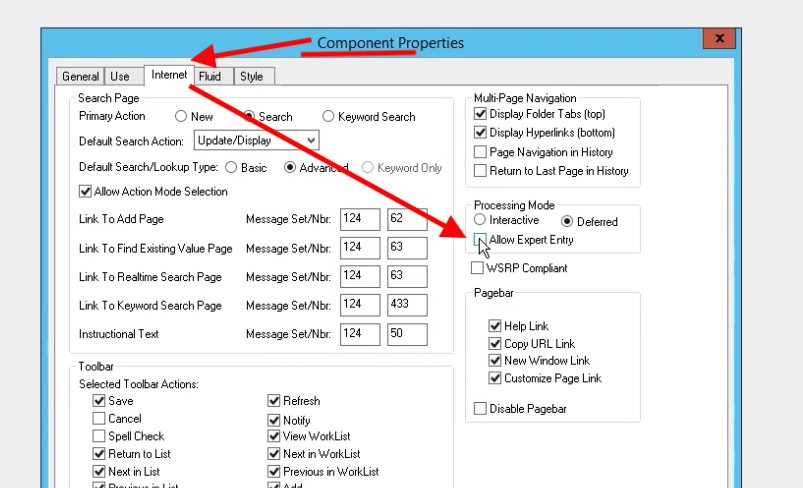  
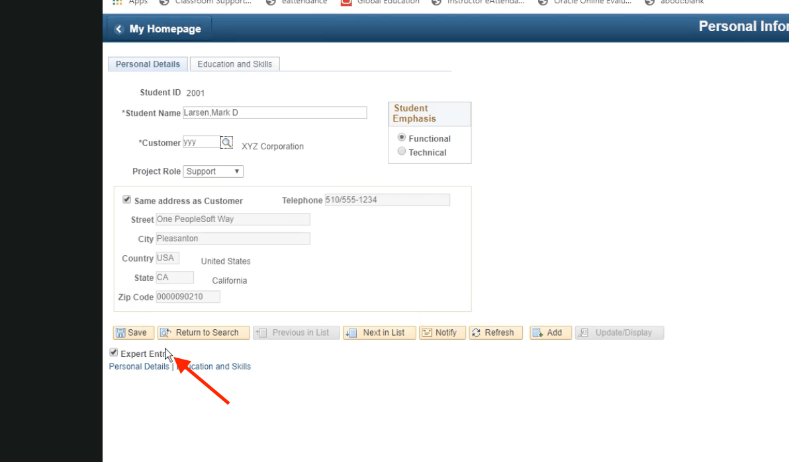  

----------

## 4.7 Activity 4: Using SearchInit to Control the Search Page

這節是練習了  
怎麼用這些技術，不需要經過搜尋畫面，就能進到操作者的資料去  
myresume  不知道有沒有  
這一節完全就是在講 `SetSearchDialogBehavior(0)` 而已  
到時候去公司搜尋看看 code  


### **活動概述：使用 SearchInit 控制搜尋頁面**
- **SetSearchDialogBehavior** 可用於略過標準元件的搜尋頁面。
- 本活動展示如何利用 **SetSearchDialogBehavior(0)** 讓使用者直接進入目標頁面，而無需先經過搜尋頁面。

這邊在說明怎麼操作來玩這個功能而已
### **活動詳細步驟**
- 透過 **Navigator** 進入 **My System Profile**，直接開啟 **General Profile Information** 頁面，顯示登入使用者的資料。
- 在 **PIA** 介面中，點選導覽列進入 **Navigator**，再點擊 **My System Profile**，系統將直接進入對應的資訊頁面，而非搜尋頁面。

### **開啟記錄定義**
- 在 **Application Designer** 中，以 **雙層模式** 登入後，開啟 **PSUSERSELF_SRCH** 記錄定義。
- 透過 **File > Open > Record**，選取 **PSUSERSELF_SRCH** 並開啟。

### **修改 SearchInit 程式**
- **右鍵點擊 OPRID 欄位**，選擇 **View PeopleCode** 進入 **SearchInit 事件**。
- 使用 **REM 註解** 關閉 **SetSearchDialogBehavior(0)**，讓系統恢復顯示搜尋頁面，而不直接跳轉目標頁面。

### **測試與結果**
- 點選 **Home** 圖示，從 **Recent Places** 選擇 **My System Profile**，發現頁面不再直接顯示資料，而是出現搜尋介面，並預填 **PT Code** 作為使用者 ID。
- 按 **F5** 或透過導覽列操作，都會先顯示搜尋頁面，使用者需輸入條件才能進入 **General Profile Information**。

這樣的流程反映了 **SetSearchDialogBehavior(0)** 控制搜尋頁面的作用，註解該行後即回復標準搜尋行為。希 


  

-------------  

## 4.8 Activity 5: Placing WinMessage in Search Events

這節在測試 `SearchInit` 和 `SearchSave` 的執行時機點  
可以對照前面的 flow 圖來看  
我比較好奇的是，為什麼表現出來的 UI 不一樣  

更神奇的是，兩邊都用同樣的定義方式  
那這樣我們怎麼知道有存在？？？？  


### **活動概述：在搜尋事件中加入 WinMessage**
- **WinMessage** 可用來測試 **SearchInit** 和 **SearchSave** 事件的執行時機。
- 透過在這些事件中加入 **WinMessage**，使用者可明確觀察事件何時被觸發。

### **活動詳細步驟**
- 在 **PeopleSoft Application Designer** 開啟 **PSU_INSTR** 元件定義。
- 於 **Structure** 標籤中，右鍵點擊 **PSU_INSTR**，選擇 **View PeopleCode**。
- 在 **左側選單** 選擇 **PSU_INSTR_TBL** 記錄，在 **右側選單** 選擇 **SearchInit** 事件。

### **編寫 PeopleCode**
- 定義 **整數型變數 &C**，並在事件執行時 **累加數值**。
- 使用 **WinMessage** 顯示事件名稱、元件名稱、記錄與欄位值，以及 **計數器值**。
- **驗證程式碼** 是否有錯誤，確保 WinMessage 正確執行。

### **加入 SearchSave 事件**
- 於 **右側選單** 切換至 **SearchSave** 事件。
- **複製** 之前的程式碼，修改訊息內容為 **SearchSave**。
- **儲存變更**，確保事件可正確運行。

### **測試與結果**
- 進入 **Instructors, Professional Details** 頁面，確保 **SearchInit 事件** 在頁面載入前執行，顯示對應訊息。
- 在搜尋頁面輸入 **JEG** 並執行搜尋，確認 **SearchSave 事件** 執行並顯示訊息。
- 事件觸發順序：
  - **SearchInit 在搜尋頁面顯示前觸發**
  - **SearchSave 在搜尋條件提交後觸發**


在 **PeopleCode** 中，`Component` 變數和 `Global` 變數各自擁有不同的作用域與適用場景。以下是它們的詳細比較：

| **比較項目**   | **Component 變數** (`Component.`) | **Global 變數** (`Global.`) |
|---------------|--------------------------------|----------------------------|
| **作用域（Scope）** | 只能在 **同一元件（Component）內的所有事件** 存取 | 可在 **整個 PeopleSoft Session** 內存取（跨元件） |
| **生命週期（Lifetime）** | **元件開啟後至關閉前有效**，離開元件後變數消失 | **Session 持續有效**，直到使用者登出或 Session 終止 |
| **事件存取** | **可在相同元件的多個事件間共享**（如 `RowInsert`、`SaveEdit`） | **可在所有事件**（不同元件的 `SearchSave`、`FieldChange`）存取 |
| **跨元件** | **不能跨元件**（只限於目前開啟的元件） | **可跨元件**，不同 Component 均可讀取與修改 |
| **適用場景** | - **在相同元件內共享計數或狀態資訊**<br>- **避免使用 Local 變數導致每次事件重置數據** | - **需要跨元件共享資料，如登入狀態、Session 計數**<br>- **避免頻繁使用 Component 變數，提升可存取範圍** |
| **範例** | `Component integer &count;` <br> 在 `SearchInit` 設定值，`SavePostChange` 讀取 | `Global integer &sessionCounter;` <br> 可在 `FieldChange` 設定值，`SearchSave` 讀取 |  

以下是 **Local、Component、Global** 變數在 **PeopleCode** 中的詳細比較：

### **作用域（Scope）與存取範圍**
| **變數類型**  | **Local 變數 (`Local &`)** | **Component 變數 (`Component &`)** | **Global 變數 (`Global &`)** |
|--------------|------------------|----------------------|----------------------|
| **存取範圍** | **僅限於當前事件或函式內** | **可在相同元件內的所有事件間存取** | **可在所有元件、所有事件間存取** |
| **跨事件存取** | **不能跨事件**，事件結束變數就消失 | **可以跨事件**，但僅限於元件內 | **可跨所有事件** |
| **跨元件存取** | **不能跨元件** | **不能跨元件** | **可以跨元件** |

### **生命週期（Lifetime）**
| **變數類型**  | **Local 變數 (`Local &`)** | **Component 變數 (`Component &`)** | **Global 變數 (`Global &`)** |
|--------------|------------------|----------------------|----------------------|
| **變數存續時間** | 只在事件執行期間有效，事件結束即消失 | 元件開啟後到關閉前都有效 | 保留至使用者登出或 **Session 終止** |
| **是否會被清除** | **事件結束後消失** | **離開元件後變數消失** | **使用者登出後變數消失** |
| **適合儲存** | **暫時性計算數據** | **元件內共享的狀態資訊** | **Session 內的共享數據** |

### **範例與應用場景**
#### **1. Local 變數**
適用於 **僅限當前事件內的計算**：
```peoplecode
Function ComputeTotal(&price As Number, &quantity As Number) Returns Number
   Local &total; /* 只在此函式內有效 */
   &total = &price * &quantity;
   Return &total;
End-Function;
```
- `Local &total` **只能在 ComputeTotal 函式內存取**，函式執行結束後變數即消失。

#### **2. Component 變數**
適用於 **元件內不同事件間共享變數**：
```peoplecode
Component integer &C;

/* 在 SearchInit 事件內設定初始值 */
If (IsNull(&C)) Then
   &C = 1;
End-If;

/* 在 SearchSave 事件內累加計數器 */
&C = &C + 1;
WinMessage("計數值：" | &C);
```
- `Component integer &C` **可在同一元件內的所有事件存取**，確保計數值不會在事件結束後消失。

#### **3. Global 變數**
適用於 **跨元件的 Session 變數**：
```peoplecode
Global string &UserRole;

Function SetRole()
   &UserRole = "Administrator";
End-Function;

Function GetRole()
   WinMessage("目前角色：" | &UserRole);
End-Function;
```
- `Global string &UserRole` **可在所有元件內存取**，不同元件均能讀取與修改。

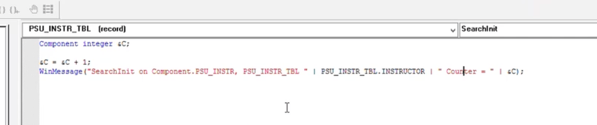  
  
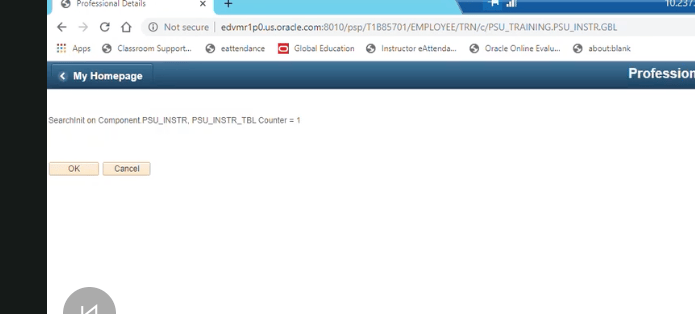  
  
  


--------------  

## 4.9 Activity 6: Placing WinMessage in Component Build Events


### **活動概述：在 Component Build 事件中加入 WinMessage**
- **WinMessage** 用於測試 **PreBuild** 和 **RowInit** 事件的執行時機。
- 透過在這些事件中加入 **WinMessage**，使用者可以清楚看到 **Component Processor** 的執行順序。

### **活動詳細步驟**
- 在 **PeopleSoft Application Designer** 中，開啟 **PSU Instructor** 元件定義。
- 於 **Structure** 標籤中，右鍵點擊 **PSU Instructor**，選擇 **View PeopleCode**。
- 在 **左側選單** 選擇 **PSU Instructor Table** 記錄，在 **右側選單** 選擇 **RowInit** 事件。

### **編寫 RowInit 事件的 PeopleCode**
- 定義 **Component integer &C** 變數，並在事件執行時 **累加計數值**。
- 使用 **WinMessage** 顯示 **RowInit 事件名稱、元件名稱、記錄欄位值、計數器值**。
- 加入 **樣式參數（Style Parameter）** 來影響頁面渲染方式。

### **加入 PreBuild 事件**
- 在 **左側選單** 選擇 **Instructor Component**，在 **右側選單** 切換至 **PreBuild**。
- **複製** RowInit 的 PeopleCode，將事件名稱修改為 **PreBuild**。
- **儲存變更**，確保 **PreBuild 事件** 可正常執行並顯示 WinMessage。

### **測試與結果**
- **RowInit 事件**：在頁面載入時執行，顯示 Instructor 記錄的訊息與計數值。
- **PreBuild 事件**：在元件建立之前執行，確保初始邏輯被執行。
- 這些事件的測試有助於理解 **Component Processor Flow**，讓開發者掌握事件觸發順序。


### **事件執行順序**
1. **SearchInit 事件** 先執行，並初始化計數器為 `1`。
2. **SearchSave 事件** 於搜尋提交時執行，計數器加 `1`（變為 `2`）。
3. **進入元件後，Component Buffer 啟動**，**PreBuild 事件** 立即執行，計數器重置為 `1`（不同於搜尋計數）。
4. **RowInit 事件** 在每個 Level 1 Scroll Row 上執行，每行累加計數值。

### **RowInit 事件的特性**
- **RowInit 事件會在每個記錄行執行**，即 **每個資料列都會觸發一次**。
- **計數器 &C 會根據行數遞增**：
  - 第一行 `RowInit = 2`
  - 第二行 `RowInit = 3`
  - 第三行 `RowInit = 4`
- **RowInit 的執行次數與 Level 1 Scroll 中的記錄行數相對應**。

### **結果與觀察**
- **PreBuild 事件** 確保元件初始化完成，計數器重設。
- **RowInit 事件** 依照資料行數執行，每行遞增。
- **最終 RowInit 的次數等於記錄行數**（如果有 3 行，則最後一次計數為 `4`）。

延續上面的 4.8  
Search buffer 跟 Component Buffer 有所區別  
所以 &C 被是不同的  

回顧 4.8 最後一張圖  
  

接著看  

  
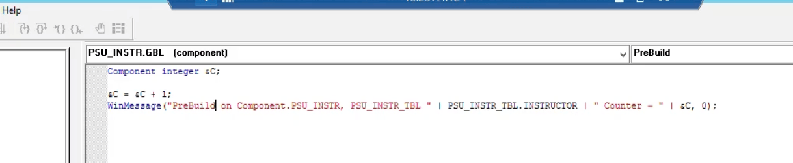  
  
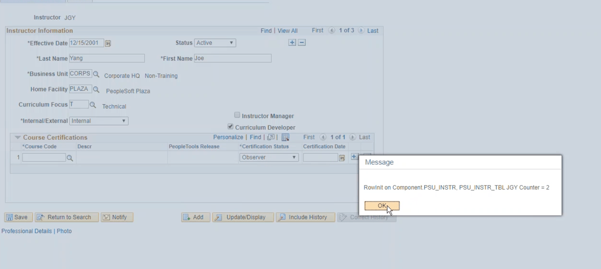  
  
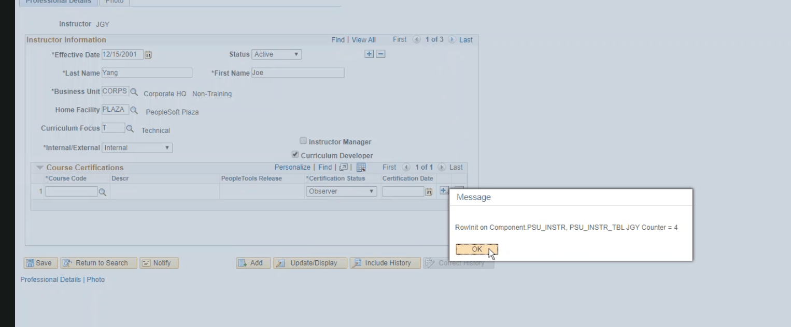  


-----------

## 4.10 Activity 7: Placing WinMessage in Row Action Events

延續 4.9 的範例繼續下去 

以下是文章的摘要整理，每段以 3 到 5 條重點說明：

### **活動概述：在 Row Action 事件中觀察 WinMessage**
- **WinMessage** 用於測試 **RowInsert 事件** 的執行時機。
- **RowInsert 事件** 在使用者 **插入新行** 時觸發，影響 **Component Processor Flow**。
- 透過 **WinMessage**，可觀察 **RowInsert 事件與 RowInit 事件的執行順序**。

### **事件執行順序**
1. **SearchInit 事件執行**（計數器初始化為 `1`）。
2. **SearchSave 事件執行**（計數器加 `1`）。
3. 進入 **元件後，Component Buffer 啟動**，**PreBuild 事件** 立即執行（計數器重置為 `1`）。
4. **RowInit 事件** 依據 **現有的三行記錄** 執行，每行遞增計數值。

### **插入新行時的事件執行**
- **RowInsert 事件** 在 **使用者插入新行（點選「＋」）** 時觸發。
- 插入新行後，**RowInit 事件** 再次執行，初始化行資料並累加計數器。
- **RowInsert -> RowInit** 的執行順序：
  1. 按 **+** 插入新行 → **RowInsert 觸發**
  2. **RowInit 觸發** 並對新行進行初始化
  3. 計數值遞增，顯示在 WinMessage 訊息框中。

### **結果與觀察**
- **RowInsert 事件** 控制新行插入的邏輯，**RowInit 事件** 負責初始化行內資料。
- **RowInit 事件執行次數與行數相符**，例如：
  - 第一次 `RowInit = 2`
  - 第二次 `RowInit = 3`
  - 最後一次 `RowInit = 4`
- **RowInsert 事件只執行一次**，但 **RowInit 事件對所有行執行**。


RowInsert 執行完後，又會有一次  RowInit  


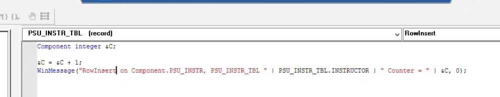  
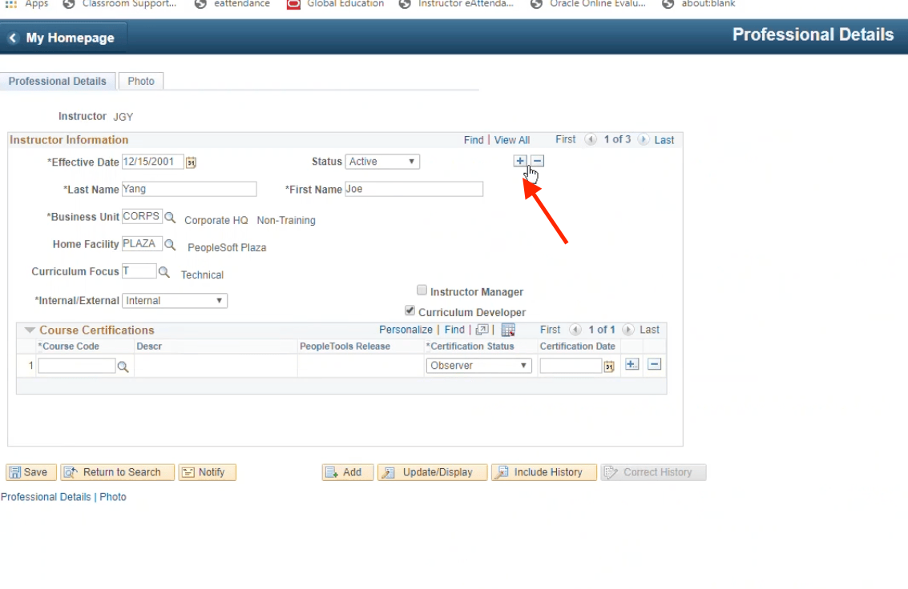  
  
  

--------------  

## 4.11 Activity 8: Placing WinMessage in Save Action Events


### **活動概述：在 Save Action 事件中加入 WinMessage**
- **WinMessage** 用於測試 **SaveEdit 事件** 的執行時機。
- **SaveEdit 事件** 在使用者 **點擊「儲存」時** 觸發，主要用於 **資料驗證與保存控制**。
- 透過 **WinMessage**，開發者可以清楚看到 **SaveEdit 事件何時被觸發**。

### **活動詳細步驟**
- 在 **PeopleSoft Application Designer** 開啟 **PSU Instructor** 元件定義。
- 於 **Structure** 標籤中，右鍵點擊 **PSU Instructor**，選擇 **View PeopleCode**。
- 在 **左側選單** 選擇 **PSU Instructor Table** 記錄，在 **右側選單** 選擇 **SaveEdit** 事件。

### **編寫 SaveEdit 事件的 PeopleCode**
- **定義 Component integer &C 變數**，並在 **SaveEdit 事件執行時累加計數值**。
- **使用 WinMessage 顯示 SaveEdit 事件名稱、元件名稱、記錄欄位值、計數器值**。
- **儲存變更**，確保 **SaveEdit 事件** 可正常執行並顯示 WinMessage。

### **SaveEdit 事件的執行流程**
1. 進入 **Professional Details**，初始化 **Component Buffer**。
2. 點選 **Correct History**，選擇 **Instructor JGY**，修改 Instructor 資料（如增加 middle initial）。
3. 按 **Save**，觸發 **SaveEdit 事件**，WinMessage 顯示變數值：
   - 第一次 SaveEdit 計數器 **= 5**
   - 再次執行 **= 6**
   - 最後 **= 7**
4. **SaveEdit 事件對所有 Level 1 行執行，但只保存被更改的資料**。

### **結果與觀察**
- **SaveEdit 事件執行一次，適用於每行的資料驗證**。
- **計數器值根據行數累加**（如果有 3 行，則 SaveEdit 會執行 3 次）。
- **僅修改的資料才會被存入，不影響未變更的行**。
 

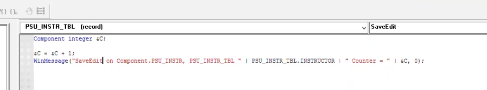  
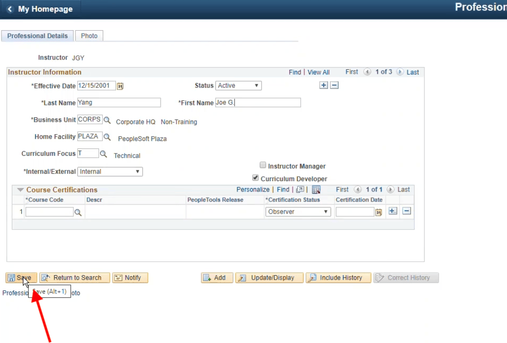  
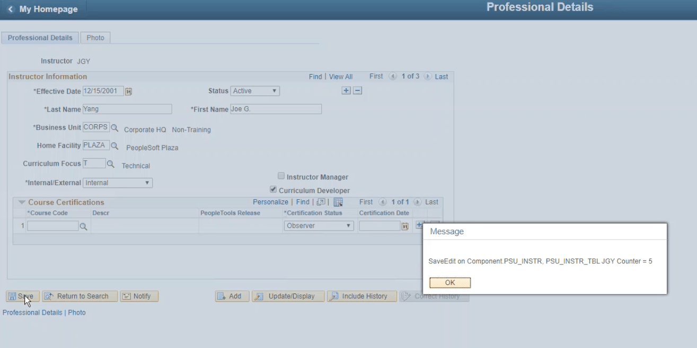  
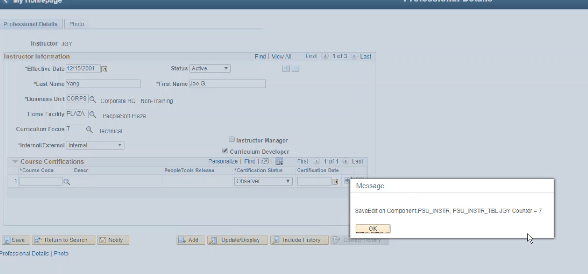  

----------  

## 4.12 Activity 9: Examining Deferred Processing


### **活動概述：檢視 Deferred Processing**
- **Deferred Processing** 可在 **元件（Component）、頁面（Page）、欄位（Field）** 層級進行控制。
- 預設情況下，**元件的 Processing Mode 設為 Deferred**，代表啟用了延遲處理模式。
- 此活動將探討如何在 **PeopleSoft Application Designer** 設定 Deferred Processing。

### **活動詳細步驟**
- 在 **PeopleSoft Application Designer** 開啟 **PSU_TASK_RESOURCES** 元件定義。
- 選擇 **File > Definition Properties**，開啟 **Component Properties** 對話框。
- 前往 **Internet** 標籤，找到 **Processing Mode** 設定選項。

### **Processing Mode 設定**
- **Interactive**：所有操作**即時回應**，每次變更都會觸發後端處理。
- **Deferred**：系統會**延遲送出**使用者的變更，直到使用者執行提交動作（如儲存）。
- **允許 Expert Entry**：可讓 **具備 Expert Entry 權限的使用者** 強制執行 Deferred Mode，即使元件原本為 Interactive。

### **使用者權限設定**
- 在 **PeopleTools > Security > User Profiles > User Profiles**，查詢使用者 ID（如 `PTCODE`）。
- 在 **General 頁面**，確認 **Enable Expert Entry** 選項是否被啟用。
- 若 **元件允許 Expert Entry**，但此選項未開啟，則該使用者仍無法進行 Expert Entry 操作。

### **結果與觀察**
- 元件的 **Processing Mode** 可決定其處理方式（Deferred 或 Interactive）。
- **頁面層級** 亦可設定不同的處理模式，使同一元件內的不同頁面**部分為 Deferred，部分為 Interactive**。
- **欄位層級** 也可影響處理方式，提供更細緻的控制權限。

以下是文章的摘要整理，每段以 3 到 5 條重點說明：

### **活動概述：檢視 Deferred Processing 設定**
- **Deferred Processing** 影響元件（Component）、頁面（Page）、欄位（Field）的執行模式。
- **啟用「允許 Expert Entry」後，「Refresh」選項也會自動啟用**，允許使用者強制伺服器處理。
- 使用者可透過 **[Refresh] 按鈕或 Alt-0 強制與伺服器同步**。

### **活動詳細步驟**
- 在 **PeopleSoft Application Designer** 開啟 **PSU_TASK_RESOURCES** 元件定義。
- 前往 **Internet 標籤**，調整 **Processing Mode**：
  - **Deferred**：延遲處理，變更資料後不立即更新伺服器。
  - **Interactive**：即時處理，每次變更都立即送至伺服器。
  - **Allow Expert Entry**：允許具備 **Expert Entry 權限的使用者** 強制執行 Deferred Mode。

### **啟用 Refresh 按鈕**
- 若元件設為 **Deferred Processing**，系統會 **自動啟用 Refresh 按鈕**。
- **使用 Refresh 按鈕** 可強制伺服器同步，確保變更即時更新。

### **頁面層級 Deferred Processing 設定**
- 在 **PSU_TASK_RESOURCES** 頁面內：
  - 進入 **Page Properties > Use 標籤**，確認 **Allow Deferred Processing** 是否啟用。
  - 若頁面與元件均允許 Deferred，則系統將依照 **頁面控件** 進行處理。

### **欄位層級 Deferred Processing**
- 在 **INSTRUCTOR 欄位** 進入 **Edit Box Properties > Use 標籤**：
  - **預設允許 Deferred Processing**，意味著該欄位的變更不會立即送出至伺服器。
  - **若取消此選項**，則該欄位將執行 **即時（Interactive）處理**，變更會立刻同步。
  - 在 **Order 標籤** 可查看 **Deferred Processing 設定為 Display Only**，不可修改。

### **結果與觀察**
- **元件、頁面、欄位皆可獨立設定 Deferred Processing**，提供更靈活的處理模式。
- **允許 Expert Entry** 的使用者可手動切換 Deferred 或 Interactive。
- **「Refresh」按鈕使使用者能夠強制伺服器同步，即使 Deferred Processing 已啟用**。


這章節沒有系統操作  
就是複習工具上我們要怎麼設定 interative or deferred mode 而已  
可以拿之前的圖片一起做參考  

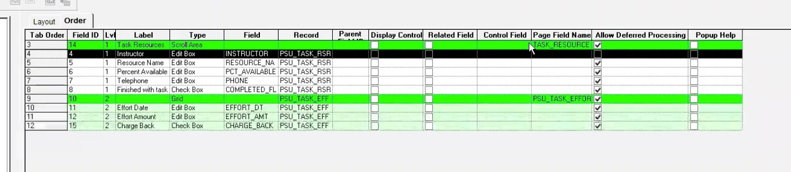   


--------

## 4.13 Activity 10: Reviewing the Programs That Synchronize Student Addresses with Customer Addresses


### **活動概述：同步學生地址與客戶地址**
- **RowInit** 與 **FieldChange** 事件用於控制 **PSU_STUDENT_TBL** 的欄位可用性。
- **FieldChange 事件** 會自動填入 **PSU_CUST_TBL** 的地址資料，當「Same Address as Customer」勾選時。
- **SavePostChange 事件** 負責同步客戶地址的變更至 **相關學生記錄**，確保數據一致性。

### **活動詳細步驟**
- 在 **PeopleSoft Application Designer**，開啟 **PSU_STUDENT_TBL** 的 **RowInit** 事件。
- 在 **Personal Details 頁面** 選擇「Same Address as Customer」，觀察地址欄位是否變更。
- 若取消「Same Address as Customer」，地址欄位 **解除鎖定**，允許使用者編輯。

### **使用者操作**
- 進入 **Students > Personal Information**，在搜尋條件的 **Customer 欄位輸入 XYZ**。
- 按下 **Search**，查看符合條件的學生名單（共 58 位，第一位為 Mark Larsen）。
- 使用 **Next in List** 按鈕逐一檢視學生記錄，確認 **地址欄位與客戶地址的同步情況**。

### **地址同步機制**
- **若 Same Address as Customer 被勾選**，則：
  - 地址欄位自動填入客戶資料，且 **欄位不可編輯**。
- **若取消勾選**，則：
  - 地址欄位 **恢復可編輯狀態**，允許使用者輸入。

### **結果與觀察**
- **RowInit** 事件控制欄位的初始可用性，依據 **客戶地址關聯**。
- **FieldChange** 事件確保使用者選擇客戶地址時，**自動填入對應資料**。
- **SavePostChange** 事件則負責 **全局同步變更**，若客戶地址更新，則關聯學生的地址同步更新。

 

### **活動概述：檢視地址同步機制**
- **RowInit PeopleCode** 用於初始化 **PSU_STUDENT_TBL**，根據「Same Address as Customer」選項控制地址欄位的啟用或禁用。
- **FieldChange PeopleCode** 負責同步地址資料，當使用者勾選或取消「Same Address as Customer」時，更新欄位狀態。
- 地址同步機制確保學生地址與客戶地址的一致性，避免數據不一致。

### **RowInit PeopleCode**
- **若 Same Address as Customer 的值為 "Y"**，則：
  - 地址欄位（如 STREET1、CITY、STATE、ZIP、COUNTRY、PHONE）被禁用（Enabled = False）。
  - 使用者無法編輯地址欄位。
- **PSU_STUDENT_TBL 被宣告為物件**，指向學生記錄表，簡化程式碼操作。
- **PSU_CUST_TBL 的物件可選擇性宣告**，但非必要，避免額外程式碼。

### **FieldChange PeopleCode**
- **取消勾選 Same Address as Customer**：
  - 地址欄位啟用（Enabled = True），允許使用者編輯。
  - 使用者可輸入新地址（如 One Larson Way）。
- **重新勾選 Same Address as Customer**：
  - 地址欄位禁用，並同步至 **PSU_CUST_TBL** 的地址資料。
  - 確保地址欄位與客戶地址一致。

### **操作步驟**
- 進入 **Personal Details 頁面**，選擇 Mark Larsen 的記錄。
- **取消勾選 Same Address as Customer**，觀察地址欄位啟用並可編輯。
- **重新勾選 Same Address as Customer**，地址欄位禁用並恢復客戶地址。
- 使用 **Next in List** 按鈕逐一檢視其他學生記錄，確認地址同步情況。

### **結果與觀察**
- **RowInit PeopleCode** 初始化地址欄位狀態，根據「Same Address as Customer」選項控制啟用或禁用。
- **FieldChange PeopleCode** 實現地址資料的同步，確保學生地址與客戶地址的一致性。
- **PSU_STUDENT_TBL 與 PSU_CUST_TBL 的同步機制**，有效維護數據完整性。

 
 

### **RowInit PeopleCode 的功能**
- **若 Same Address as Customer 的值為 "Y"**：
  - 地址欄位（STREET1、CITY、STATE、ZIP、COUNTRY、PHONE）被禁用（Enabled = False）。
  - 地址欄位的值會從 **PSU_CUST_TBL** 中取得並同步。
- **若 Same Address as Customer 的值為 "N"**：
  - 地址欄位啟用（Enabled = True），允許使用者自行輸入資料。

### **FieldChange PeopleCode 的功能**
- **取消勾選 Same Address as Customer**：
  - 地址欄位啟用，使用者可編輯並輸入新地址。
- **重新勾選 Same Address as Customer**：
  - 地址欄位禁用，並同步至 **PSU_CUST_TBL** 的地址資料。
  - 確保地址欄位與客戶地址一致。

### **SavePostChange PeopleCode 的功能**
- **客戶地址變更後**：
  - 使用 **SQLExec** 更新 **PSU_STUDENT_TBL** 中的相關學生記錄。
  - 更新條件包括：
    - CUSTOMER_ID 與變更的客戶 ID 相符。
    - Same Address as Customer 的值為 "Y"。
- **SQLExec 的作用**：
  - 將客戶地址的變更同步至所有相關學生記錄，確保數據一致性。

### **操作步驟**
- 進入 **Customers > General Information**，選擇 XYZ 客戶。
- 修改客戶地址為 **1 PeopleSoft Way, Pleasanton, California, 90210**，並儲存。
- 進入 **Students > Personal Information**，搜尋 XYZ 客戶的學生名單。
- 確認所有勾選 Same Address as Customer 的學生地址已同步更新。

### **結果與觀察**
- **RowInit PeopleCode** 初始化地址欄位狀態，根據「Same Address as Customer」選項控制啟用或禁用。
- **FieldChange PeopleCode** 實現地址資料的同步，確保學生地址與客戶地址的一致性。
- **SavePostChange PeopleCode** 負責全局同步，確保客戶地址變更後，所有相關學生記錄均被更新。
 

前半段完全就是之前的 FieldChange 範例  
後半段就是用 SavePostChange 展示  確保客戶地址變更後，所有相關學生記錄均被更新。  

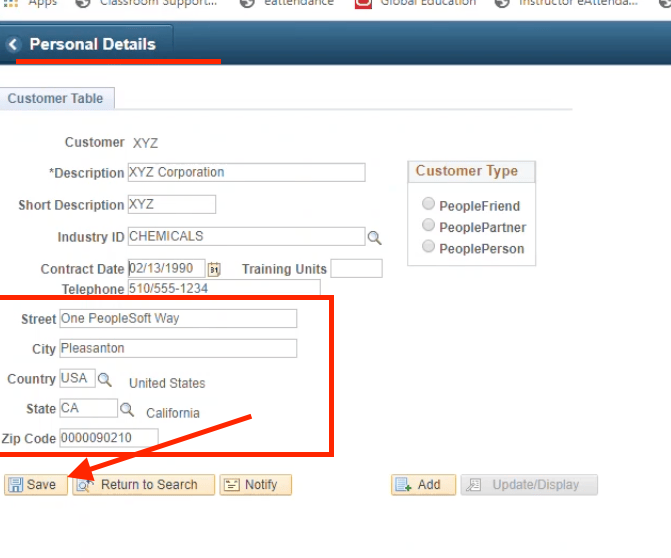  
  
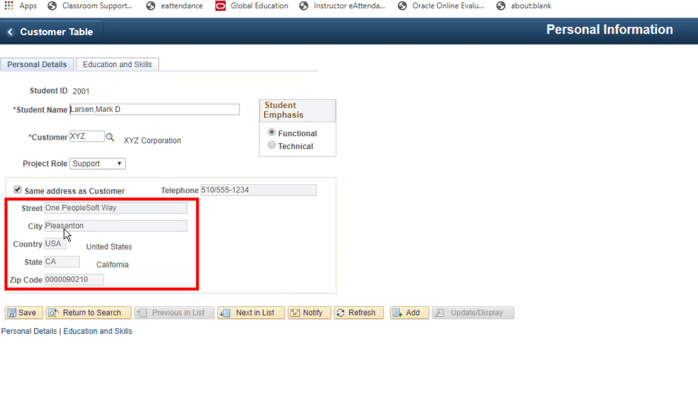  


---------

## 5.1 Writing PeopleCode Programs  

這章節就是各種語法  
 

### **Lesson 5: 撰寫 PeopleCode 程式**
- 學習目標：撰寫 PeopleCode 陳述式、條件判斷及迴圈語法。
- 了解陳述式的基本組成，包括變數、函式、類別、方法、屬 性及註解。
- 理解每個 PeopleCode 陳述式通常需以分號結尾，但某些結構（如 `If Then`）有例外。

### **PeopleCode 陳述式**
- 陳述式包括變數宣告、值指派、控制流（條件分支、迴圈）、函式及方法調用等。
- **分號 (;) 用於結束陳述式**，但像 `If Then` 結構直到 `End-If` 才視為完整陳述式。
- `If Then Else End-If` 屬於單一區塊，因此分號出現在 `End-If` 之後，而非 `Then` 之後。
- 同樣規則適用於其他控制流結構，如 `For` 迴圈。

### **賦值陳述式**
- 透過 `=` 將值賦予欄位、變數、物件屬性或物件本身，可為直接值、函式運算結果或其他變數。
- 例如：`&S1 = "String1"`，將字串指派給變數 `&S1`。
- 也可透過變數間指派，例如：`&S2 = &S1`，使 `&S2` 取得 `&S1` 的值。

### **運算式、函式與方法**
- 宣告變數：如 `Local String &S1, &S2`，表示同一行內定義兩個字串變數。
- 變數指派可為字串、數值、日期等基本類型，也可為物件導向資料型別。
- 例如：宣告 `RowSet` 物件：`Local RowSet &rowset1, &rowset2`，並透過 `CreateRowSet` 或 `GetRowSet` 進行物件實例化。

### **註解**
- **使用 `Rem`（Remark）標註單行註解**，直到第一個分號結束。
- **使用 C 風格註解 (`/* ... */`) 標註多行註解**，適用於較長的註解區段。
- `Rem` 方法源自傳統 BASIC 程式，而 C 風格適用於更靈活的多行註解。

 

### **區塊註解（Block Comments）**
- 使用**標籤符號 `<* ... *>`** 來標記註解區塊，適用於已含註解的程式碼段。
- 可以有效屏蔽多行程式碼，使其暫時無法執行。
- 適用於大範圍的註解，避免影響原有的其他註解結構。

### **編譯器自動產生的註解**
- **`/*+ ... +*/` 由編譯器自動插入**，使用者無法自行撰寫這類註解。
- 主要出現在**應用程式類別（Application Class）內的方法和屬性定義**。
- 這些註解是為了標記特定的程式碼結構，幫助開發環境理解類別設計。

### **PeopleCode 的數學運算子**
- **加法 (`+`)**：`&Price + &Tax` 用於數值相加。
- **減法 (`-`)**：`&Gross - &Tax` 可進行數值減法或一元負號運算（`- &Deductions`）。
- **乘法 (`*`)**：`&Price * &Quantity` 代表數值相乘。
- **除法 (`/`)**：`&AnnualPayments / 12` 代表除法運算。
- **指數運算 (`**`)**：`Radius ** 2` 代表指數運算，將 `Radius` 的值提升至平方。

### **運算順序與優先權**
- **遵循標準運算順序**（PEMDAS）：**括號、指數、乘除、加減**（同階運算依左至右）。
- 可透過**括號 `()` 覆蓋預設的計算優先權**，確保運算結果符合預期。
- 與一般程式語言的運算邏輯一致，可靈活運用於 PeopleCode 計算式中。

### **日期與時間運算**
- **時間 `+` 或 `-` 秒數**：結果仍為時間型別（Time）。
- **時間 `-` 時間**：結果為秒數（數值型別）。
- **日期 `+` 或 `-` 天數**：結果為新的日期（Date）。
- **日期 `-` 日期**：結果為天數差異（數值型別）。
- **日期 `+` 時間**：結果為日期時間型別（DateTime），兩者結合。


這裡是你的文章摘要，每段內容都整理成 3 到 5 條重點，並以台灣繁體中文表達：

### **日期與時間運算**
- `%Date` 代表**當前系統日期**，可進行日期運算，例如 `&Date1 = %Date + 7` 計算**七天後的日期**。
- `%Time` 代表**當前系統時間**，可進行秒數運算，例如 `&Time = %Time + 300` 計算**五分鐘後的時間**。
- `%Date` 和 `%Time` 的值來自**資料庫伺服器**，確保正確同步當前日期時間。

### **條件判斷 (`If Then Else` 結構)**
- **基本語法**：`If 條件 Then 陳述式列表 [Else 陳述式列表] End-If`。
- **巢狀結構**：`If` 可**巢狀嵌套多個條件**，形成多層判斷，例如：
  ```PeopleCode
  If %Mode = "A" Then
      If &Find > 0 Then
          Error "請確認條件"
      End-If
  End-If
  ```
- **無 `Else-If`**：PeopleSoft **不支援 `Else If`**，須使用 `Evaluate` 進行條件判斷。

### **關係與布林運算子**
- **關係運算子**：`=`（等於）、`<>`（不等於）、`>`（大於）、`<`（小於）、`>=`（大於等於）、`<=`（小於等於）。
- **布林運算子**：`Not`（非）、`And`（且）、`Or`（或）。
- **運算順序**：PeopleCode 依序計算 `Not` → `And` → `Or`，可使用**括號 `()`** 控制運算優先順序。

### **錯誤與警告處理**
- **錯誤 (`Error` 函式)**：顯示訊息並**停止處理**，直到使用者修正輸入。
- **示例**：
  ```PeopleCode
  If All(&EmpBirthDate) Then
      Error "請輸入生日"
  End-If
  ```
- **錯誤應在條件判斷後執行**，避免欄位無法更新或影響使用者操作。


### **錯誤 (`Error`) 函式**
- **主要功能**：顯示錯誤訊息，**停止 PeopleCode 處理**，使後續程式碼無法執行。
- **應用於欄位編輯 (`FieldEdit`) 時**，該欄位會變紅，並且使用者無法離開該欄位。
- **示例**：
  ```PeopleCode
  If &Employee.BirthDate > %Date Then
      Error "生日不得晚於今日"
  End-If
  ```
- **括號 (`()`) 是選擇性**，但通常建議使用以提高可讀性。

### **警告 (`Warning`) 函式**
- **主要功能**：顯示警告訊息，但不阻止處理，讓使用者決定是否繼續。
- **適用於數據檢查**，如**雇用日期應符合邏輯順序**。
- **示例**：
  ```PeopleCode
  If All(&Job.OrigHireDate, &Employment.HireDate) And 
     &Job.OrigHireDate > &Employment.HireDate Then
      Warning "原始雇用日期不應晚於正式雇用日期"
  End-If
  ```
- **使用者可選擇繼續或修正輸入**，與 `Error` 函式的強制性不同。

### **判斷值是否為「空」**
- **`All()` 函式回傳 `True`，當所有參數都不為 `Null`、`0` 或空字串**。
- **日期欄位的「空值」為 `Null`，數值欄位則為 `0`，文字欄位則為空白 (`""`)**。

### **錯誤與警告的區別**
- **`Error` 函式：強制停止程式執行，使用者必須修正輸入**。
- **`Warning` 函式：提示可能錯誤，使用者可選擇修正或忽略**。
- **適用於不同場景，例如 `Error` 用於嚴重錯誤，`Warning` 用於建議性檢查**。

### **可選括號 (`Optional Parentheses`)**
- **如果 `Error` 或 `Warning` 只包含簡單字串，可不使用括號**。
- **當使用 `MessageGet` 函式時，括號必須存在**：

```PeopleCode
Warning(MessageGet(1000, 5, "請確認資料"))
```

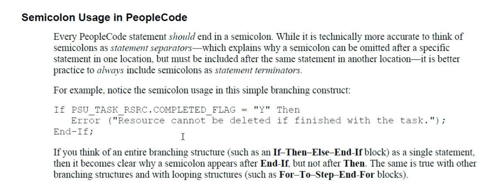  
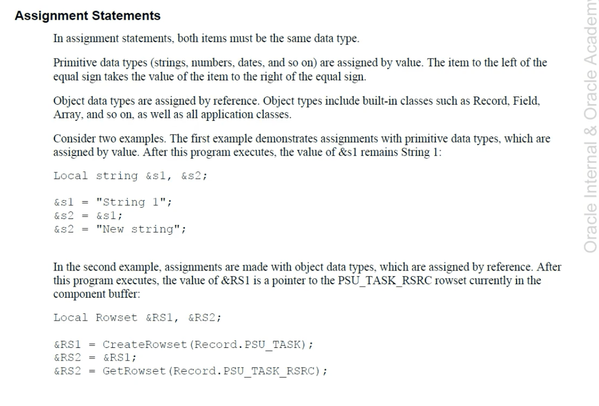  
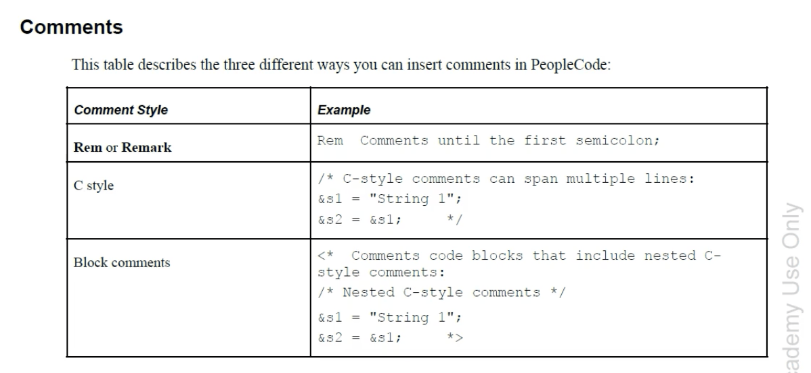  
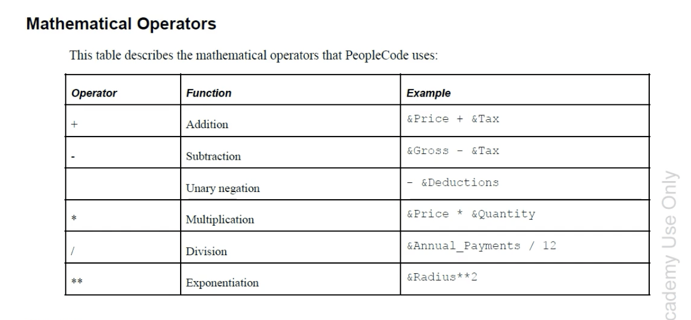  
  
  
  
  
  
  
  


--------

## 5.2 Writing Conditional Statements (continued)  

這裡是你的文章摘要，每段內容都整理成 3 到 5 條重點，並以台灣繁體中文表達：

### **Evaluate 結構**
- **適用於判斷多種可能值**，比使用多層 `If` 條件更簡潔高效。
- 語法結構：
  ```PeopleCode
  Evaluate 變數
      When 條件1
          陳述式1
      When 條件2
          陳述式2
      When-Other
          陳述式3
  End-Evaluate
  ```
- 必須以 `End-Evaluate` 結束，每個 `When` 代表一種條件，`When-Other` 為**預設條件**（可省略）。

### **運作機制**
- `Evaluate` **僅使用初始值進行判斷**，即使 `When` 條件內修改變數，後續判斷仍使用原始值。
- **標準關係運算子可用於 `When` 條件**（`=`, `<`, `>`, `>=`, `<=`, `<>`）。
- **未指定運算子時，預設為等於 (`=`)**。

### **與其他語言的比較**
- **類似於 SQR 的 `Evaluate` 或其他語言的 `Switch`/`Case`**，但 PeopleCode **不會重新評估變數變更**。
- 在 SQR 中，若在 `When` 條件內變更變數，後續判斷會使用新值。

### **示例**
```PeopleCode
Local Number &Var = 5;

Evaluate &Var
    When > 1
        &Var = &Var + 9; /* 5 + 9 = 14 */
    When = 5
        &Var = &Var + 10; /* 5 + 10 = 15 (但 `&Var` 早已變成 14) */
    When = 24
        &Var = 222;
    When-Other
        &Var = 7;
End-Evaluate;
```
結果：**即使 `When > 1` 內修改 `&Var`，後續判斷仍以最初的 `5` 為基準，而非修改後的 `14`。**


### **Evaluate 的隱含 `Or` 運算**
- **多個 `When` 子句無陳述式時，視為隱含的 `Or` 運算**，如：
  ```PeopleCode
  Evaluate &Var
      When "A"
      When "B"
          /* 代表 "A" 或 "B" 時執行此區塊 */
          StatementList1;
      When "C"
          StatementList2;
  End-Evaluate;
  ```
- **當 `&Var` 為 `"A"` 或 `"B"` 時，執行 `StatementList1`**；若為 `"C"`，則執行 `StatementList2`。

### **Break 語句**
- **`Break` 可用於結束 `Evaluate` 或迴圈**，停止進一步判斷與執行。
- **示例**：
  ```PeopleCode
  Evaluate RECORD.FIELD
      When 1
      When 2
          StatementList1;
          Break; /* 直接跳出 Evaluate */
      When 3
          StatementList2;
          Break;
      When-Other
          StatementList3;
  End-Evaluate;
  ```
- **`Break` 只影響內層 `Evaluate` 或迴圈**，不會影響外部結構。

### **巢狀 `Evaluate` 應用**
- **可用於 PeopleSoft 組件中的 `FieldChange` 事件**，決定適用的提示表 (`Prompt Table`)：
  ```PeopleCode
  Evaluate PSU_EMP_RVW_RVR.REVIEW_TYPE
      When "S" /* 主管 */
          DERIVED.EDITABLE = PSU_SUPVR_VW;
          Break;
      When "F", "P" /* 員工或其他角色 */
          DERIVED.EDITABLE = PERSONAL_DATA;
          Break;
      When "E" /* 特定角色 */
          PERSONAL_DATA = "NONE";
          REVIEWER_ID.Value = PSU_EMP_RVW_RVR.EMPLID;
          /* 禁用欄位 */
  End-Evaluate;
  ```
- **根據不同的 `Review_Type` 設定適用的資料檢視 (`View`)**。

### **邏輯運算與布林值處理**
- **邏輯運算適用於 `If`、`Evaluate` 和迴圈結構**，結果必為 `True` 或 `False`。
- **`Not` 運算子可反向布林值**：
  ```PeopleCode
  Local Boolean &Flag = True;
  &Flag = Not &Flag; /* 反轉 True → False */
  If Not &Flag Then
      WinMessage("Flag equals False");
  End-If;
  ```
- **可透過 `False` 比較來反向布林值**：
  ```PeopleCode
  Local Boolean &Flag = True;
  &Flag = (&Flag = False); /* 確保布林值反向 */
  ```

### **Evaluate 布林運算**
- **可評估多個條件是否符合範圍**：
  ```PeopleCode
  Local Number &Var = 5;
  Evaluate True
      When &Var >= 1 And &Var <= 10
          WinMessage("Range of values");
  End-Evaluate;
  ```
- **當 `&Var` 介於 `1` 到 `10` 之間時，顯示訊息**。

這裡是你的文章摘要，每段內容都整理成 3 到 5 條重點，並以台灣繁體中文表達：

### **Evaluate 結構的隱含 `Or` 運算**
- **多個 `When` 子句無陳述式時，視為隱含的 `Or` 運算**，如：
  ```PeopleCode
  Evaluate &Var
      When = 1
      When = 3
      When = 5
          WinMessage("List of values");
  End-Evaluate;
  ```
- **當 `&Var` 為 `1`、`3` 或 `5` 時，顯示 `"List of values"` 訊息**。

### **PeopleCode 的三種迴圈**
1. **While 迴圈**
   - **只要條件為 `True`，迴圈就持續執行**。
   - **條件在迴圈開始時檢查**，若 `False`，則可能 **一次都不執行**。
   - **示例**：
     ```PeopleCode
     While &Count < 10
         &Count = &Count + 1;
     End-While;
     ```

2. **Repeat 迴圈**
   - **至少執行一次**，直到條件變為 `True` 才結束。
   - **條件檢查發生在迴圈結尾**。
   - **示例**：
     ```PeopleCode
     Repeat
         &Count = &Count + 1;
     Until &Count >= 10;
     ```

3. **For 迴圈**
   - **執行固定次數，根據 `起始值 → 終止值 → 步長` 設定**。
   - **如果未指定步長，預設為 `1`**。
   - **示例**：
     ```PeopleCode
     For &I = 1 To 10 Step 2
         WinMessage("Current value: " | &I);
     End-For;
     ```

### **For 迴圈的進階應用**
- **可以遞減執行**，如：
  ```PeopleCode
  For &I = 10 To 1 Step -2
      WinMessage("Current value: " | &I);
  End-For;
  ```
- **不需要提前宣告 `&I`，PeopleCode 會自動初始化為 `Any` 類型**。

### **活動 11：PeopleCode 事件選擇**
- **學習如何選擇正確的 PeopleCode 事件**來強制執行業務規則。
- **課程總結**：
  - **PeopleCode 由陳述式 (`Statements`) 組成**，可包含註解、宣告、指派、程式結構及方法調用。
  - **條件分支可透過 `If` 或 `Evaluate` 構造**。
  - **迴圈可使用 `While`、`Repeat` 或 `For`**。
 
  
  
  
  
  
  
  
  
  

-------

## 5.3 Activity 11: Selecting the Correct PeopleCode Events for Error Messages


### **選擇正確的 PeopleCode 事件以產生錯誤訊息**
- **目標**：撰寫 PeopleCode 以執行三項業務規則並選擇適當的事件。
- **判斷事件的三大原則**：
  - **何時 (`When`)**：PeopleCode 應在何時執行？可能需要多個事件。
  - **何處 (`Where`)**：應附加 PeopleCode 的位置？需考慮處理模式影響。
  - **程式邏輯 (`What`)**：程式的邏輯結構應如何設計？

### **業務規則與適用事件**
1. **檢查資源可用性超過 100%**
   - **問題**：因元件處於 **Deferred Mode**，`PCT_AVAILABLE` 的變更僅在下一次伺服器傳輸後才會被識別。
   - **解決方案**：**關閉 PCT_AVAILABLE 欄位的延遲處理 (`Deferred Processing`)**，確保即時驗證。

2. **防止刪除已完成任務的資源**
   - **適用事件**：`RowDelete`（在刪除行時驗證條件）。
   - **驗證條件**：若資源已完成任務，則產生錯誤訊息。

3. **檢查結束日期是否早於開始日期**
   - **適用事件**：`FieldEdit`（在輸入資料時驗證欄位）。
   - **邏輯**：若 `EndDate` < `StartDate`，則顯示錯誤。

### **關閉延遲處理 (`Deferred Processing`)**
- **步驟**：
  1. **開啟 `PSU_TASK_RESOURCES` 組件**。
  2. **進入 Task Resources 頁面**，雙擊 `PCT_AVAILABLE` 欄位。
  3. **前往 `Use` 分頁，取消選取 `Allow Deferred Processing`**。
  4. **點擊 `OK` 並 `Save`**。

：

### **設定 `FieldEdit` 事件以驗證資源可用性**
- 於 `PSU_TASK_RESOURCES` 組件的 `Percent Available` 欄位，選擇 `FieldEdit` 事件。
- 撰寫 PeopleCode，判斷 `PCT_AVAILABLE` 是否大於 `100`，若是則顯示錯誤訊息：
  ```PeopleCode
  If &PCT_AVAILABLE > 100 Then
      Error "Resource cannot be available more than 100%";
  End-If;
  ```
- 儲存 PeopleCode 以完成設定。

### **設定 `RowDelete` 事件以防止刪除已完成任務的資源**
- 於 `PSU_TASK_RESOURCES` 組件的 `COMPLETED_FLAG` 欄位，取消延遲處理 (`Deferred Processing`)。
- 在 `RowDelete` 事件中撰寫 PeopleCode，檢查 `COMPLETED_FLAG` 是否為 `"Y"`：
  ```PeopleCode
  If &COMPLETED_FLAG = "Y" Then
      Error "Resource cannot be deleted if finished with the task";
  End-If;
  ```
- 儲存 PeopleCode 以完成設定。

### **設定 `SaveEdit` 事件以檢查開始日期與結束日期**
- 於 `PSU_TASK_TBL` 組件的 `SaveEdit` 事件，撰寫 PeopleCode 確保 `EndDate` 不小於 `StartDate`。
- 使用 `All()` 函式檢查兩個欄位是否有值：
  ```PeopleCode
  If All(&StartDate, &EndDate) And (&StartDate > &EndDate) Then
      Error "Start date must precede end date";
  End-If;
  ```
- 儲存程式碼，確保輸入資料符合規範。

### **測試 PeopleCode**
- **測試 `PCT_AVAILABLE` 限制**：登入 PeopleSoft，前往 `Task Resources` 頁面，測試超過 `100%` 可用性是否觸發錯誤。
- **測試刪除驗證**：嘗試刪除已完成任務的資源，檢查錯誤訊息是否正確顯示。
- **測試日期邏輯**：輸入開始與結束日期，嘗試設定 `EndDate < StartDate` 以驗證錯誤機制是否生效。


### **測試 PeopleCode 錯誤訊息**
1. **驗證資源可用性是否超過 100%**
   - 在 `PIA` 中導航至 `Setup Training > Training Tasks > Task Resources and Efforts`。
   - 搜尋並選擇 `Task 1`，將 `Ed Kellenberger` 的 `PCT_AVAILABLE` 設為 `110%`。
   - **錯誤訊息應出現**：`Resource cannot be available more than 100%`。

2. **測試刪除已完成任務的資源**
   - **將 `Ed Kellenberger` 的可用性調整回 `50%`**。
   - 按 `Alt+8` 來刪除該行，系統顯示刪除確認。
   - 點擊 `OK`，應收到 **錯誤訊息**：`Resource cannot be deleted if finished with a task`。

3. **測試結束日期是否早於開始日期**
   - **導航至 `Task Table`**，修改 `StartDate` 為 `2011`，`EndDate` 為 `2002`。
   - **點擊 `Save` 時應顯示錯誤訊息**：`Start date must precede end date`。

### **活動總結**
- 成功驗證 `FieldEdit`、`RowDelete` 和 `SaveEdit` 事件的錯誤處理機制。
- 所有測試均產生預期的錯誤訊息，確保業務規則正確執行。

第2個 checkbox 防呆實作讓我很疑惑   
如果沒有拿掉 deferred 的話，不會抓到正確的直嗎？  

  
  
  
  
  
  
  
  

--------

## 6.1 Using PeopleCode Variables

### **Lesson 6：使用 PeopleCode 變數**
- **目標**：學習如何建立**使用者定義變數**、使用**系統變數**、在應用程式中加入**衍生工作欄位**，並描述**上下文提示表編輯**。

### **使用者定義變數**
- 用於**暫存數據**，名稱必須以 `&` 開頭。
- 變數名稱可包含 **字母 (A-Z, a-z)、數字 (0-9)、特殊字符 (#, @, $, _)**，長度最多 1,000 字元。
- **範例**：
  - **數字運算**：`&I`, `&N`, `&Count`
  - **字串類型**：`&S1`, `&S2`, `&Title`, `&Description`
  - **布林值**：`&Bool`, `&Succeeded`
  - **日期時間**：`&Today`, `&Date`, `&CreateDTTM`, `&LastUpdDTTM`
  - **物件變數**：`&RS1`（Rowset1）, `&RS2`（Rowset2）, `&Cust_Rowset`

### **變數作用域 (Scope)**
- **Local（區域變數）**：僅限於該 PeopleCode 事件執行期間，例如 `FieldChange`。
- **Component（組件變數）**：在同一個組件內有效，可跨 `FieldChange`, `FieldEdit`, `RowEdit` 等事件。
- **Global（全域變數）**：在整個使用者工作階段 (Session) 內有效。

### **變數宣告方式**
- **Component 及 Global 變數必須在使用的每個 PeopleCode 程式中重新宣告**。
- 若未指定作用域，則預設為 `Local`（僅在該事件內有效）。
- **所有變數宣告應放在程式碼的最前面**，避免作用域錯誤。

這裡是你的文章摘要，每段內容都整理成 3 到 5 條重點，並以台灣繁體中文表達：

### **變數作用域 (Scope)**
- **Local（區域變數）**：僅在定義該變數的事件內有效，每次進入新事件即為獨立的記憶體區段。
- **Component（組件變數）**：在同一個 PeopleSoft **組件內持續存在**，可在不同頁面間傳遞資料。
- **Global（全域變數）**：使用者登入後初始化，持續存在於整個使用者工作階段，可在不同組件間共享。

### **常規數據型別**
- **PeopleCode 的基本數據型別**：
  - **數值**：`Number`、`Integer`、`Float`
  - **日期時間**：`Date`、`DateTime`、`Time`
  - **文字與布林**：`String`、`Boolean`、`Any`
- 建議 **在需要高效能運算時使用 `Float` 或 `Integer`，而非 `Number`**，以提高計算速度。

### **使用者定義常數**
- **可在程式開頭定義，並用於整個程式碼**：
  ```PeopleCode
  Constant &AddMode = "A";
  ```
- 常數可用於 **數字 (`Number`)、字串 (`String`)、布林值 (`Boolean`)**。

### **物件數據型別**
- **PeopleCode 的物件類型**：
  - **Component Buffer 類**：`Rowset`、`Row`、`Record`、`Field`
  - **應用程式類別** (`Application Class`)
  - **SQL、Charting 類別**：`SQL`、`Chart`、`Gantt`、`OrgChart`
- 物件的數據結構基於其類別，提供更靈活的數據處理方式。

### **變數宣告**
- **Component 及 Global 變數須在程式碼的第一行之前宣告**。
- **Local 變數可在任意程式內宣告**，但作用域僅限該事件。
- 若未明確宣告，PeopleCode 會 **自動設為 Local 作用域，且型別為 `Any`**（不推薦）。


### **未宣告變數的影響**
- 若變數未明確宣告型別，**PeopleCode 會自動將其設為 `Local` 作用域，且型別為 `Any`**。
- 這可能導致程式在執行時出現型別不匹配問題，影響程式穩定性。
- **範例**：
  ```PeopleCode
  &Length = 6; /* 變數 &Length 被自動宣告為 Any */
  &CHECK = Rpt 9 for &Length; /* PeopleCode 無法提前識別正確型別 */
  ```
- **建議**：所有變數應**明確宣告型別**，避免編譯時的問題。

### **變數型別驗證**
- **使用 Validate 功能檢查自動宣告的變數**。
- 編譯器會輸出訊息，顯示哪些變數被自動宣告，例如：
  ```
  &Length is auto-declared
  &CHECK is auto-declared
  &Student_ID is auto-declared
  ```
- **未宣告的變數預設為 `Local` 作用域，僅可在該函式內使用**。

### **系統變數（System Variables）**
- **系統變數在使用者登入時自動建立，可於 PeopleCode 內隨時使用**。
- 這些變數以 `%` 開頭，例如：
  - **`%Date`**：返回 **當前伺服器日期**（Date 型別）。
  - **`%Time`**：返回 **當前伺服器時間**（Time 型別）。
  - **`%DateTime`**：返回 **當前伺服器日期時間**（DateTime 型別）。

### **額外的系統變數**
- **`%Component`**：回傳目前執行中的 **組件名稱**（大寫字串）。
- **`%Menu`**：回傳目前的 **選單名稱**。
- **`%Mode`**：回傳 **目前的頁面模式**：
  - `"A"` 表示 **新增模式 (`Add Mode`)**。
  - `"U"` 表示 **更新模式 (`Update Mode`)**。


### **PeopleCode 系統變數（System Variables）**
- **`%Page`**：回傳目前使用者所在的 **頁面名稱**。
- **`%Component`、`%Menu`、`%Mode`、`%Page`** 常被稱為 **「當前上下文」** 變數，可用來識別目前運行的環境。

### **與網際網路相關的系統變數**
- **`%Content_ID`**：回傳 **當前內容的識別碼**（字串）。
- **`%ContentType`**：回傳 **當前內容的類型**（字串）。
- **`%Node`**：回傳 **目前請求物件的節點名稱**。
- **`%Portal`**：回傳 **當前使用的門戶**。
- **`%RouteLevel`**：對應 **選單系統的路由層級**。
- **`%Request`**：回傳 **目前請求物件的引用**。

### **與使用者資訊相關的系統變數**
- **`%ClientDate`**：回傳 **使用者的當前日期**，已根據使用者時區調整。
- **`%ClientTimeZone`**：回傳 **使用者的時區**（3 字元表示）。
- **`%Currency`**：回傳 **使用者的偏好貨幣**。
- **`%UserId`**：回傳 **目前登入的使用者 ID**。
- **`Language_User`**：回傳 **使用者的語言設定**（從登入畫面選擇）。

### **應用類別相關變數**
- **`%This`**：指向 **當前的物件**（適用於應用程式類別）。
- **`%Super`**：指向 **父類別物件**（用於繼承）。

### **查詢 PeopleCode 系統變數**
- **使用 `F1` 鍵查詢變數定義**：
  - 在 **PeopleCode Language Reference Guide** 中尋找詳細說明。
  - **導航至變數參考頁面**，可查看所有可用的系統變數。


  
  
  
  
  
  

--------

## 6.2 Incorporating Derived/Work Fields into Your Applications


### **衍生工作欄位 (Derived Work Fields)**
- **提供元件的工作儲存空間**，其生命週期僅限於**當前元件 (Component)**。
- **儲存於衍生工作記錄 (Derived Work Record)**，可用作編輯欄位，如：
  - **提示表編輯 (Prompt Table Edits)**
  - **轉換表編輯 (Translate Table Edits)**
  - **是/否編輯 (Yes/No Edits)**
  - **可與按鈕 (Push Button) 相關聯**

### **衍生工作欄位 vs. PeopleCode 變數**
- **PeopleCode 變數 (`Local`, `Component`, `Global`) 只能儲存於記憶體，不會顯示在頁面上**。
- **衍生工作欄位可顯示於頁面**，但其作用範圍仍限於該元件 (`Component` Scope)。
- **可用於計算數值或控制頁面行為**，但不儲存至數據庫。

### **應用於購買訂單 (`Purchasing` Component)**
- 在 **Application Designer** 中，`PSU_PURCHASEORDER` 元件包含 **衍生工作記錄 (Derived Education Services)**。
- **總價 (`Total Price`) 和總計 (`Grand Total`) 來自該衍生工作記錄**。
- **透過 PeopleCode `RowInit` 和 `FieldChange` 計算這些欄位值**，並即時顯示於頁面。

### **查詢衍生工作記錄**
- 在 **Application Designer**：
  - **開啟 PSU_PURCHASEORDER 元件**
  - **點擊結構 (`Structure`)**
  - **檢視衍生工作記錄 (`Derived Education Services`)**
  - **查看欄位 (`Total Price`, `Grand Total`) 的定義**


### **衍生工作記錄 (`Derived Work Record`)**
- **用於存放計算欄位或輔助函式**，提供**暫存數據**以便在 PeopleCode 中使用。
- 可用於 **顯示計算後的數值**（如 `Total Price`、`Grand Total`）。
- **不存儲於資料庫**，僅限當前元件 (`Component`) 使用。

### **衍生工作記錄的特性**
- **僅包含欄位**，但**無法建立 SQL View、資料表或子記錄 (`Subrecord`)**。
- **不可編譯 (`Build` 選項為灰色)**，僅作為元件內的欄位佔位使用。
- **可與按鈕 (`Push Button`) 及編輯事件 (`FieldEdit`, `FieldChange`) 互動**。

### **衍生工作欄位的用途**
- **顯示數據而不存入資料庫**，如購買訂單 (`Purchase Order`) 總價計算。
- **作為 PeopleCode 程式中的暫存變數**，允許程式之間傳遞數值。
- **作為 `FieldEdit` 或 `FieldChange` 的儲存位置**，處理按鈕事件。
- **可存儲 PeopleCode 函式，作為應用程式特定功能的永久儲存區**。

### **變數與衍生工作欄位的比較**
| 變數類型 | 壽命 | 主要用途 | 可顯示在頁面上 |
|----------|------|---------|----------------|
| Local 變數 | 僅限該程式 | 暫存數據 | 否 |
| Component 變數 | 組件內可使用 | 在組件內共享值 | 否 |
| Global 變數 | 使用者工作階段 | 跨組件傳遞數據 | 否 |
| **Derived Work Field** | **組件內可使用** | ** 庫** | **是** |

### **如何建立衍生工作欄位**
1. **建立欄位定義 (`Field Definition`)**。
2. **建立記錄定義 (`Record Definition`)**，並**設為衍生工作記錄 (`Derived Work`)**。
3. **將欄位加入記錄，儲存該記錄**。
4. **將記錄中的欄位加入頁面，以便 PeopleCode 讀取並運用**。


### **使用衍生工作欄位 (`Derived Work Fields`) 的情境**
- **適用於需顯示計算結果但不存入資料庫的數據**（如購買訂單的總價）。
- **適用於按鈕 (`Push Button`) 操作，但不需儲存動作結果**。
- **適用於跨組件重複使用的功能**，確保一致性且減少額外變數宣告。
 
### **衍生工作記錄 (`Derived Work Record`) 在 PeopleCode 的應用**
- 在 **記錄定義 (`Record Definition`)** 中建立 `FieldChange` 事件，以計算價格：
  ```PeopleCode
  &TotalPrice = &Quantity * &Price;
  &GrandTotal = &GrandTotal + &TotalPrice - &OldPrice;
  ```
- **`RowInit` 事件用於查詢模式 (`Inquiry Mode`) 時，計算預設值**。
- **欄位 (`Field`) 來自衍生工作記錄，並被加入頁面來顯示結果**。

### **建立與使用衍生工作欄位的步驟**
1. **建立欄位 (`Field Definition`)**，如 `Total Price`。
2. **建立衍生工作記錄 (`Derived Work Record`)，並加入該欄位**。
3. **將衍生工作欄位拖曳到頁面，分配記憶體空間**。
4. **在 PeopleCode 事件 (`FieldChange`, `RowInit`) 中使用該欄位進行計算**。

### **衍生工作欄位的頁面行為**
- **通常設定為唯讀 (`Display Only`)，避免使用者手動修改計算結果**。
- **不受 SQL 表或 SQL View 限制，可跨不同發生 (`Occurs`) 層級使用**。
- **在 PeopleSoft 系統中，衍生工作記錄的數值僅存於記憶體，並持續有效直到元件被關閉**。


  
  
  
  

-------

## 6.3 Describing Contextual Prompt Table Edits

6.3 看不懂耶 ＠＠  


------

## 6.4 Activity 12: Calculating and Displaying Derived Values

不錯  這題
展示到怎麼建立 
Derived  
然後用 event 動態計算  

另外又展示了  transfer code    


  
  
  
  
  
  
  
  
  
  
  
  
  
  
  
  
  
  


------

## 6.5 Activity 13: Reviewing the Setup for Contextual Prompt Table Edits

derived + prompt table 的範例  
 
  
  
  
  
  
  
  
  
  